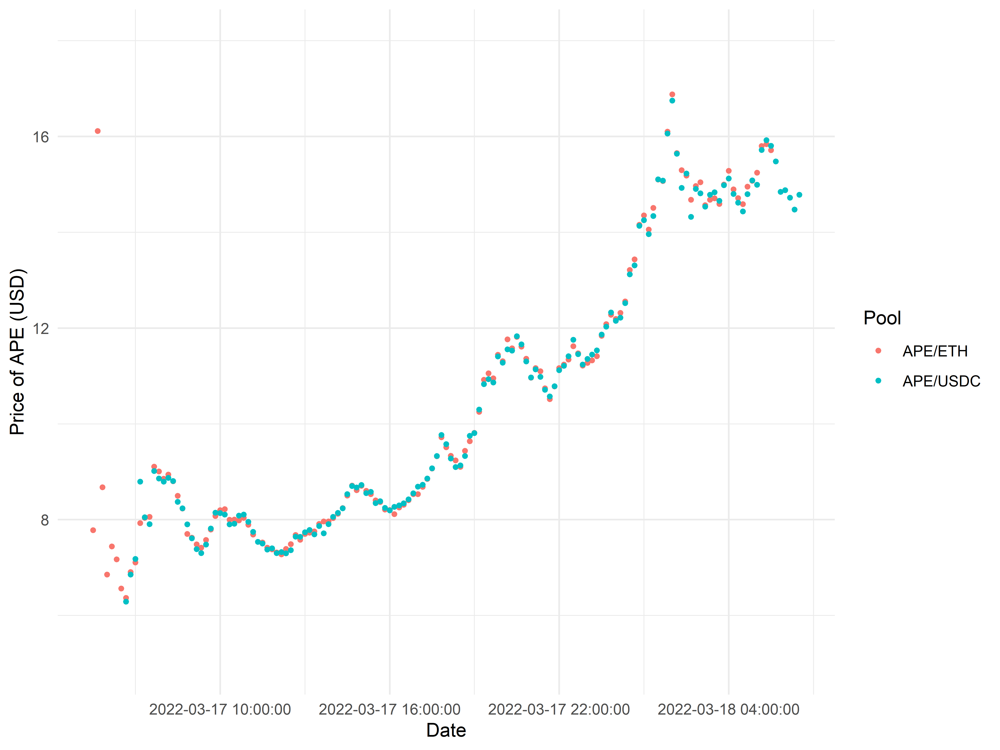
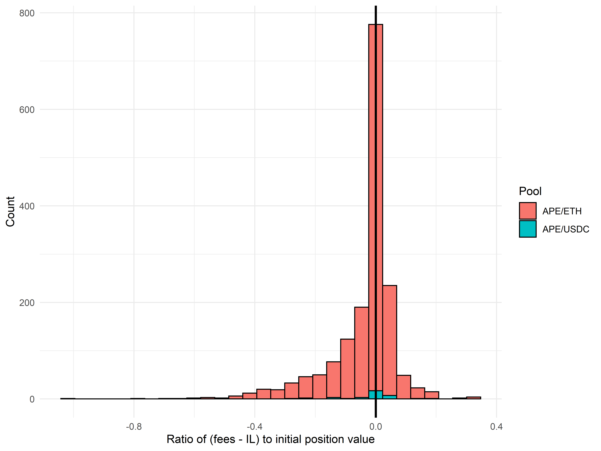

## Introduction

On March 17, 2022, Yuga Labs, the owner of the Bored Ape Yacht Club (BAYC) brand and related derivatives, [launched](https://crypto.com/product-news/apecoin-token-feature) ApeCoin ($APE). Large quantities of ApeCoin were claimable for free by owners of BAYC and BAYC-related NFTs; at the same time, liquidity for the token was added to major exchanges such as FTX. Although ApeCoin has no current functionality, it was the subject of considerable interest from traders, and after an initial post-launch slump, the token price increased by up to 2.5x within the subsequent 24 hours to a fully diluted valuation well exceeding $15 billion.

Although most ApeCoin trading volume occurred on centralized exchanges such as FTX and Binance, a considerable amount also occurred on-chain, primarily via Uniswap on Ethereum mainnet. In this post, we conduct a rudimentary analysis of this on-chain data, which we hope will readers find interesting.

## Initial observations

Aside from some initial divergence in the first hour of trading (likely due to severe lack of liquidity), the price of ApeCoin has been very consistent across both the APE/ETH and APE/USDC liquidity pools:

This is not too surprising, as by default Uniswap will route swaps through multiple pools for the best execution.

Notably, both the APE/ETH and APE/USDC liquidity pools on Uniswap charge 1% fees---higher than typical (for example, ETH/LOOKS charges 0.3%), but not unprecedented (SHIB and other 'meme' tokens also tend to have 1% fee tiers). Given the strong trading interest in ApeCoin, this was a very appealing incentive for users to step in and add liquidity to reap trading fees. Correspondingly, the number of open liquidity positions on Uniswap skyrocketed in the first 12 hours of trading, eventually plateauing at around 650 positions:

Interestingly, the vast majority of liquidity positions are minted on the APE/ETH pool, rather than on the APE/USDC pool, a relationship which continues to hold when looking at the total value of added liquidity rather than the number of positions alone:

One reason why liquidity providers may have preferred APE/ETH is to minimize impermanent loss (IL). In principle, the prices of APE and ETH should be partially correlated from market beta; as such, ETH is typically the numéraire of choice for volatile, risky assets such as ApeCoin. Over a timescale as short as 1-2 days, the price volatility of ETH will typically be fairly low, and hence both APE/ETH and APE/USDC pools should not experience vastly divergent levels of impermanent loss. Nevertheless, liquidity providers clearly preferred to supply liquidity to APE/ETH rather than to APE/USDC.

Following a sharp decline in the first 6 hours, combinedUniswap trading volumes for ApeCoin remained at fairly high levels throughout the day:

We can already immediately see that supplying ApeCoin liquidity on Uniswap was a highly rewarding endeavor. Eyeballing the graphs: suppose we estimate 10-minute trading volume at $3 million, corresponding to $30k in fees; multiplying by 144 (the number of 10-minute perids in a day) and dividing by $40m total liquidity suggests that LP returns in the first 24 hours are on the order of 10% (before accounting for impermanent loss). This calculation is corroborated by the current Uniswap estimate of 24-hour fees at 11% of TVL in the APE/ETH liquidity pool.

## Impermanent loss versus fee generation

To better understand the returns to supplying ApeCoin liquidity, we also need to consider the phenomenon of impermanent loss. Because providing liquidity in a given price range is essentially selling the well-performing asset as it appreciates (equivalently, buying the relatively poorly-performing asset as it depreciates), a liquidity provider's portfolio is expected to strictly underperform holding assets directly in the absence of trading fees. However, if trading fees are set appropriately relative to the degree of trading volume and expected price movement, liquidity providers may profit.

As we previously observed, the price of ApeCoin increased substantially in the first 24 hours of trading. Therefore, the impermanent loss experienced by liquidity providers is expected to be fairly substantial, and it is valuable to understand whether or not it was in fact worth it for them to supply liquidity.

To do so, we first calculated the impermanent loss of every liquidity position (either based on when the position was burned or, if still active after 24h, on the ApeCoin price at that time) relative to a hypothetical portfolio where the liquidity provider simply holds the tokens they used to mint the liquidity position. We then divided this measure of impermanent loss by the market value of their liquidity position at the time of minting.

In the median case, the ratio of impermanent loss to position value experienced by a position was merely 0.007, likely due to positions opened and closed in a small range of time. However, the distribution of such losses has a long right tail, and on average positions lost 2.3% of their initial principal to IL (although, of course, they likely gained much more from the appreciation of their ApeCoin exposure). In the worst cases, some people experienced IL up to 15% of their initial principal, such as the owner of position ID [205089](https://etherscan.io/nft/0xc36442b4a4522e871399cd717abdd847ab11fe88/205089), who [minted](https://etherscan.io/tx/0x2b13580dd5fc2bf7ab65dcdee8f962de65fe59fc87a87a3ad9f21767e265d760) their position when the price of ApeCoin was below $7 and [closed](https://etherscan.io/tx/0xd699187f11cc56ffbbb46a99b9c210328fa9fc07f111b6801896d93d0b3922a4) it when the price was above $15.

Were accrued trading fees sufficient to compensate for this impermanent loss? To answer this question, we derived basic estimates of the trading fees realized by each liquidity position:

As we can see, depending on position size and duration, trading fees earned were as high as tens of thousands of dollars. Dividing fees accrued by a liquidity position's initial market value, we can immediately see that these fees substantially outweighed impermanent loss for most liquidity providers:

In fact, some positions earned fees as substantial as 50% of their initial position value, likely from the very high trading volumes in the first several hours.

We can now directly subtract off IL from fees earned to see how likely it is for liquidity providers to be in profit, relative to a hypothetical portfolio where they simply held APE and ETH/USDC instead of minting a liquidity position:

The answer is *yes*---most positions are well in profit from trading fees after taking into account impermanent loss, with the median position profiting by 2.2% of their initial position value, notwithstanding the overall appreciation in ApeCoin value!

Intuitively, this outcome makes sense. To experience the worst IL, you would have needed to buy and mint liquidity at the very bottom of ApeCoin prices, before the slow runup in the last 12 hours. In that case, impermanent loss would have amounted to around 15% of your initial portfolio size. Such positions are likely exactly those which for which IL exceeds fees in the above plot. However, we previously observed on the basis of trading volumes alone that trading fees on average delivered a return of 10% or greater. Therefore, as long as your position was minted with an appropriate range, it is reasonably likely that the fees collected to your position well exceeded the IL experienced.

## Conclusion