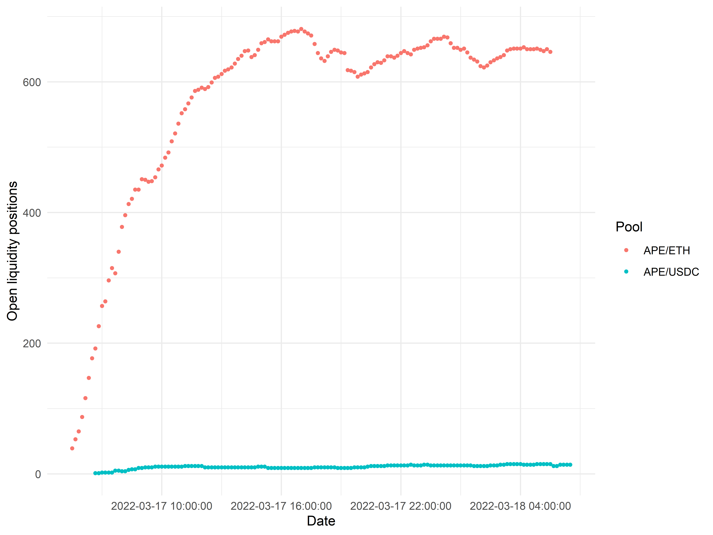
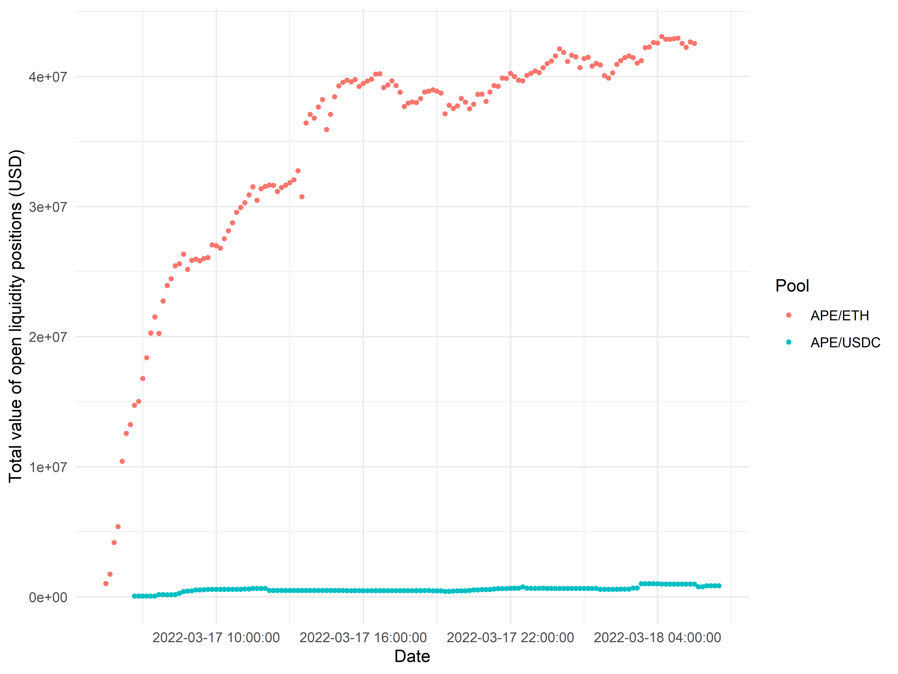
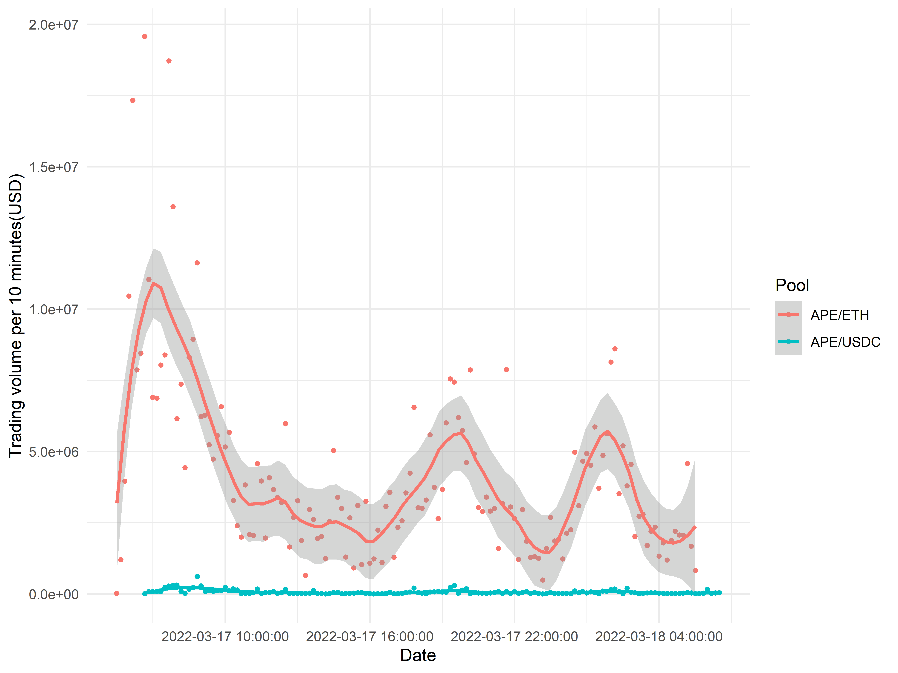
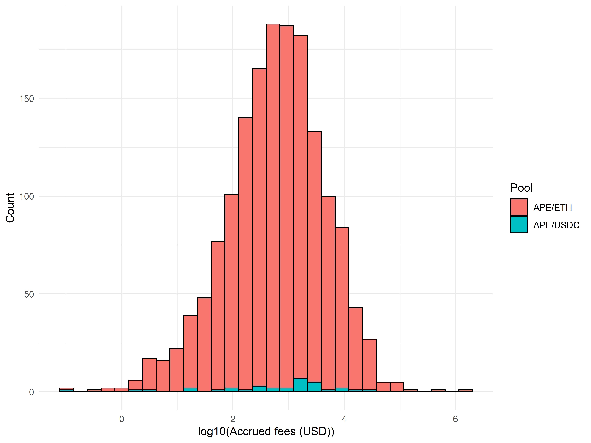
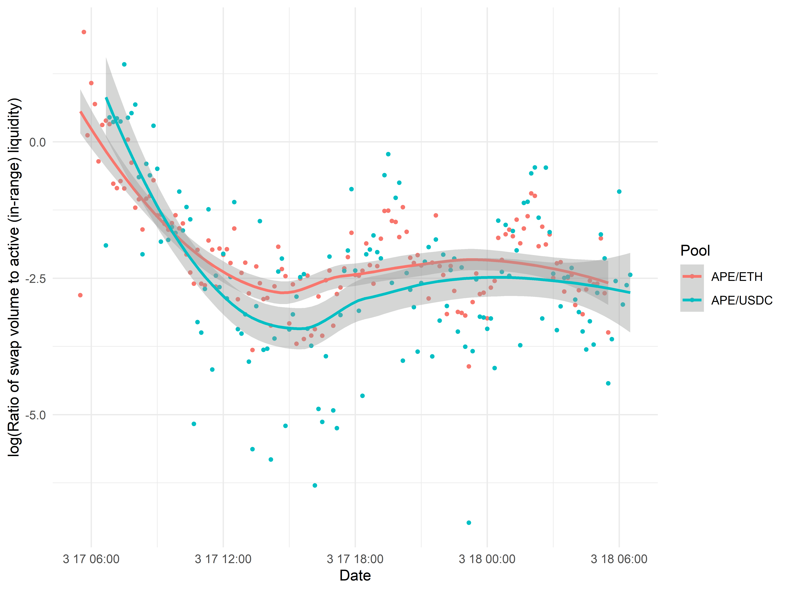

## Introduction

On March 17, 2022, Yuga Labs, the owner of the Bored Ape Yacht Club (BAYC) brand and related derivatives, [launched](https://crypto.com/product-news/apecoin-token-feature) ApeCoin ($APE). Large quantities of ApeCoin were claimable for free by owners of BAYC and BAYC-related NFTs; at the same time, liquidity for the token was added to major exchanges such as FTX. Although ApeCoin has no current functionality, it was the subject of considerable interest from traders, and after an initial post-launch slump, the token price increased by up to 2.5x within the subsequent 24 hours to a fully diluted valuation well exceeding $15 billion.

Although most ApeCoin trading volume occurred on centralized exchanges such as FTX and Binance, a considerable amount also occurred on-chain, primarily via Uniswap on Ethereum mainnet. In this post, we report the results of a rudimentary analysis of the first 24 hours of on-chain trading data with a focus on liquidity providers' profits. Liquidity providers on Uniswap V3 derive revenue from collection of trading fees (a fixed percent of all swap volume); however, as prices fluctuate, they also suffer from impermanent loss (IL). Whether liquidity providers are in profit *relative to a portfolio where they hold the paired assets directly* therefore depends on the balance between trading fees and impermanent loss.

We show that although over 86% of ApeCoin liquidity positions on Uniswap V3 were in profits compared to their invested balances, the majority of liquidity positions incurred impermanent losses which outweighed their collected trading fees, suggesting that the typical liquidity provider would have been better off simply holding APE directly. Our results suggest that liquidity providers systematically underestimated the volatility of ApeCoin prices, leading them to undersize their position ranges and leading to substantial levels of impermanent loss.

## Initial observations

Immediately subsequent to the launch of ApeCoin on centralized exchanges, liquidity was also supplied on Uniswap V3, first via the APE/ETH pool and later via the APE/USDC pool approximately an hour afterward. Initially, prices spiked then dropped dramatically; after several hours at around $8 per APE, the price began to steadily increase, reaching a high of over $16 by the end of the first 24 hours:

Aside from some heightened volatility within the first hour of trading (likely due to severe lack of liquidity), the price of ApeCoin was been very consistent across both the APE/ETH and APE/USDC liquidity pools: not too surprising, as by default Uniswap will route swaps through multiple pools for the best execution.

Notably, both the APE/ETH and APE/USDC liquidity pools on Uniswap charge 1% fees—higher than typical (for example, ETH/LOOKS charges 0.3%), but not unprecedented (SHIB and other 'meme' tokens also tend to have 1% fee tiers). Given the strong trading interest in ApeCoin, this was a very appealing incentive for users to step in and add liquidity to reap trading fees. Correspondingly, the number of open liquidity positions on Uniswap skyrocketed in the first 12 hours of trading, eventually plateauing at around 650 positions:

Interestingly, the vast majority of liquidity positions are minted on the APE/ETH pool, rather than on the APE/USDC pool. Correspondingly, the APE/ETH pool also contains a dominant majority of the liquidity in dollar terms:

On average, liquidity positions were also similarly sized across the two pools. As the plot of position sizes below illustrates, all liquidity positions were smaller than $10 million; however, the distribution of position sizes is nevertheless quite broad, ranging from $100 positions or smaller all the way into the upper seven figures.

One reason why liquidity providers may have preferred APE/ETH is to minimize impermanent loss. In principle, the prices of APE and ETH should be partially correlated from market beta; as such, ETH is typically the numéraire of choice for volatile, risky assets such as ApeCoin. Over a timescale as short as 1-2 days, the price volatility of ETH will typically be fairly low, and hence both APE/ETH and APE/USDC pools should not experience vastly divergent levels of impermanent loss. Nevertheless, liquidity providers clearly preferred to supply liquidity to APE/ETH rather than to APE/USDC.

Following a sharp decline in the first 6 hours, combined Uniswap trading volumes for ApeCoin remained at fairly high levels throughout the day:

We can already immediately see that supplying ApeCoin liquidity on Uniswap was potentially a highly rewarding endeavor. Eyeballing the graphs: suppose we estimate 10-minute trading volume at $3 million, corresponding to $30k in fees; multiplying by 144 (the number of 10-minute periods in a day) and dividing by $40m total liquidity suggests that LP returns in the first 24 hours are on the order of 10% (before accounting for impermanent loss). This calculation is corroborated by the current Uniswap estimate of 24-hour fees at 11% of TVL in the APE/ETH liquidity pool.

However, fee generation is not the only determinant of liquidity providers' profitability!

## Impermanent loss versus fee generation

To better understand the returns to supplying ApeCoin liquidity, we also need to consider the phenomenon of impermanent loss. Because providing liquidity in a given price range is essentially selling the well-performing asset as it appreciates (equivalently, buying the relatively poorly-performing asset as it depreciates), a liquidity provider's portfolio is expected to strictly underperform holding assets directly in the absence of trading fees. However, if trading fees are set appropriately relative to the degree of trading volume and expected price movement, liquidity providers may profit.

As we previously observed, the price of ApeCoin increased substantially in the first 24 hours of trading. Therefore, the impermanent loss experienced by liquidity providers is expected to be fairly substantial, and it is valuable to understand whether or not it was in fact worth it for them to supply liquidity.

To do so, we estimated the impermament loss incurred by each liquidity position. Each individual liquidity position can have its liquidity increased and decreased multiple times between the minting and burning transactions, meaning that we have to very careful to precisely define impermanent loss. For each liquidity position, we tabulated all of the liquidity addition events and tracked how many tokens of each type were added. We considered impermanent loss beginning from the time the liquidity position was minted and ending either at the time the liquidity position was burned, if it was burned within the first 24 hours post-launch, or if not, then at the end of the 24 hours.

To define our baseline counterfactual, where the liquidity provider keeps their tokens in their wallet and never mints a position, we considered the following question: For each liquidity addition event, suppose that the liquidity provider keeps the same quantities of tokens (APE, ETH, and/or USDC), but never mints or adds them to a liquidity position. What would be their portfolio value at the end of the evaluation period? Next, we calculated the exact market value of the liquidity position at the end of the evaluation period, which is fully determined by market prices, the range of their liquidity position, and the tokens supplied. Finally, we took the difference of their hypothetical counterfactual portfolio value without liquidity minting and their actual portfolio value at the end of the evaluation period, and divided this difference by the total dollar value of liquidity they supplied. This ratio is shown below.

The median liquidity position loses 0.3% of its initial portfolio value due to impermanent loss. However, the distribution of such losses has a long right tail, and on *average* positions lost 9.4% of their initial principal to IL (although, of course, they likely gained much more from the appreciation of their ApeCoin exposure). In the worst cases, some people experiencedIL up to 100% of their initial principal!

Although seemingly implausible, manual inspection of the top three liquidity positions ranked by impermanent loss suggests these figures are accurate:

* #1 ([204927](https://revert.finance/#/uniswap-position/mainnet/204927)) added 1 ETH of liquidity at approximately 150,000x the current market price of APE and is currently down an unrecoverable 100%.
* #2  ([205104](https://revert.finance/#/uniswap-position/mainnet/205104)) added 1,500 APE of liquidity when the price of APE was $6.56 for an initial portfolio value of $9,840. At the end of the evaluation period, the position was still open and the price of APE was $14.78, near the upper bound of its range; as such, the position was predominantly ETH, and had a total value of $13,964. If, instead, the minter had simply held their 1,500 APE in their wallet, they would be worth $22,170. The difference between these two is their impermanent loss of $8,206, nearly 84% of their initial position value.
* #3 ([205949](https://revert.finance/#/uniswap-position/mainnet/205949)) added 50,470 APE of liquidity when the price was APE was $7.96. They set a very narrow range for their liquidity position; specifically, 0.0029 to 0.0031 ETH per APE, which at $2,800 per ETH is approximately $8.12 to $8.68 per APE. At the end of the first 24 hours, their position was still open, and the price of APE was much higher than the upper bound of their range. Essentially, their range operated analogously to a limit order which sold APE continuously from $8.12 to $8.68 (roughly a 5% profit from their starting price), and they consequently missed out on all of the subsequent price appreciation of APE (as past the upper bound of $8.68, their position was essentially converted into 100% ETH).

In general, given the steady uptrend in ApeCoin's price action, the duration that a liquidity position stayed open was strongly positively correlated with the degree of impermanent loss:

Although there is substantial dispersion depending on exactly when liquidity positions were opened and closed, we see, as expected, that in the presence of strong directional price movement, keeping a liquidity position open for longer also results in greater impermanent loss.

Were accrued trading fees sufficient to compensate for the severity of this impermanent loss? To answer this question, we derived basic estimates of the trading fees realized by each liquidity position. Within each 10-minute interval, we tabulated the liquidity positions which were open and in range as well as the total swap volume within that interval. We then applied the simplifying assumption that the trading fees (1% of volume) were distributed proportionally to all active liquidity positions on the basis of their market value.

As we can see, depending on position size and duration, trading fees earned were often as high as tens of thousands of dollars. Dividing fees accrued by a liquidity position's initial market value, we can immediately see that the fees collected were, on average, not sufficient to fully compensate for impermanent loss:

The median (resp. mean) position earned 3.3% (resp. 5.7%) of its initial principal in fees. However, a sizable minority of positions outperformed these statistics considerably, with 21.9% of liquidity positions earning more than 10% of initial principal in fees. The strongest performer, ID [204926](https://revert.finance/#/uniswap-position/mainnet/204926), managed to earn as much as 33.1% of its initial value in fees.

We can now directly subtract off IL from fees earned to see how likely it is for liquidity providers to be in profit, relative to a hypothetical portfolio where they simply held APE and ETH/USDC instead of minting a liquidity position:

The answer to our motivating question is therefore *no*—the majority of ApeCoin liquidity positions are not in profit with respect to impermanent loss vs. fees. Because many positions have both zero fees and impermanent loss (likely due to being permanently out of range), the median position ends up being precisely break-even; however, there is a substantial long tail of losses, and the average liquidity position loses 3.8% of their initial principal in this calculation.

Note that this does not mean that most liquidity positions *lost money* relative to their initial states! Instead, it means that the *balance* of impermanent loss vs. fees, in the first 24 hours of ApeCoin trading on Uniswap V3, tended to favor impermanent losses for the majority of liquidity positions. This can be intuitively thought of as the return distribution if liquidity providers were fully delta hedged (*e.g.,* via perpetual futures on an external exchange; assume negligible funding fees).

In actuality, we can also examine the *total return* of liquidity positions by adding up their portfolio value at the end of the evaluation period (either when the position is closed or at the end of the first 24 hours) with our estimate of accrued fees and dividing by the initial portfolio value:

Out of nearly 1,700 liquidity positions studied, 86% were in profit, with the median position realizing a return of 7.7% on their initial portfolio and the average position realizing a remarkable return of 13.5%! Of course, what goes up can also go down, and had the price of ApeCoin decreased rather than increased, liquidity providers would be seriously in the red. Ultimately, these results suggest that the typical liquidity provider would likely have been better off not providing liquidity and instead holding ApeCoin directly to profit from its appreciation.

## Comparison with ambient liquidity

Providing concentrated liquidity in Uniswap V3 comes with both benefits and risks. If the price stays within the prespecified range, the liquidity provider can collect trading fees with greater capital efficiency. However, if the price drifts far beyond the position's range, the liquidity provider faces the prospects of severe impermanent loss on a deactivated position that isn't even collecting any trading fees.

It is illustrative to consider, as a point of comparison, how liquidity via the more classic *xy = k* model, implemented on Uniswap V2 and still effectively available in Uniswap V3 through setting a maximally wide range, would have fared. This model is far simpler to analyze, with the portfolio value scaling proportional to the square root of the risky asset (if we denominate using ETH or USDC as the numéraire). Suppose, hypothetically, that liquidity providers had all simply added ambient, *xy = k* liquidity instead of defining narrow concentrated positions. What would their returns have been?

We find, as shown below, that impermanent losses would have been substantially curtailed relative to the observed IL in the actual liquidity positions data:

Notably, the worst case of IL only loses 15% of the initial portfolio value, as opposed to our empirical observation of multiple >50% losses in users' actual positions. Going further and subtracting off this hypothetical *xy = k* IL from fees, it appears that the balance between the two falls heavily on the side of profitability:

If all liquidity providers had provided ambient liquidity, a full 86% of positions would be in profit from the balance of fees vs. IL alone! This result strongly suggests that liquidity providers did not accurately estimate the extent of future price volatility or appreciation and therefore dramatically undersized the range of their liquidity positions.

## Positions going out of range

As we saw above, the trading fees collected by liquidity positions were fairly substantial, even if they were not always higher than impermanent losses. To efficiently collect trading fees, liquidity providers had to ensure that the range on their concentrated Uniswap V3 positions was sufficiently wide. Otherwise, given the strong directional price action of ApeCoin in the last half of the time period we studied, their liquidity position may have become deactivated as the price went above their upper bound. This would have been doubly painful, as they would have missed out on both the price appreciation of ApeCoin as well as all trading fees deriving from swap volume after the inactivation of their position.

By tracking liquidity positions and pool prices over time, we can calculate exactly what proportion of open liquidity positions are actually in range over the course of the first 24 hours:

In most of the first 12 hours, over 85% of APE/ETH and APE/USDC liquidity positions are in range. However, as the price of ApeCoin started to increase rapidly, the proportion of in-range positions fell to as low as 50% for APE/ETH positions and 30% for APE/USDC positions, suggesting that liquidity providers did not anticipate the rapid uptrend and consequently set their position ranges to be overly narrow. Overlaying the price of ApeCoin over time onto the same plot makes this trend particularly clear (note the ApeCoin price has been arbitrarily rescaled to fit on the same ordinate axis):

One caveat in the above analysis is that some liquidity positions may be very small, so looking at the proportion of in-range positions may misrepresent the state of the pool's overall liquidity in dollar terms. As such, we weighted each position by the market value of its constituent tokens at the time of liquidity addition and calculated the proportion of liquidity TVL in range over time:

The above plot reveals an interesting dynamic. Overall, we see that the proportion of liquidity in range *by volume* is generally higher than the proportion of *individual unweighted positions* in range, suggesting that larger liquidity positions are generally more likely to be in range. This phenomenon may be due to a number of different reasons. For example, on Ethereum mainnet, transaction fees can be quite high; as such, active management of liquidity positions is more valuable with larger position sizes, as the benefits of staying in range increasingly outweigh the fixed cost of paying a gas fee. Additionally, larger liquidity providers may adopt a more sophisticated and active approach overall to liquidity management, where they continually monitor the price movements and readjust positions as necessary or make more informed predictions about future price movement as to set appropriately wide ranges for their liquidity positions.

Liquidity providers naturally do not want their positions to stray out of range and should therefore set the upper and lower bounds on newly minted liquidity positions to reflect expectations about future price movements. These expectations may naturally change over time as liquidity providers, both new and existing, observe fluctuations in the price of ApeCoin. If we examine the upper bounds of newly minted liquidity positions over time, we can see that this is indeed the case:

In particular, we see that as the price of ApeCoin increases in the latter half of the 24-hour period, the upper bounds of newly minted positions increase out of proportion with the appreciation of ApeCoin (*i.e.,* the upper bounds is not always just a constant distance away from the current ApeCoin price). This suggests that as liquidity providers began to observe ApeCoin's upward price action, they also made upward revisions to their expectations of future price growth. A similar trend is observable with the lower bounds of newly minted positions:

By the end of the first 24 hours, the lowest of new liquidity positions' lower bounds have begun to overlap with the actual prices of ApeCoin 18-24 hours prior!

Finally, to explicitly compare the efficiency of collecting trading fees in the APE/ETH and APE/USDC liquidity pools over time, we can take the swap volume for each pool at each timepoint and normalize by the amount of active (in-range) liquidity available at that timepoint. This ratio is plotted below (log scale used for clarity).

We see that the fee accrual in the APE/ETH pool is slightly superior to fee accrual in the APE/USDC in terms of both consistency and absolute quantity of fees collected on average. However, the difference is fairly marginal, suggesting an implicit market for liquidity provisioning which keeps the fee-to-TVL ratios relatively similar between the two pools. Note that several different factors are implicitly included in this metric: trading volume, the amount of overall liquidity supplied, and the proportion of supplied liquidity which is actually in range.

## Conclusion

Providing liquidity on Uniswap V3 requires a skillful balance of many disparate factors. The liquidity provider must make predictions about future price volatility and directionality and set an appropriate range for their concentrated liquidity position in order to maximize their capture of trading fees while minimizing their exposure to impermanent loss. When done adeptly, providing liquidity can be very profitable endeavor; when not, it can be risky and occasionally quite costly.

The benefits of concentrated liquidity are tremendous: Uniswap V3 allows for the replication of arbitrary distributions of liquidity over prices, with dramatically improved capital efficiency and superior swap execution. However, these results highlight the importance of further development in the field of concentrated liquidity DEXes. Future iterations on the model which provide greater guidance to liquidity providers and support the active monitoring and management of liquidity positions will lead the path forward to the growth of a healthy, self-sustaining ecosystem of liquidity provisioning, which is ultimately required for the long-term success of decentralized finance.

We hope that you enjoyed this brief look at a recent, highly anticipated token launch. At CrocSwap, we are working on a series of posts analyzing concentrated liquidity positions on Uniswap V3 in greater detail. If you found this post interesting, please keep an eye out for our future articles in the very near future!