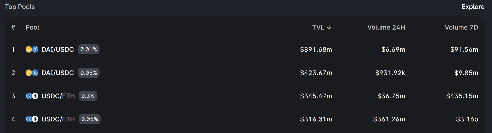
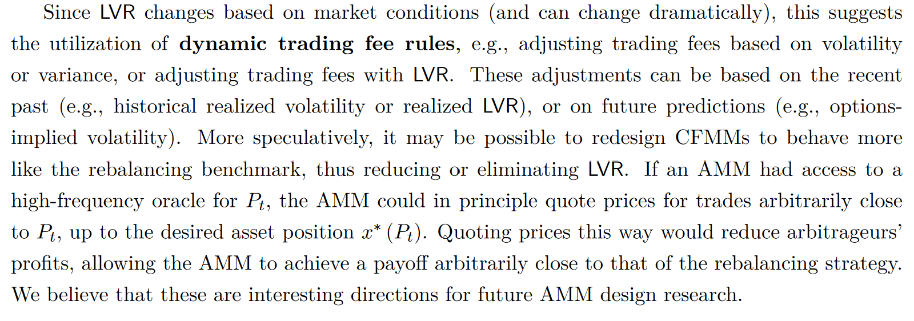

# Why Use a Dynamic Fee for Liquidity Pools?

*This is the first in a series of multiple posts by [0xfbifemboy](https://twitter.com/0xfbifemboy) about dynamic fee policy for AMM liquidity pools.*

It is [well understood](https://rekt.news/uniswap-v3-lp-rekt/) that Uniswap V3 liquidity providers are at best inconsistently profitable. Furthermore, analyses we performed several months ago [demonstrated](https://crocswap.medium.com/unraveling-a-puzzle-a-per-wallet-analysis-of-eth-usdc-liquidity-on-uniswap-v3-a00b0f836ac3) that even when conducting detailed, per-wallet analyses, systematic predictors of LP position profitability, net of divergence loss (also known as 'impermanent loss'), are extremely difficult to identify.

This is not a good situation! Abundant on-chain liquidity is a cornerstone of decentralized finance that enables easy composability between different protocols. Moreover, liquid token swapping is one of the most popular on-chain activities. If liquidity providers are systematically losing money, they should rationally stop providing on-chain DEX liquidity, effectively shutting down a wide range of cryptoeconomic use cases.

These considerations motivate the following question: *Is it possible to build a DEX that helps liquidity providers make money?* In the long run, a DEX that optimizes toward LP profitaility will attract the deepest and most sustainable liquidity compared to those that do not, resulting not only in LP profits but also a superior user experience.

In this series of articles, we will motivate the construction of a basic, *proof-of-concept* dynamic fee policy which is superior to remaining in a static Uniswap fee tier and which allows LPs to reap higher and more consistent profits net of divergence loss. Due to the inherent complexity of this topic, we will seek to progressively work through the details of a dynamic fee policy over the course of multiple posts. In the first installment, we will simply aim to briefly lay out our thinking about why a dynamic fee policy would be helpful and, crucially, our proposed empirical framework for constructing a dynamic fee policy in the context of deep preexisting liquidity on other decentralized venues.

To understand the need for a dynamic fee rate, it is informative to examine the simple case of ETH/USDC liquidity. Notably, the two largest non-stablecoin/stablecoin pools on Uniswap V3 are the USDC/ETH 0.3% and USDC/ETH 0.05% pools:

By and large, swaps between ETH and USDC on Ethereum mainnet flow through either the 0.3% or 0.05% pool — generally the latter, due to its lower fee rate, but the former still manages to capture a sizable amount of volume. There is also a 1% fee rate pool, albeit with substantially lower TVL and swap volume.

We immediately see one clear motivation for a dynamic fee rate: there is substantial overhead associated with increasing the "price" of the liquidity that you supply! Suppose that a liquidity provider anticipates higher market volatility in the next week; they might correspondingly wish to move their liquidity position in the 0.05% pool to a higher fee tier (correspondingly, roughly, to a larger bid-ask spread in a traditional order book). Doing so requires burning their liquidity position in the 0.05% pool and re-minting a new liquidity position in the 0.3% pool, which introduces a fixed gas cost as well as substantial logistical complexity. As such, liquidity providers may miss out on highly profitable fee generation opportunities if they are not well equipped to handle the complexity of active position management.

It is valuable to note that the notion of a dynamically adjusting liquidity fee is not novel. For example, a recent paper by [Milionis, Moallemi, Roughgarden, and Zhang](https://moallemi.com/ciamac/papers/lvr-2022.pdf) suggests that AMMs might want to adjust trading fees based on ambient market conditions:

Specific proposals have also been made toward particular models for calculating an "optimal" dynamic fee, such as work by [Guillaume Lambert](https://lambert-guillaume.medium.com/designing-a-constant-volatility-amm-e167278b5d61) which proposes a fee which is adjusted dynamically so as to target a constant implied volatility. However, notably, the discussion of dynamic fees has typically focused on a theoretical setting where the DEX is assumed to be operating in a relatively stylized environment, without other competing sources of liquidity aside, perhaps, from a reference exchange where price discovery occurs.

Although the theoretical question of what the "best model" of dynamic fees is remains important, we first propose to analyze a simpler, and perhaps more empirically tractable, question. Suppose that a new DEX is created with a dynamic fee policy. For simplicity, consider only ambient liquidity. What considerations does the *marginal unit of additional ETH/USDC liquidity* face? We see immediately that we have to consider the overall state of the *market for liquidity* — namely, the swap fee should probably be not too much lower than 0.05% and not too much higher than 1%. There is such a glut of Uniswap V3 liquidity provided at the 0.05% and 1% fee rates that venturing too far out of this range for a marginal unit of liquidity is likely inefficient. If the fee is much lower than 0.05%, then the liquidity will likely capture the same swap volume at 0.05% or slightly below; conversely, if the fee is much higher than 1%, the liquidity will likely be outcompeted by the large amount of ambient liquidity available in the Uniswap 0.3% and 1% pools.

We are now beginning to converge on a simpler operationalization of the problem of setting a dynamic fee rate, at least (1) in the case of ETH/USDC and (2) assuming that the amount of liquidity added is a small fraction of that available on Uniswap. The observation that a dynamic fee policy in this case must empirically demand on the dynamics of pre-existing liquidity on other venues allows us to transform a challenging theoretical question to a more tractable empirical question, and any conclusions we draw here may eventually help us in relaxing both of those assumptions.

To be precise, we can ask the following question: for a marginal unit of additional liquidity, *assuming that Uniswap liquidity pools remain as they are,* what should the dynamic fee rate be set to? We propose that this fee is well estimated by the following procedure. At any given point in time, we may ask the following question: which of the three ETH/USDC Uniswap pools (0.05%, 0.3%, 1%) will have the highest fee accrual for a unit of ambient liquidity over the next several minutes? We should be able to estimate a probability distribution over the three pools: for example, we may have 80% confidence that the 0.3% pool will be the highest performing over the next 10 minutes, 15% confidence in the 0.05% pool, and 5% confidence in the 1% pool. There are various options for a choice of dynamic fee which naturally follow from the concept of such a probability distribution; for example, we might choose weighted sum of the three Uniswap pool fee rates: `0.8*0.003 + 0.15*0.0005 + 0.05*0.01 = 0.002975`, or a 0.2975% swap fee; alternatively, we might simply choose the fee rate with the highest probability estimate, in this case 0.3%.

Notice that we have reduced a hard theoretical question into what can even be framed as a simple regression problem. At each point in time, one might imagine collecting an assortment of historical variables: statistics about the three Uniswap pools at past timepoints or even external metrics such as on-chain activity or CEX funding rates. With this data, one can then predict the fee growth for each of the three Uniswap pools over the next interval of time, the probability that any given pool will have higher fee growth than the other two, *etc.* The resulting predictions may then inform our choice of a dynamic fee policy. In the special case where the dynamic fee is chosen to be equal to one of the three Uniswap fee tiers, the performance of the dynamic fee policy can be easily compared, head-to-head, against the static fee tiers by simulating the growth of ambient liquidity that moves between the three static pools according to our dynamic fee policy.

Additionally, the scope of these results is not necessarily limited to ETH/USDC pools alone! Rather than analyzing each liquidity pool as its own, isolated environment, we may take advantage of the well-known facts that altcoins farther out on the risk curve often trade, to some extent, like "levered ETH," suggesting that the same statistical signals that predict fee tier performance in static ETH/USDC liquidity pools may also retain value in liquidity pools for, say, ETH/LDO or ETH/FXS. In general, because market volatility is often downstream of factors that affect *all* markets, such as macroeconomic developments or crypto-wide regulatory considerations, we should expect that the same signals that predict fee tier performance in static ETH/USDC pools can be generalizable, with appropriate transformations, to liquidity pools for other types of assets. As such, an in-depth empirical analysis of ETH/USDC fee dynamics — in a market which can plausibly be claimed to represent the purest "crypto market beta" — may in principle provide the foundation for a dynamic fee policy that can be applied to arbitrary pairs of assets ranging from pairs of custodial stablecoins to highly speculative liquidity for new protocol tokens.

In subsequent posts in this series, we will follow the course of empirical analysis plotted above. In particular, we will explore the dynamics of fee growth between the three static ETH/USDC tiers, construct a dynamic fee policy that plausibly outperforms each of the static fee tiers again, and characterize its generalizability across other dimensions (to different chains, different token pairs, and so on). Stay tuned for the next installment — and in the interim, any and all thoughts are of course very welcome!