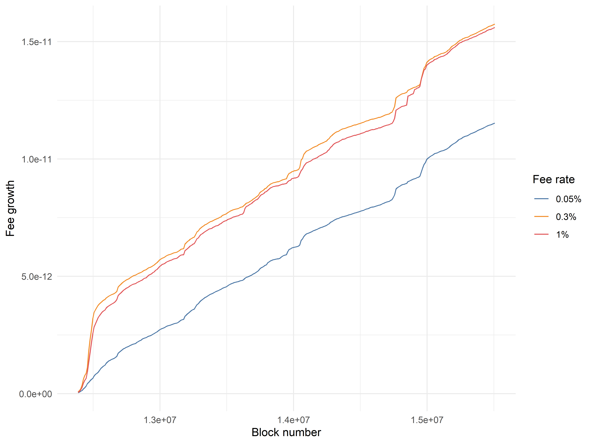
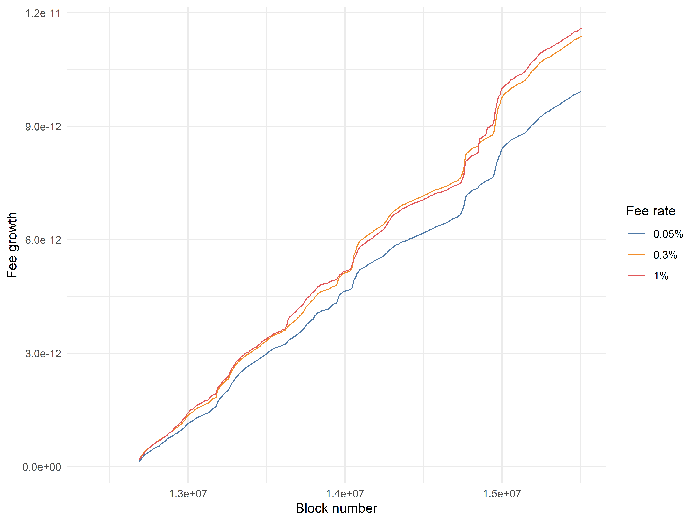
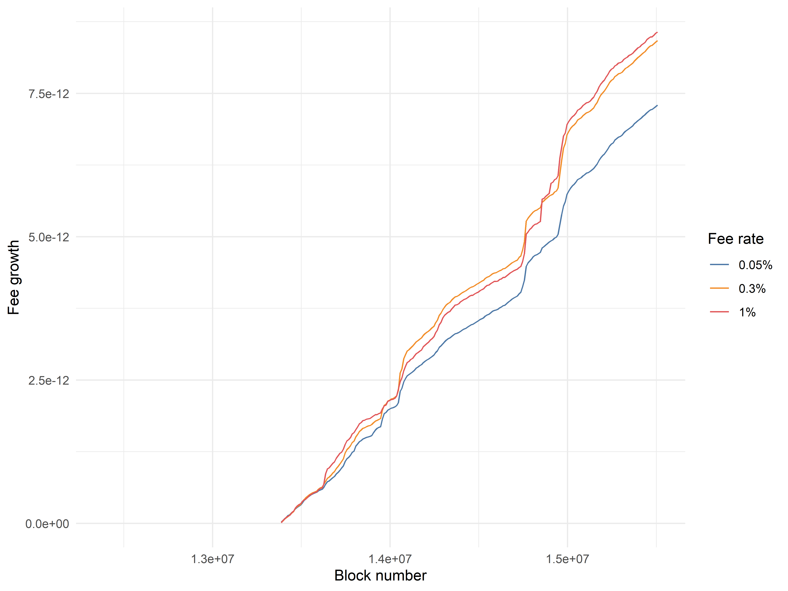
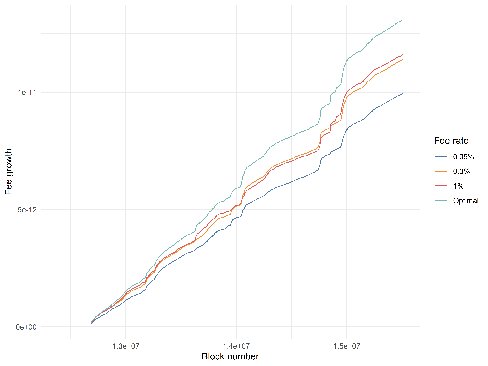
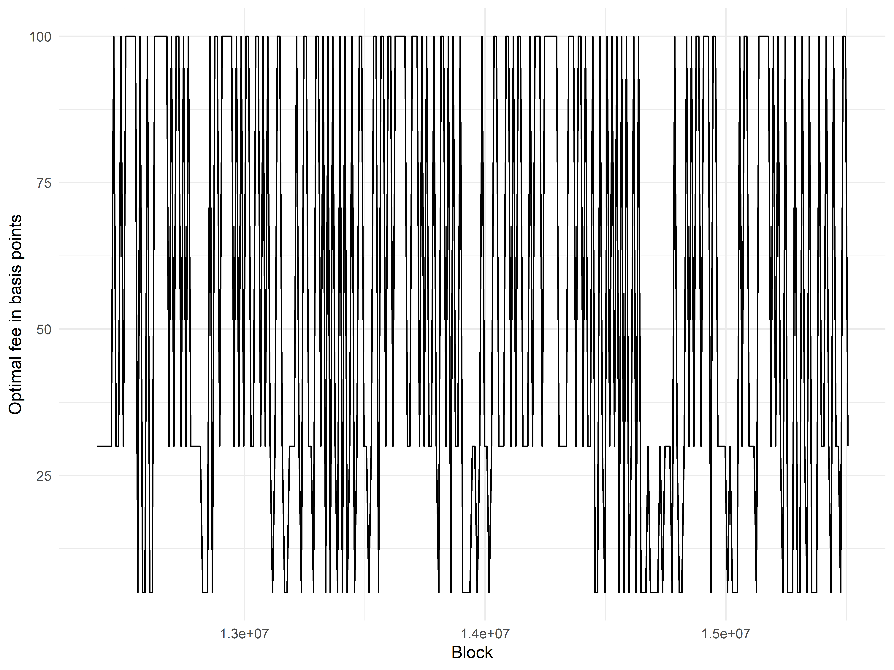
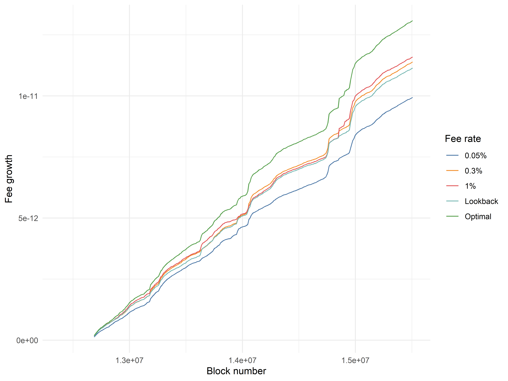
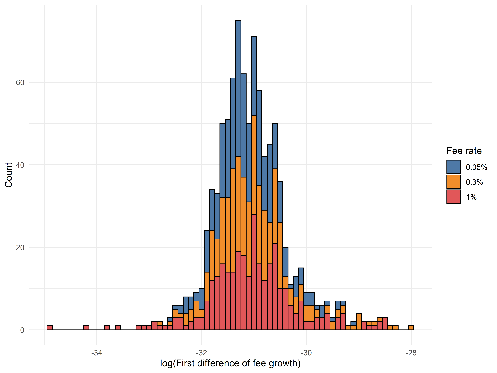

# Exploring Low-Resolution Dynamics of Uniswap Fee Performance

*This is the second in a series of multiple posts by [0xfbifemboy](https://twitter.com/0xfbifemboy) about dynamic fee policy for AMM liquidity pools.*

In a [previous post](https://crocswap.medium.com/why-use-a-dynamic-fee-for-liquidity-pools-def07a1e6c3b), we laid out an empirical framework for construction of a ETH/USDC dynamic fee policy. This article builds on that empirical framework by looking at *low-resolution* (one snapshot every 10,000 blocks) Uniswap data for its three ETH/USC liquidity pools. While we will ultimately find that we need to look to higher-resolution data in order to build a dynamic fee policy that outperforms static fee tiers, the work presented in this article is a gentle introduction to the sources of data that we are drawing from as well as our analytic approach overall.

As mentioned previously, we have one principal question before us: How can we estimate which Uniswap fee tier will outperform in the next interval of time? We begin by first determining *how* we can quantify the relative performance of each pool compared to the others. Thankfully, each Uniswap V3 pool contract contains two state variables, `feeGrowthGlobal0X128` and `feeGrowthGlobal1X128`, which represent "the total amount of fees that have been earned per unit of virtual liquidity over the entire history of the contract [*i.e.*] the total amount of fees that would have been earned by 1 unit of unbounded liquidity that was deposited when the contract was first initialized." Comparing the rate of change of these variables between the three liquidity pools will allow us to determine which pool, over any given interval of time, had the highest fee accrual compared to the others.

In order to begin exploring fee dynamics, we first retrieved the values of `feeGrowthGlobal0X128` and `feeGrowthGlobal1X128` for each of the three Uniswap ETH/USDC liquidity pools in intervals of 10,000 blocks (approximately 1.5 days) apart. Importantly, Uniswap V3 fees are collected in each of the two tokens separately (based on the direction of the swap), so it is necessary to combine `feeGrowthGlobal0X128` and `feeGrowthGlobal1X128` while accounting for the variation of ETH price in USD over time. We took the first difference of these two variables, converted the differences into corresponding USD values using the pool's ETH to USDC price (`sqrtPriceX96`) at the same block, summed them together, then recomputed a cumulative sum over time to determine the cumulative USD fee growth per 1 unit of ambient liquidity over time. Note that this cumulative fee growth statistic assumes that you begin with 1 unit of ambient liquidity at the beginning of each 10,000 block interval, *i.e.,* fee compounding is ignored; this is equivalent to taking into account compounding and logarithmically scaling the ordinate, just a little simpler to implement.

Visually, the growth rates appear relatively similar; however, in the first week or two of the data, the 0.05% pool substantially underperforms the other two, and this underperformance is permanently captured in the long-term trend. However, the underperformance was plausibly due to idiosyncratic factors related to the launch of Uniswap V3; as such, we can obtain a more accurate comparison by trimming off the first several time periods and recalculating cumulative fee growth.

Interestingly, once we do so, it becomes quite clear that the 0.05% pool is systematically underperforming the fee accrual of the 0.3% and 1% pools. Between the 0.3% and 1% pools, cumulative fee accrual is relatively evenly matched. A similar pattern recurs if we restrict to a different starting point:

Overall, it appears that we can plausibly claim that the 0.05% liquidity pool is receiving an excess supply of liquidity, not accounting for differences in the concentration of individual liquidity positions. These observations motivate our next exploration: suppose that at the beginning of each period of 10,000 blocks, we had perfect foreknowledge of which of the three Uniswap liquidity pools would have the highest fee accrual in that period as well as the ability to costlessly move our liquidity to that pool. In this situation, where we "optimally" switch between the three fee tiers with perfect foreknowledge on a 10,000 block frequency, what would our cumulative fee accrual look like?

Unsurprisingly, the "optimal predictor" outperforms staying in any individual liquidity pool by a substantial margin, eventually attaining a terminal value 12.9% greater than the 1% fee pool and 31.8% greater than the 0.05% fee pool. A low double-digit performance improvement for a model with perfect foreknowledge may initially seem underwhelming; however, it is crucial to note that this model is only switching between fee tiers at an extremely low frequency (\~1.5 days)! Periods of elevated volatility often last minutes or hours rather than weeks, so it is plausible that an imperfect model that switches between fee tiers at a much higher frequency could perform comparably to this "optimal" but low-frequency model.

It is also valuable to briefly note that this model is not, in principle, the highest performing dynamic fee strategy that could be implemented on an external, non-Uniswap DEX. For example, a dynamic fee model that sets the fee to the tier recommended by the "optimal predictor" model minus a single basis point might find outsized gains from systematically undercutting a large tranche of Uniswap liquidity. Alternatively, setting the fee rate to an intermediate value not represented in the three fee tiers might also result in outperformance of this model if done correctly. However, it is difficult to model the hypothetical flow of liquidity in the presence of additional pools of liquidity, so we will reserve considerations of these complexities for later.

How often does the "optimal predictor" model switch between the 0.05%, 0.3%, and 1% fee tiers? We find that it spends about 40% of its time in the 0.3% and 1% pools and 20% of its time in the 0.05% pool:

Although the plot is a little messy, it is clear that there is occasionally "persistence" of the choice of optimal fee tier across more than one interval of 10,000 blocks. This motivates the construction of a simple model without foreknowledge, where we look at the fee tier which outperformed best in the latest period of 10,000 blocks and select that fee tier for the next interval. The performance of this model is plotted below, as the "Lookback" model.

Unfortunately, this "single-period lookback" model underperforms the 0.3% and 1% fee tiers, although it still substantially outperforms the 0.05% fee tier. Examining the data more closely, we find that the average length of time the model "dwells" in a specific fee tier is equal to 1.58 intervals of 10,000 blocks, which is intuitively not sufficiently long for a simple lookback model to work well. This is a clear suggestion that there are substantial gains to be made by looking at higher-resolution data; because the selection of the optimal fee tier is not an unpredictably random process, looking at a sufficiently small time interval should allow us to detect persistence of pool outperformance across multiple intervals.

One last observation about this low-frequency dataset: if we examine the distribution of fee accrual per each 10,000 block interval, it is clear that the 0.3% and 1% pools have a wider distribution of outcomes than the 0.05% pool:

In other words, the lowest fee tier, 0.05%, is the most consistent of the three pools in generating a steady flow of swap fees for liquidity providers. Intuitively, this makes sense, as swaps should by default use the cheapest liquidity available; it is mainly in times of heightened volatility, when there is an inadequate supply of cheap liquidity, that the more expensive fee tiers receive a disproportionate amount of swap volume, hence the wider variance in their distributions of outcomes.

Overall, while we were unable to trivially construct a low-frequency dynamic fee policy that outperforms Uniswap's static fee tiers, we obtained some compelling evidence that 10,000 blocks is (perhaps unsurprisingly) far too low of a resolution for studying fee dynamics. We also introduce the concepts of the theoretically "optimal" predictor, which represents perfect foreknowledge of fee outperformance, as well as the idea of a "lookback" predictor that uses information about fee outperformance in the past several fee tiers.

In the next article in the series, we will extend these same principles to analysis of Uniswap fee pools at a much *higher* resolution, namely a 10-minute resolution. Will a straightforward application of these same ideas allow a liquidity provider to easily outperform Uniswap's static fee tiers? Or will it be very challenging to find consistent ways to outperform? How do our dynamic fee policies stack up against the divergence loss that liquidity positions are always exposed to? Stick around for the next installment to find out!