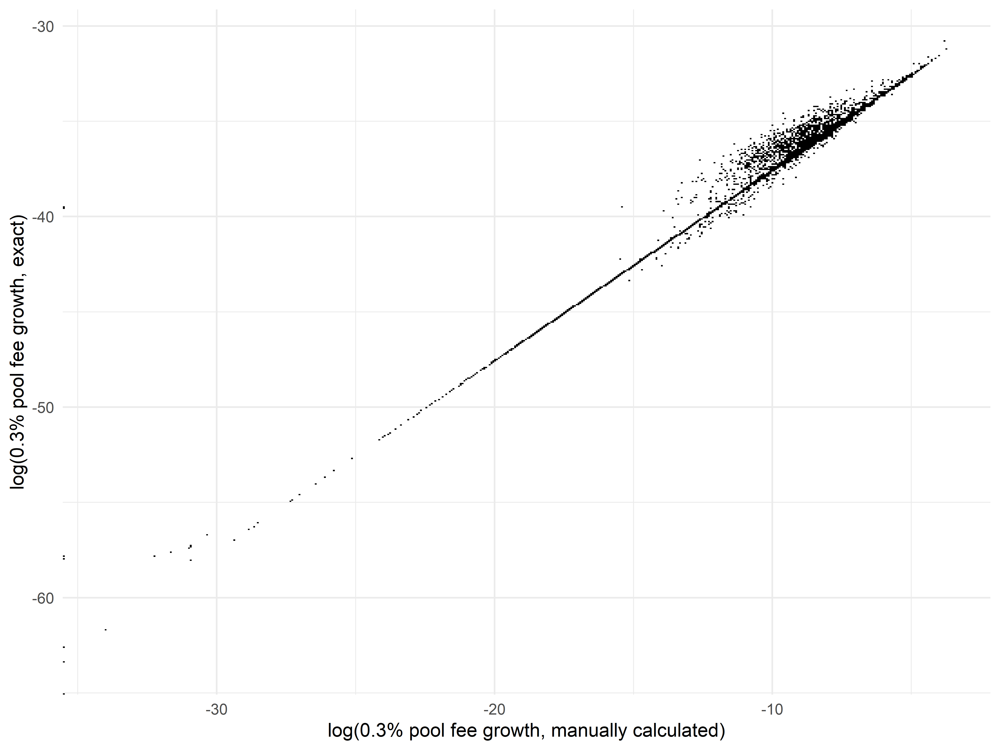
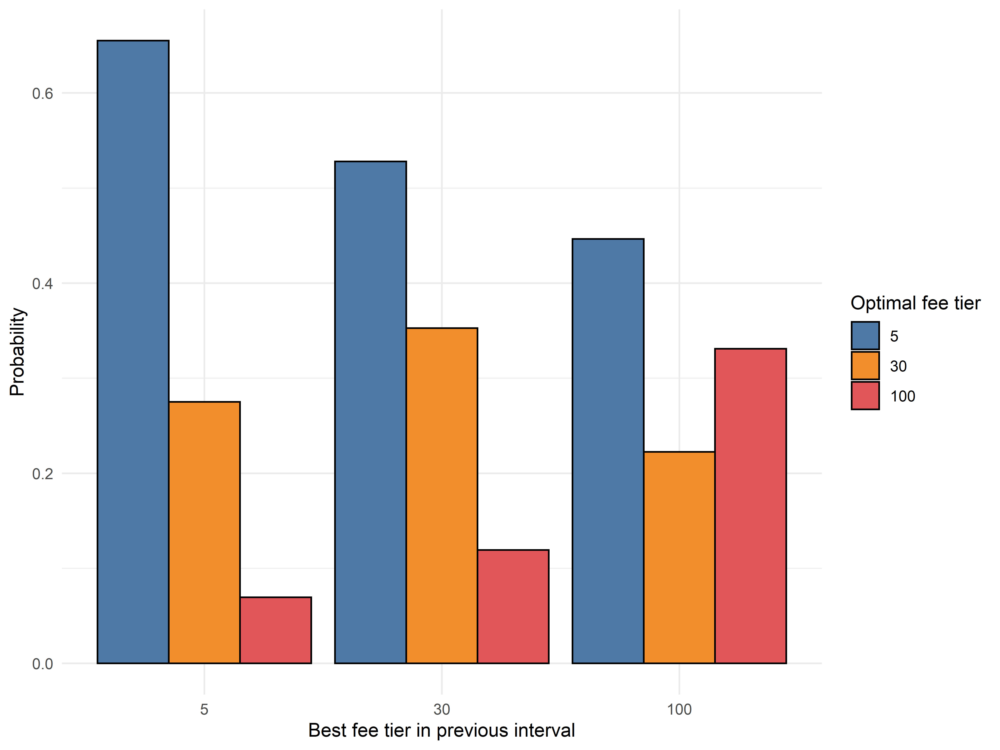

# Designing a Dynamic Fee Policy that Outperforms All Uniswap ETH/USDC Pools

*This is the third in a series of multiple posts by [0xfbifemboy](https://twitter.com/0xfbifemboy) about dynamic fee policy for AMM liquidity pools.*

[Previously](https://crocswap.medium.com/exploring-low-resolution-dynamics-of-uniswap-fee-performance-820bea2f0b90), we explored the dynamics of Uniswap ETH/USDC fee accrual across the three static fee tiers by looking at extremely *low-resolution* data (one snapshot every 10k blocks). We found that it was challenging to design a simple strategy that used historical data to select the fee tier in the next time interval, but we also identified several indications that we could benefit from looking at higher-resolution data, where fee outperformance of a specific pool in one time interval might have a better chance of carrying over through the next time interval.

## Initial analysis

To move past the simplistic, low-resolution analysis, we collect two new sources of data: (1) the entire swap history of the three Uniswap pools and (2) the same `feeGrowthGlobal0X128` and `feeGrowthGlobal1X128` variables collected above, but at a higher time resolution of approximately 10 minutes. In principle, knowing the swap history, one could directly calculate a rudimentary version of `feeGrowthGlobal0X128` and `feeGrowthGlobal1X128` by taking the swap volume in each time interval, multiplying by the fee rate, and dividing by the amount of active liquidity; however, this relies on careful bookkeeping of all concentrated liquidity positions and summing up mints and burns accurately, leading to an additional source of error in the results. That is why we chose to query the `feeGrowthGlobal` variables from EVM storage directly.

That is not to say that a direct calculation of `feeGrowthGlobal` is entirely useless, however. Even if the manual calculation from swap volume is inaccurate, we should still expect to see a reasonably tight correlation with the exact `feeGrowthGlobal` variables in contract storage; conversely, observing a tight correlation gives us confidence that our swap volumes are reasonably accurately determined. Fortuitously, it does appear that a tight correlation does hold, for example in the 0.3% pool:

Similar results are observed for the other two liquidity pools, suggesting that our swap volumes (and other values derived from swap data, such as measures of volatility) are reasonably accurate. If we shift the values of either axis by a single increment in either direction, the correlational structure is largely lost, as seen below.

On one hand, this gives us additional confidence that our data are not subject to any "off-by-one" problems and that we have, in general, joined the swap volume data and the `feeGrowthGlobal` data together accurately; on the other hand, the much weaker correlation here means that a "lookback predictor" that moves liquidity to the fee rate which performed best in the previous 10 minutes will substantially underperform the theoretical optimum.

We test this directly by computing, as we did with the larger time intervals, cumulative fee growth statistics that track (1) an optimal predictor that moves between the 0.05%, 0.3%, and 1% pools with perfect foreknowledge and (2) a one-interval lookback predictor that stays in the best-performing pool in the most recent time interval.

As we hoped, the optimal predictor outperforms the static fee tiers by an enormous margin, with over twice the rate of fee accrual! While the one-interval lookback predictor (labeled "Lookback" in the plot) does not perform nearly as well as the optimal predictor, it still outperforms all three of the static fee tiers. As a matter of fact, this one-interval lookback predictor, while exceedingly simple, already specifies a dynamic fee policy which clearly outperforms all three static fee pools!

Interestingly, the average "dwell time" for the optimal fee predictor is 2.13, which is meaningfully but not dramatically greater than the average "dwell time" of 1.58 intervals with the low-resolution data. In theory, it might be possible to improve the performance of the one-interval lookback predictor by using even smaller time intervals, although it is likely impractical to go much further in that direction due to excessive transaction fees from high-frequency fee updates. Hopefully, we will be able to narrow the gap with the theoretical optimum with alternative methods.

We also previously observed that the optimal predictor using 10,000 block intervals spent a *minority* of its time (\~20%) in the lowest fee tier. This is a little unexpected, as the typical market-making model in an orderbook setting is to quote a tight bid/ask spread most of the time and widen spreads in times of heightened uncertainty. However, we know that 10,000 blocks is such a large time interval that it obscures most of the dynamics of relative performance between different fee tiers. Does this unexpected observation also hold true when we use 10 minute time intervals instead?  As a matter of fact, it does not. When we examine the optimal predictor in the higher-resolution data, we find that it spends 60% of its time in the 0.05% pool, 30% of its time in the 0.3% pool, and only 10% of its time in the 1% pool, corresponding nicely to the analogous behavior of market makers in orderbook settings and further validating our choice of a smaller time interval.

## Extending the lookback model

How much further can we push the one-interval lookback model? If the only thing we are allowed to observe is the best-performing fee tier of the latest time interval, the space of models is quite limited (in fact, there are only 9 possible models). Suppose we ask the following question: if the best-performing fee tier of the latest time interval was *X* and we switch liquidity to fee tier *Y*, what is the average fee accrual? It turns out that simply "copying" *X* over to *Y* is quite close to optimal, within this limited model space:

The above plot has several interesting properties. As the fee rate of the best-performing fee tier in the previous interval increases, we notice that the average fee accrual increases overall, regardless of what fee tier is selected next. This matches our general intuition that higher fee tiers perform better in volatile environments, where the fee accrual of the 0.3% or 1% pools spikes due to an acute increase in the overall demand for liquidity. Additionally, when the best performing fee tier is 1%, the returns to selecting the 1% fee tier again in the next time interval are quite high! This suggests that there is great value in being able to accurately detect the "persistence" of the volatile periods where higher performing fee tiers outperform.

This narrative is supported by a direct examination of the "transition probabilities" of moving from optimal fee tier *X* at time *t-1* to optimal fee tier *Y* at time *t*, as shown below.

Notice that regardless of the optimal choice of fee tier at time *t-1*, it is most probable that the choice of optimal fee tier at time *t* is the 0.05% pool rather than the 0.3% or the 1% pools. How can we reconcile this with the success of our lookback model? The answer must lie in the fact that while the 0.05% pool is the most probable optimal fee tier, it outperforms to a smaller degree compared to when the 0.3% pool or, especially, the 1% pool experiences strong fee accrual.

The above analysis suggests that we have almost fully captured the signal of a one-period lookback with our naive lookback strategy. However, a simple way to extend this model is to simply use a *two-period* lookback, where we decide on the the fee rate at time *t* based on the optimal choice of fee tier at times *t-2* and *t-1*. First, we calculate the average fee accrual of selecting a given fee tier at time *t*, conditional on each of the 9 different Possibilities for optimal choices at *t-2* and *t-1*:

We can immediately notice differences from the one-period lookback. For example, if the optimal fee tiers at *t-2* and *t-1* were 1% and 0.3% respectively, the one-period lookback would suggest selecting the 0.3% fee tier at time *t*, whereas the optimal choice with two-period lookback is to return back to the 1% fee tier. In general, these results are consistent with our prior hypothesis that a large proportion of the gains come from successfully recognizing "regime shifts" where the higher fee tiers, especially the 1% fee tier, outperforms by a large margin.

Almost by definition, we know that the two-period lookback model should strictly outperform the one-period lookback when measured over the entire dataset. However, what is the actual quantitative degree of outperformance?

Looking at the cumulative fee growth of the two-period lookback model, labeled above as "Lookback v2", we see that it outperforms the one-period lookback model by a small but noticeable margin — an impressive gain for such a tiny increase in model complexity! One interpretation of the additional return is as follows: even in periods of high volatility, where the 0.3% or 1% fee tiers outperform, there is inevitably going to be interval-to-interval variation in swap volume and relative fee accrual. For example, even if we are in a "regime" where the 1% fee tier is generally outperforming, it is possible that, from time to time, the optimal fee tier in a specific time interval may drop to 0.05% due to random variations in swap volume or price action. Assuming you are in such a regime, it is desirable to "smooth over" such variations, because of the asymmetric returns of correctly identifying time intervals where higher fee tiers outperform. Accounting for multiple time intervals in our lookback models implicitly takes the benefits of such "smoothing" into account.

The astute reader may notice at this point that our model is now effectively being "trained" on the dataset and, consequently, that it is improper to measure the performance of this model on the exact dataset where was trained. In principle, we want to ask: what is the performance of this model if, at any given time *t = T*, we train the model using all data where *t < T* and predict the optimal fee setting at *t = T*? We will explore this further in the next section.

At this point, it is natural to suspect that extending the lookback model even further back in history will only yield very marginal returns. In theory, of course, it is possible that there could be unusual nonlinearities that only begin to show up with sufficiently many lookback periods. At the risk of overly belaboring the point, we extended the lookback model to use *three* historical periods, *i.e.,* choosing the fee tier at time *t* based on the outperforming fee tiers at *t-3*, *t-2*, and *t-1*. The cumulative performance of this model is plotted below, as "Lookback v3":

As expected, the improvement in performance over the two-period lookback model is nonzero but extremely slight, and it is likely safe to say that extending the lookback model with more "local history" will not prove to be a fruitful endeavor. To develop dynamic fee models with superior performance, we will have to begin incorporating in other variables into our analysis beyond the choice of optimal fee tier in the last 1 to 3 time intervals. For example, we might look at swap volume, price volatility, CEX metrics like the funding rates of perpetual futures, or the actual quantitative *degree* of historical fee outperformance rather than simply the *choice* of optimal fee tier in prior time intervals.

What we have learned from exploring simple lookback models will serve as a valuable foundation for more complex analyses. We have observed that historical fee outperformance is a high-signal predictor that we should incorporate into our models. Beyond that, the observation that there are effectively zero marginal returns to incorporating more than 3 historical time periods into our simple lookback model gives us a vague sense of the "local timescale" over which we should measure other variables such as swap volume or price volatility.

## Training models on historical data

As discussed above, it is improper to train and evaluate dynamic fee policies on the same dataset — we only did so previously due to the convenience of easily illustrating the benefit of extending our simple model to use more historical data. However, of course, the resulting fee policy uses data from July 2021 through September 2022; if, say, we were attempting to use a dynamic fee policy at any time in between, for example May 2022, we would only have access to data up to that point!

If, at any given time *t = T*, we only restrict ourselves to data generated at times *t < T*, one can conceive of quite a diverse array of methods to develop fee policies from that historical data. As mentioned, one might simply apply the same strategy as with the three-period lookback model on data at *t < T* to set a dynamic fee at *t = T*. Alternatively — and this is a somewhat separate but still interesting point — it is valuable to note that the three-period lookback model we previously developed essentially uses *global* data to predict a *local* phenomenon. Conceivably, the relative fee growths of the 0.05%, 0.3%, and 1% pools in the last 24 hours might be far more informative for predicting the best fee tier at *t = T* than the relative fee growths in a 24 hour period many months back in time. Correspondingly, one might imagine a dynamic fee policy that only takes into account the latest *N* days of fee growth history, or perhaps uses all data *t < T* but assigns greater importance to more recent data.

Rather than explore every possible direction of inquiry here, we will postpone their exploration to a later date, when we can more explicitly create predictive models for optimal fee selection using a wider array of variables, as previously mentioned. Instead, we will explore a simple extension to the three-period lookback model where, at each time *t = T*, the only data used to generate the dynamic fee policy is data at *t < T*. For computational simplicity, the new dynamic fee policy is only regenerated once every 24 hours and is constrained to use at least 1 month of historical data (*i.e.,* the model makes no predictions for the first month's worth of data).

Doing so, we find that this model, termed "Lookback v4" below for lack of a better name, substantially underperforms not just the original three-period lookback model ("Lookback v3") but also the original, single-period lookback model ("Lookback")!

In some sense, this is actually a little surprising. The original, single-period lookback model simply replicated the best-performing fee tier in the previous time interval and did not involve any global computations over the entire dataset, and so we should expect that a model which takes into account more data (both in terms of using all data *t < T* to calculate transition probabilities and payoffs as well as determining optimal choices for each of 27 different scenarios based on the last 3 time intervals) should readily outperform such a simple model — yet that does not seem to be the case. At the very least, however, our more principled "Lookback v4" model still readily outperforms all of the three static fee tiers.

Looking closely, it almost appears as though the relative performance of the "Lookback v4" model is steadily increasing over time. The effect is marginal, but it does appear to be "closing the gap" with the (unprincipled) "Lookback v3" three-period lookback model over time. One interpretation is that as the "Lookback v4" model accumulates a larger history of data over which it calculates a dynamic fee policy, those predictions become increasingly accurate; indeed, at the highest timepoint, the dynamic fee policy should be nearly exactly the same as the fee policy used in the v3 model.

One way to check this narrative is to only begin calculating cumulative fee growth halfway into the dataset, where the v4 model begins with access to half a year's worth of data rather than just a single month:

In this case, over the long run, the v4 model is clearly outperforming the naive, single-period lookback model we started with, and is halfway "caught up" to the cumulative fee growth of the unprincipled v3 model! On the other hand, one could argue that this is confounded by the ordering of events in the dataset — if we shuffled the training data (on the level of days or months to preserve local structure), would we regain the same result?

Again, we will reserve consideration of these complexities for a fuller analysis. We have, by and large, achieved our principal goal with the lookback analyses, which is to demonstrate a *proof-of-concept* for an dynamic fee policy which is likely superior to any of the three static fee tiers.

(*N.B.* One might reasonably wonder whether it is fruitful to naively extend the lookback extent to a greater number of time intervals when we only allow usage of data at time *t < T*, the principle being that a greater "search depth" might in a sense be more useful when data is relatively scarce, the principle being that it might allow for capturing lower-frequency signals that are unnecessary or redundant in the case where one trains the model on all available data. When attempted, the benefit of doing so was effectively zero.)

## Accounting for divergence loss

Finally, before moving on to more sophisticated model construction, we ought to revisit the original premise of optimizing fee accrual. Naturally, liquidity will flock to whatever platform allows it to accrue the most fees; however, beyond optimizing fee accrual for liquidity providers, the key question here is whether or not liquidity provision can be made into a *consistently profitable* endeavor *net of divergence losses (DL).* If we quadruple fee accrual but LPs are still bleeding money from divergence loss, the broader question of sustainable liquidity provision remains unaddressed. However, if we can improve fee accrual to a point that allows unprofitable or marginally profitable LPs to become consistently and reliably profitable, that is a very real and meaningful contribution to the broader cryptoeconomic ecosystem.

To calculate divergence loss in a manner directly comparable to our fee accrual statistics, we ask the following question: suppose you begin each time interval with one unit of ambient liquidity, which corresponds to some fixed quantities of USDC and ETH depending on the ETH/USDC price at that time. You can either burn the liquidity and hold the tokens directly or you can keep the liquidity as-is, in which case it will be convertible to different quantities of USDC and ETH if the ETH/USDC price has changed from the beginning to the end of the time interval. The USD value of your portfolio can be calculated in either of those two scenarios; the former is mathematically guaranteed to have a greater portfolio value than the latter, and the shortfall between the two values is denoted as divergence loss. While actual portfolio values in practice also vary due to direct exposure to asset values, we assume that liquidity providers are hedged against this exposure; while this assumption is not necessarily true in practice, it is the only practical way to perform a principled analysis of fees vs. DL without being hopelessly confounded by asset price fluctuations dependent upon extrinsic factors.

Subtracting divergence loss from fee accrual in each time interval and calculating the cumulative portfolio growth in USD (without compounding), we find that, unsurprisingly, a static portfolio that remains in one fee tier throughout the entire dataset does not perform very well:

The 0.05% fee tier has remarkably poor performance, with very few periods of positive returns after DL is accounted for. The 0.3% and 1% fee tiers perform relatively better; one unit of ambient liquidity minted at the start of July 2021 would be in profit today. However, the margin of profitability is low, and there are long, multi-month stretches of negative returns where fee accrual consistently fails to outweigh DL. Remaining in those fee tiers would be a very poor experience for a liquidity provider, who must wait out stretches of underperformance of indeterminate length just to "catch" the very short time periods with extraordinarily high fee accrual in those fee tiers.

However, if we perform the same fees-minus-DL analysis with our final v4 lookback model, we find that it is a marked improvement over the static fee tiers:

(Note that the cumulative fee accrual and DL are computed starting one month into the data, so that the v4 lookback model has a month's worth of training data to begin with.) The lookback model manages to deliver very consistent profits net of DL, outperforming the annual profits of the 0.3% or 1% fee tiers by a factor of 3 or greater. In addition to long-term outperformance, it also has much shorter stretches of local underperformance, while still managing to mostly capture the large spikes of fee accrual in the 0.3% and 1% liquidity pools — certainly a very desirable property for any liquidity provider.

It is worth explicitly drawing attention to the benefits of the dynamic fee model from the perspective of the liquidity provider. Obviously, a LP supplying liquidity to the 0.05% static pool will, over almost *all* intervals of time, be in the red due to insufficient fee accrual compared to divergence losses. However, even if liquidity is supplied to the 0.3% or 1% static pools, there can be *multi-month periods,* approaching a year or greater, where the LP might be continuously unprofitable net of DL, despite the fact that the *overall* profitability of an ambient position over our entire historical data range is positive!

In fact, suppose that we look at all possible 1-month intervals in the dataset. A liquidity provider in the 0.05% pool is profitable in merely 20.9% of these intervals; the 0.3% and 1% pools are not much better, with LPs being profitable in 61.7% and 42.7% of all intervals respectively. (Note that although the 1% pool has higher overall growth, it is also more volatile and underperformed the 0.3% pool for a large duration of its history.) However, the dynamic v4 lookback model is profitable in an astonishing 98.4% of all 1-month intervals! Even with such a naive model — one which only looks at three categorical variables, each with three possible values — the dynamic fee model we have constructed is not only superior in terms of higher returns, it is also *dramatically* superior in terms of *risk-adjusted* returns.

In summary, we have managed to use high-resolution data to construct a conceptually simple yet highly effective dynamic fee policy which significantly outperforms each of the three static Uniswap ETH/USDC fee tiers. This outperformance is reflected in both higher returns and lower volatility, which is especially apparent when returns are adjusted for divergence losses — the v4 lookback dynamic fee policy results in a sequence of portfolio returns which is qualitatively far more appealing to the prospective supplier of AMM liquidity than any of the static fee tiers individually, with much smaller and less prolonged drawdowns.

Can we improve even further on our simple v4 lookback model? In the next post in this series, we will explore the effect of adding variables such as trading volume, volatility, and even off-chain metrics to our models!