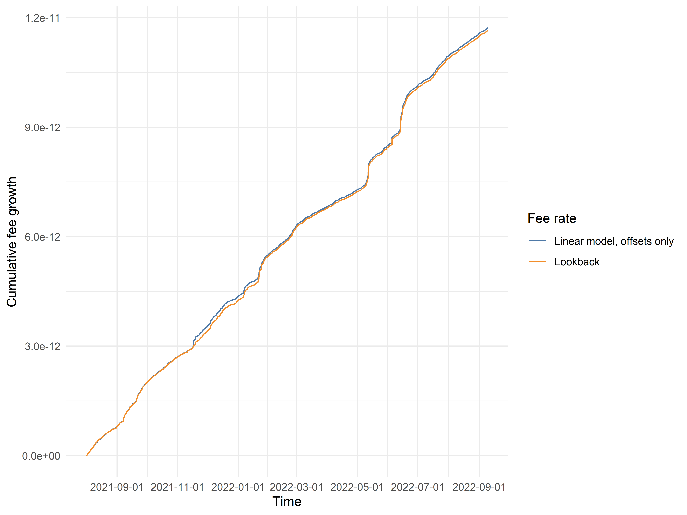
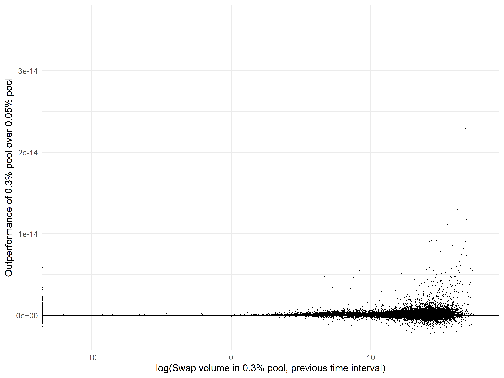
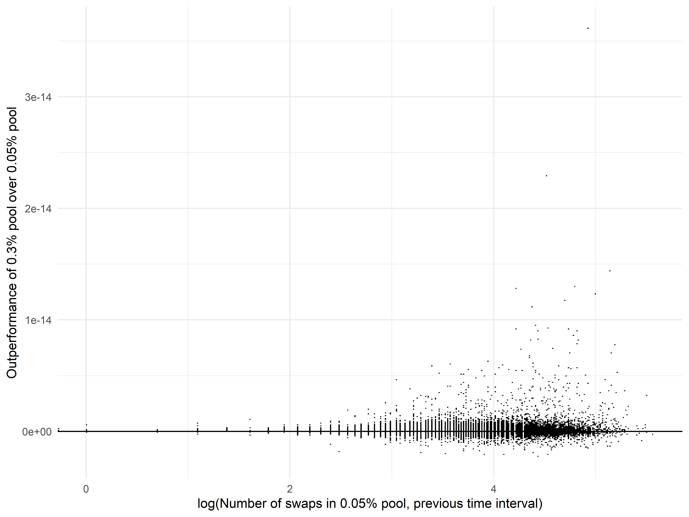
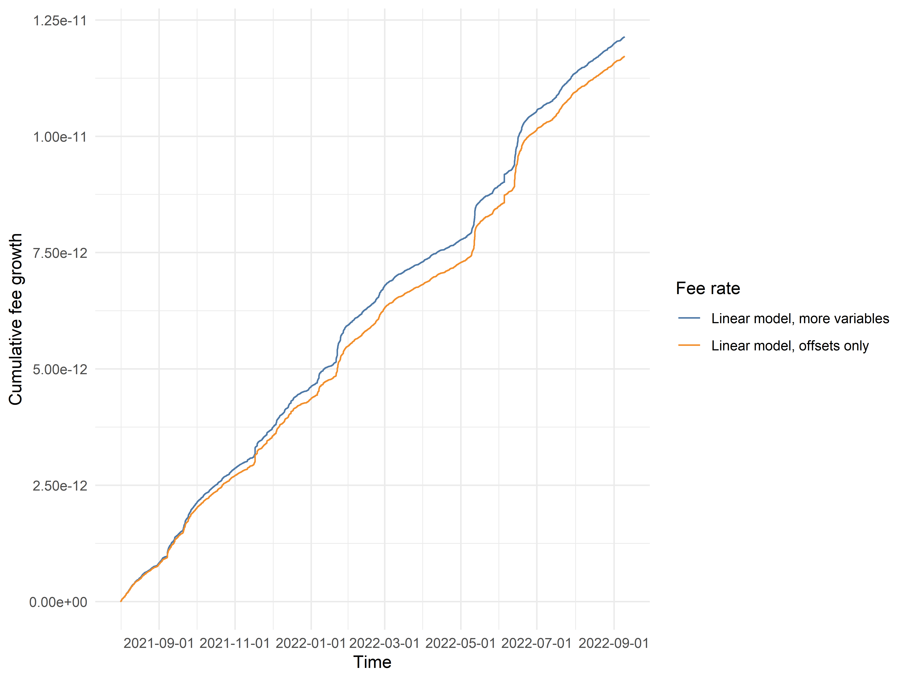
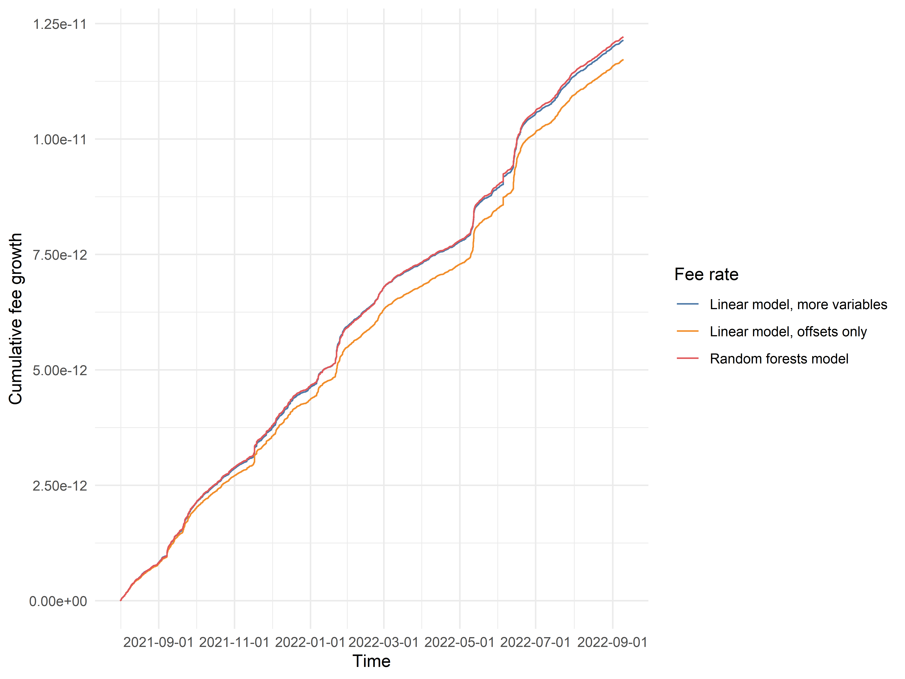
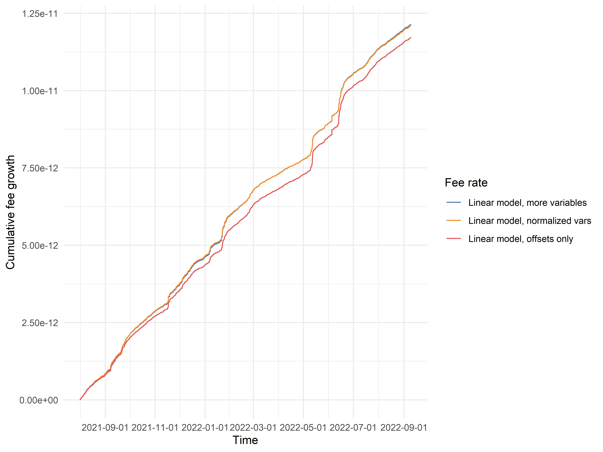
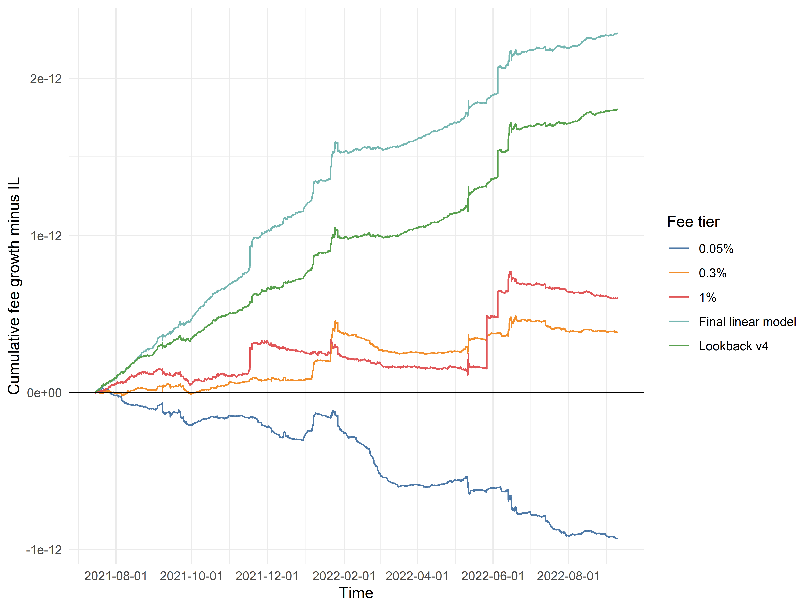

# Constructing Multivariate Models to Improve a ETH/USDC Dynamic Fee Policy

*This is the fourth in a series of multiple posts by [0xfbifemboy](https://twitter.com/0xfbifemboy) about dynamic fee policy for AMM liquidity pools.*

In the previous post in this series, we constructed a dynamic fee policy for ETH/USDC liquidity that cleanly outperforms all three of Uniswap's static fee tiers. However, we also noted that our model was extremely simple in construction. To refresh the reader's memory, our "lookback" model essentially executed the following algorithm:

1. For a given time interval of 10 minutes, determine which fee tier (out of the Uniswap 0.05%, 0.3%, and 1% pools) had the highest fee growth in each of the last 3 time intervals.
2. Use all available historical data to determine the highest-payoff selection of fee tier for the current time interval, conditional on the historical data in (1).

In effect, for each given time interval, we are classifying it as one of 27 distinct possibilities based on recent historical fee accrual data for Uniswap's liquidity pools. The choice of which fee tier to select next is based on two criteria: first, the *probability* that, conditional on the observed fee accrual history, a given fee tier will be the best-performing fee tier, and second, the *return* of correctly selecting that fee tier, also conditional on the observed fee accrual history. These are computed over all available historical data then multiplied together to determine the *expected payoff* of selecting a given fee tier, conditional on the observed fee accrual history. Finally, the fee tier with the highest payoff is selected.

To extend this to a more general framework, we could imagine, for example, also looking at trading volume in the previous time interval (*i.e.,* in the last 10 minutes). Trading volume is a continuous variable, so we could subdivide it into arbitrarily many divisions; for example, we could say that trading volume less than *X* represents one possibility, and trading volume greater than or equal to *X* represents another possibility. In total, we would now be calculating payoffs for each of 54 distinct historical scenarios!

One can see how extending this method to additional variables becomes overly cumbersome. Instead, we propose to take a more directly predictive approach to the problem. What we would like to determine is which fee tier to select in the next time period. In other words, there are two variables we would like to predict:

1. The fee accrual in the 0.3% pool minus the fee accrual in the 0.05% pool
2. The fee accrual in the 1% pool minus the fee accrual in the 0.3% pool

We could have chosen other differences (say, 1% pool minus 0.5% pool) to use, but regardless of the specific choice, it should be clear that these two differences (or some variation of them) are sufficient to fully determine our choice of fee tier. As such, this becomes an ordinary exercise in basic statistics: take a collection of historical variables (fee performance, volume, *etc.*); regress the two desired outcome variables against those historical variables; finally, use the trained models to make predictions and select the next fee tier.

In the following, we will explore the effect of adding different variables into our model or using different types of predictive modeling on our overall ability to predict the optimal selection of ETH/USDC fee tier. A note on implementation: in the previous post, we "retrained" our lookback model on a daily basis, incorporating new historical data into the payoff calculations at most 24 hours after it was generated. In principle, we need not retrain our model so rapidly; as the amount of total historical data increases, the effect of any marginal addition of a fixed data quantity diminishes (*e.g.,* if you already have 12 months of data in your model, it doesn't really matter so much if you retrain your model at 12 months plus 1 day or at 12 months plus 1 week). For simplicity of testing and analysis, we will switch to a monthly retraining interval for comparison of different models and only lower the retraining interval at the very end. We will also specify that models only start making predictions when they have at least 1 full month's worth of training data.

To start out, let's specify a model which is fully equivalent to our "v4 lookback" model as described in the previous post. In theory, this is exactly equivalent to regressing fee accrual differences on a set of 26 binary variables, where each of them represents one of the 27 different historical scenarios (an arbitrary choice of the 27th scenario is specified when all 26 variables are equal to zero). To empirically verify that this is equivalent to the lookback model, we plot the cumulative fee growth of the two models below:

In this particular case, we do not expect the models to be *exactly* equal, because the lookback model as defined in the previous post is retrained on a daily interval, while the offset-only linear model (named as such because the model essentially learns a single constant predicted value corresponding to each of the 27 historical cases) is retrained on a monthly interval. They are indeed not *exactly* equal; however, they are extremely similar, enough so to give us confidence that the two models are equivalent in principle. We will use this offset-only linear model as a standard basis for comparison as we move into more complex model construction.

Now, suppose that we wish to determine exactly which variables we should add into our linear model. Visual examination often reveals compelling pairwise relationships; for example, comparing lagged swap volume in the 0.3% pool with the relative fee accrual of the 0.3% pool versus the 0.05% pool, we notice that when swap volume is extremely high, the 0.3% pool tends to outperform:

Similarly, we notice that when the absolute *number* of swaps in the 0.05% pool is very high, the 0.3% pool is likelier to outperform in the next time interval:

In general, one could spend a very large amount of time examining such pairwise relationships, trying to discern the appropriate transformations, *etc.* Rather than tire the reader with reams of exploratory analyses, we will simply present a combination of predictors that appeared to work well in practice:

1. Swap volume in USD, in the previous time interval
2. Maximum price tick minus minimum price tick, in the previous time interval
3. Number of swaps, in the previous time interval
4. Standard deviation of the price tick across different swaps, weighted by swap value in USD, in the previous time interval
5. Interaction of the difference in fee accrual with a categorical variable encoding the highest-performing fee tier, in each of the three most recent time intervals

Variables (1) through (4) are included twice: one time for each of the two fee tiers from which the outcome variable is derived. For example, in the model for predicting the difference in fee accrual between the 0.3% and 0.05% pools, we would include the swap volume in the 0.05% pool and the swap volume in the 0.3% pool as separate variables. Variable (5) is simply the actual value of the outcome variable in prior time intervals, stratified each time by the three possibilities for the best-performing static fee tier.

How does this model perform? Let's examine:

Clearly, adding this assortment of variables to our linear models results in a modest but significant improvement in the model's associated fee growth! It is interesting to note, however, that the linear model for predicting 0.3% vs 0.05% performance works far better than the linear model for predicting 1% vs 0.3% performance. In the former case, when trained on the entire historical dataset, the model achieves an adjusted R-squared of 10.75%; however, in the latter case, the adjusted R-squared fails to reach even 1%. Similarly, in the former case, almost all predictors included achieve a very high level of statistical significance (*p* < 0.001, unadjusted for multiple hypothesis testing); however, in the latter case, approximately half of all included predictors are nonsignificant. However, crucially, even if the model is very inaccurate, it can still be useful! We do not need to predict the *exact* degree of outperformance of one fee tier over another; instead, we only need to predict it with *sufficient precision* as to identify the highest-performing fee tier, which is a much weaker requirement.

The astute reader may ask: What about potential nonlinearities? For example, in the above plot of fee accrual difference against the logarithm of lagged swap volume, it appears that the relationship is not linear (even after taking the logarithm). In particular, it visually appears as though the majority of the predictive power comes from determining whether the lagged swap volume is above or below roughly the 90th percentile value in its own distribution.

In the process of identifying which variables to include in the linear model and how to include them, we attempted a large number of transformations: turning continuous variables into percentile bins; rank inverse normalizations; transforming into percentiles; variations of logarithmic transformations; hand-chosen thresholds for smaller numbers of bins; winsorization or other methods of outlier removal or truncation; *etc.* In the end, somewhat to our surprise, there was no consistent and principled set of transformations which substantially improved predictive power over simply throwing all the predictor variables into a simple linear model. (In fact, in many cases, the transformations we attempted degraded model performance!) Occasionally, some variables did benefit from discretization into, say, 10 different bins with endpoints at the 10th, 20th, *etc.* percentile; however, the improvement was sufficiently marginal that we chose to retain all variables as their original continuous variants in order to guard against overfitting and the addition of unnecessary complexity.

Beyond attempting various *ad hoc* transformations, it is typically recognized that certain techniques, such as random forests or gradient boosting, are usually easy and straightforward ways to improve model performance in the presence of nonlinear relationships. In effect, their usage frequently allows the modeler to have a "free lunch" above and beyond linear models, assuming that the additional training and prediction time is not overly inconveniencing. We therefore trained random forest models and compared their performance with our linear models:

Surprisingly, the marginal improvement in cumulative fee growth attained by replacing linear models with random forests is almost completely negligible! We found this result very unexpected. One potential explanation as to why is the property we previously mentioned: that the exact precision of our predictions does not matter very much after a certain point, because our ultimate goal is to select one of three fee tiers. As long as predictions are *directionally accurate* in a sense, that should largely suffice for our purposes! (As an aside, we will also note that we tried several other types of models beyond random forests, all of which resulted in similarly negligible improvements in cumulative fee growth: namely, gradient boosting, L1 normalized regression, and L1 normalized regression for variable selection followed by L2 normalized regression on the selected subset of predictors.)

Beyond moving further, we should also note that there is a critical flaw in the models as described above. Specifically, we are not necessarily interested in swap volume or the number of swaps in the previous time interval so much as we are interested in volume or swap count *relative to recent history.* For example, if, over the course of 10 years, swap volume increases tenfold due to an overall increase in on-chain activity, that intuitively does not seem like a trend that, in and of itself, predicts higher performance of the 0.3% fee tier over the 0.05% fee tier; instead, we are mainly interested in whether the swap volume or activity in a given time interval is abnormally high or low relative to swap volume or activity in the last week or the last month.

We correct for this effect very simply: by taking swap volume and swap count in a given time interval and dividing by the average swap volume or swap count across time intervals in the last month. Thankfully, the linear model using these normalized variables has almost indistinguishable fee growth from the unnormalized model:

It now appears that we have managed to construct, in a careful and principled manner, a linear model for relative fee tier performance which incorporates on-chain metrics such as swap volume, price volatility, *etc.* to attain a modest degree of improvement over the simple "lookback" model that we presented in the previous post!

One final note on model construction — we had hoped that incorporation of external variables, such as time-based variables encoding seasonality or CEX metrics like funding or perp trading volume, would improve model performance. Unfortunately, and somewhat surprisingly, this was not the case. Although some modest 'seasonal' relationships were identified between swap volume and specific timepoints such as U.S. market open/close, Asia market open/close, or CEX funding payments (which occur at specific hours), these relationships did not carry over into relative fee tier performance. We also attempted to incorporate ETH-PERP funding rate or volume data from FTX, but those data did not improve the predictive model at all. However, the funding data used was much lower resolution (hourly), and so the addition of more up-to-date funding data to the model remains worth investigating.

To close out this chapter of our investigation, we ought to return once more to the motivating question behind our exploration of dynamic fees: to what extent can we design a dynamic fee which delivers returns to liquidity providers in excess of divergence losses? We already know that the lookback model described in the previous post, equivalent to the offset-only linear model in the present analysis, has far superior return properties for LPs compared to any of the three static Uniswap fee tiers. For a final evaluation of our final linear model, we calculated model performance using a one-day retraining interval (as opposed to the monthly retraining interval used in the discussion above) and subtracted off divergence loss from the cumulative fee growth, much like before.

We clearly see that our final linear model delivers an even better return profile to liquidity providers than the previous lookback model! If we examine the plot carefully, it is straightforward to see certain areas where the simpler lookback model failed to "react" appropriately and capture temporarily elevated fee growth in a particular fee tier, but where the more complex linear model appears to capture a great deal of the outperformance. Although our linear model is assuredly still quite far off from the theoretical optimum, we have already made great strides toward developing a strategy that durably improves returns for liquidity providers.

Now that we have developed a reasonable strategy for a ETH/USDC dynamic fee, further installments in this series will focus on the *generalizability* of this model. To be sure, we could simply replicate the same *strategy* and have independent models for WBTC/USDC, ETH/DAI, *etc.* — one model for every single liquidity pool. However, it would be far simpler if the signal outputted from this ETH/USDC model could be straightforwardly applied to other pools! To what extent is this actually possible in practice? Follow along to find out!