## Why Use a Dynamic Fee for Liquidity Pools?

*This is the first in a series of multiple posts about dynamic fee policy for AMM liquidity pools.*

It is [well understood](https://rekt.news/uniswap-v3-lp-rekt/) that Uniswap V3 liquidity providers are at best inconsistently profitable. Furthermore, analyses we performed several months ago [demonstrated](https://crocswap.medium.com/unraveling-a-puzzle-a-per-wallet-analysis-of-eth-usdc-liquidity-on-uniswap-v3-a00b0f836ac3) that even when conducting detailed, per-wallet analyses, systematic predictors of LP position profitability, net of divergence loss (also known as 'impermanent loss'), are extremely difficult to identify.

This is not a good situation! Abundant on-chain liquidity is a cornerstone of decentralized finance that enables easy composability between different protocols. Moreover, liquid token swapping is one of the most popular on-chain activities. If liquidity providers are systematically losing money, they should rationally stop providing on-chain DEX liquidity, effectively shutting down a wide range of cryptoeconomic use cases.

These considerations motivate the following question: *Is it possible to build a DEX that helps liquidity providers make money?* In the long run, a DEX that optimizes toward LP profitaility will attract the deepest and most sustainable liquidity compared to those that do not, resulting not only in LP profits but also a superior user experience.

In this series of articles, we will motivate the construction of a basic, *proof-of-concept* dynamic fee policy which is superior to remaining in a static Uniswap fee tier and which allows LPs to reap higher and more consistent profits net of divergence loss. Due to the inherent complexity of this topic, we will seek to progressively work through the details of a dynamic fee policy over the course of multiple posts. In the first installment, we will simply aim to briefly lay out our thinking about why a dynamic fee policy would be helpful and, crucially, our proposed empirical framework for constructing a dynamic fee policy in the context of deep preexisting liquidity on other decentralized venues.

To understand the need for a dynamic fee rate, it is informative to examine the simple case of ETH/USDC liquidity. Notably, the two largest non-stablecoin/stablecoin pools on Uniswap V3 are the USDC/ETH 0.3% and USDC/ETH 0.05% pools:

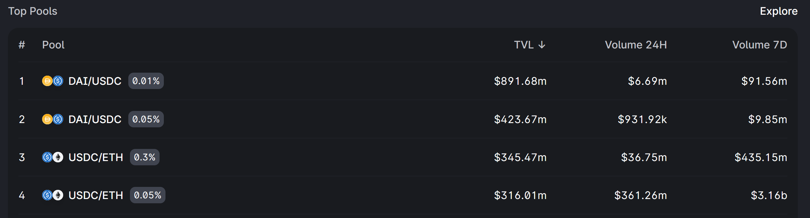

By and large, swaps between ETH and USDC on Ethereum mainnet flow through either the 0.3% or 0.05% pool ー generally the latter, due to its lower fee rate, but the former still manages to capture a sizable amount of volume. There is also a 1% fee rate pool, albeit with substantially lower TVL and swap volume.

We immediately see one clear motivation for a dynamic fee rate: there is substantial overhead associated with increasing the "price" of the liquidity that you supply! Suppose that a liquidity provider anticipates higher market volatility in the next week; they might correspondingly wish to move their liquidity position in the 0.05% pool to a higher fee tier (correspondingly, roughly, to a larger bid-ask spread in a traditional order book). Doing so requires burning their liquidity position in the 0.05% pool and re-minting a new liquidity position in the 0.3% pool, which introduces a fixed gas cost as well as substantial logistical complexity. As such, liquidity providers may miss out on highly profitable fee generation opportunities if they are not well equipped to handle the complexity of active position management.

It is valuable to note that the notion of a dynamically adjusting liquidity fee is not novel. For example, a recent paper by [Milionis, Moallemi, Roughgarden, and Zhang](https://moallemi.com/ciamac/papers/lvr-2022.pdf) suggests that AMMs might want to adjust trading fees based on ambient market conditions:

Specific proposals have also been made toward particular models for calculating an "optimal" dynamic fee, such as work by [Guillaume Lambert](https://lambert-guillaume.medium.com/designing-a-constant-volatility-amm-e167278b5d61) which proposes a fee which is adjusted dynamically so as to target a constant implied volatility. However, notably, the discussion of dynamic fees has typically focused on a theoretical setting where the DEX is assumed to be operating in a relatively stylized environment, without other competing sources of liquidity aside, perhaps, from a reference exchange where price discovery occurs.

Although the theoretical question of what the "best model" of dynamic fees is remains important, we first propose to analyze a simpler, and perhaps more empirically tractable, question. Suppose that a new DEX is created with a dynamic fee policy. For simplicity, consider only ambient liquidity. What considerations does the *marginal unit of additional ETH/USDC liquidity* face? We see immediately that we have to consider the overall state of the *market for liquidity* ー namely, the swap fee should probably be not too much lower than 0.05% and not too much higher than 1%. There is such a glut of Uniswap V3 liquidity provided at the 0.05% and 1% fee rates that venturing too far out of this range for a marginal unit of liquidity is likely inefficient. If the fee is much lower than 0.05%, then the liquidity will likely capture the same swap volume at 0.05% or slightly below; conversely, if the fee is much higher than 1%, the liquidity will likely be outcompeted by the large amount of ambient liquidity available in the Uniswap 0.3% and 1% pools.

We are now beginning to converge on a simpler operationalization of the problem of setting a dynamic fee rate, at least (1) in the case of ETH/USDC and (2) assuming that the amount of liquidity added is a small fraction of that available on Uniswap. The observation that a dynamic fee policy in this case must empirically demand on the dynamics of pre-existing liquidity on other venues allows us to transform a challenging theoretical question to a more tractable empirical question, and any conclusions we draw here may eventually help us in relaxing both of those assumptions.

To be precise, we can ask the following question: for a marginal unit of additional liquidity, *assuming that Uniswap liquidity pools remain as they are,* what should the dynamic fee rate be set to? We propose that this fee is well estimated by the following procedure. At any given point in time, we may ask the following question: which of the three ETH/USDC Uniswap pools (0.05%, 0.3%, 1%) will have the highest fee accrual for a unit of ambient liquidity over the next several minutes? We should be able to estimate a probability distribution over the three pools: for example, we may have 80% confidence that the 0.3% pool will be the highest performing over the next 10 minutes, 15% confidence in the 0.05% pool, and 5% confidence in the 1% pool. There are various options for a choice of dynamic fee which naturally follow from the concept of such a probability distribution; for example, we might choose weighted sum of the three Uniswap pool fee rates: `0.8*0.003 + 0.15*0.0005 + 0.05*0.01 = 0.002975`, or a 0.2975% swap fee; alternatively, we might simply choose the fee rate with the highest probability estimate, in this case 0.3%.

Notice that we have reduced a hard theoretical question into what can even be framed as a simple regression problem. At each point in time, one might imagine collecting an assortment of historical variables: statistics about the three Uniswap pools at past timepoints or even external metrics such as on-chain activity or CEX funding rates. With this data, one can then predict the fee growth for each of the three Uniswap pools over the next interval of time, the probability that any given pool will have higher fee growth than the other two, *etc.* The resulting predictions may then inform our choice of a dynamic fee policy. In the special case where the dynamic fee is chosen to be equal to one of the three Uniswap fee tiers, the performance of the dynamic fee policy can be easily compared, head-to-head, against the static fee tiers by simulating the growth of ambient liquidity that moves between the three static pools according to our dynamic fee policy.

Additionally, the scope of these results is not necessarily limited to ETH/USDC pools alone! Rather than analyzing each liquidity pool as its own, isolated environment, we may take advantage of the well-known facts that altcoins farther out on the risk curve often trade, to some extent, like "levered ETH," suggesting that the same statistical signals that predict fee tier performance in static ETH/USDC liquidity pools may also retain value in liquidity pools for, say, ETH/LDO or ETH/FXS. In general, because market volatility is often downstream of factors that affect *all* markets, such as macroeconomic developments or crypto-wide regulatory considerations, we should expect that the same signals that predict fee tier performance in static ETH/USDC pools can be generalizable, with appropriate transformations, to liquidity pools for other types of assets. As such, an in-depth empirical analysis of ETH/USDC fee dynamics ー in a market which can plausibly be claimed to represent the purest "crypto market beta" ー may in principle provide the foundation for a dynamic fee policy that can be applied to arbitrary pairs of assets ranging from pairs of custodial stablecoins to highly speculative liquidity for new protocol tokens.

In subsequent posts in this series, we will follow the course of empirical analysis plotted above. In particular, we will explore the dynamics of fee growth between the three static ETH/USDC tiers, construct a dynamic fee policy that plausibly outperforms each of the static fee tiers again, and characterize its generalizability across other dimensions (to different chains, different token pairs, and so on). Stay tuned for the next installment ー and in the interim, any and all thoughts are of course very welcome!

## Exploring Low-Resolution Dynamics of Uniswap Fee Performance

*This is the second in a series of multiple posts about dynamic fee policy for AMM liquidity pools.*

In a [previous post](https://crocswap.medium.com/why-use-a-dynamic-fee-for-liquidity-pools-def07a1e6c3b), we laid out an empirical framework for construction of a ETH/USDC dynamic fee policy. This article builds on that empirical framework by looking at *low-resolution* (one snapshot every 10,000 blocks) Uniswap data for its three ETH/USC liquidity pools. While we will ultimately find that we need to look to higher-resolution data in order to build a dynamic fee policy that outperforms static fee tiers, the work presented in this article is a gentle introduction to the sources of data that we are drawing from as well as our analytic approach overall.

As mentioned previously, we have one principal question before us: How can we estimate which Uniswap fee tier will outperform in the next interval of time? We begin by first determining *how* we can quantify the relative performance of each pool compared to the others. Thankfully, each Uniswap V3 pool contract contains two state variables, `feeGrowthGlobal0X128` and `feeGrowthGlobal1X128`, which represent "the total amount of fees that have been earned per unit of virtual liquidity over the entire history of the contract [*i.e.*] the total amount of fees that would have been earned by 1 unit of unbounded liquidity that was deposited when the contract was first initialized." Comparing the rate of change of these variables between the three liquidity pools will allow us to determine which pool, over any given interval of time, had the highest fee accrual compared to the others.

In order to begin exploring fee dynamics, we first retrieved the values of `feeGrowthGlobal0X128` and `feeGrowthGlobal1X128` for each of the three Uniswap ETH/USDC liquidity pools in intervals of 10,000 blocks (approximately 1.5 days) apart. Importantly, Uniswap V3 fees are collected in each of the two tokens separately (based on the direction of the swap), so it is necessary to combine `feeGrowthGlobal0X128` and `feeGrowthGlobal1X128` while accounting for the variation of ETH price in USD over time. We took the first difference of these two variables, converted the differences into corresponding USD values using the pool's ETH to USDC price (`sqrtPriceX96`) at the same block, summed them together, then recomputed a cumulative sum over time to determine the cumulative USD fee growth per 1 unit of ambient liquidity over time. Note that this cumulative fee growth statistic assumes that you begin with 1 unit of ambient liquidity at the beginning of each 10,000 block interval, *i.e.,* fee compounding is ignored; this is equivalent to taking into account compounding and logarithmically scaling the ordinate, just a little simpler to implement.

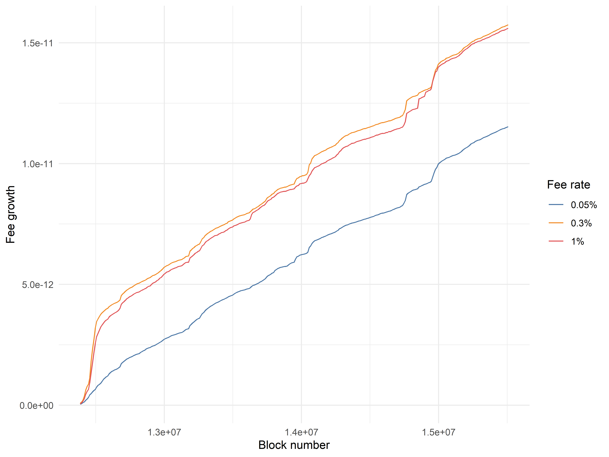

Visually, the growth rates appear relatively similar; however, in the first week or two of the data, the 0.05% pool substantially underperforms the other two, and this underperformance is permanently captured in the long-term trend. However, the underperformance was plausibly due to idiosyncratic factors related to the launch of Uniswap V3; as such, we can obtain a more accurate comparison by trimming off the first several time periods and recalculating cumulative fee growth.

Interestingly, once we do so, it becomes quite clear that the 0.05% pool is systematically underperforming the fee accrual of the 0.3% and 1% pools. Between the 0.3% and 1% pools, cumulative fee accrual is relatively evenly matched. A similar pattern recurs if we restrict to a different starting point:

Overall, it appears that we can plausibly claim that the 0.05% liquidity pool is receiving an excess supply of liquidity, not accounting for differences in the concentration of individual liquidity positions. These observations motivate our next exploration: suppose that at the beginning of each period of 10,000 blocks, we had perfect foreknowledge of which of the three Uniswap liquidity pools would have the highest fee accrual in that period as well as the ability to costlessly move our liquidity to that pool. In this situation, where we "optimally" switch between the three fee tiers with perfect foreknowledge on a 10,000 block frequency, what would our cumulative fee accrual look like?

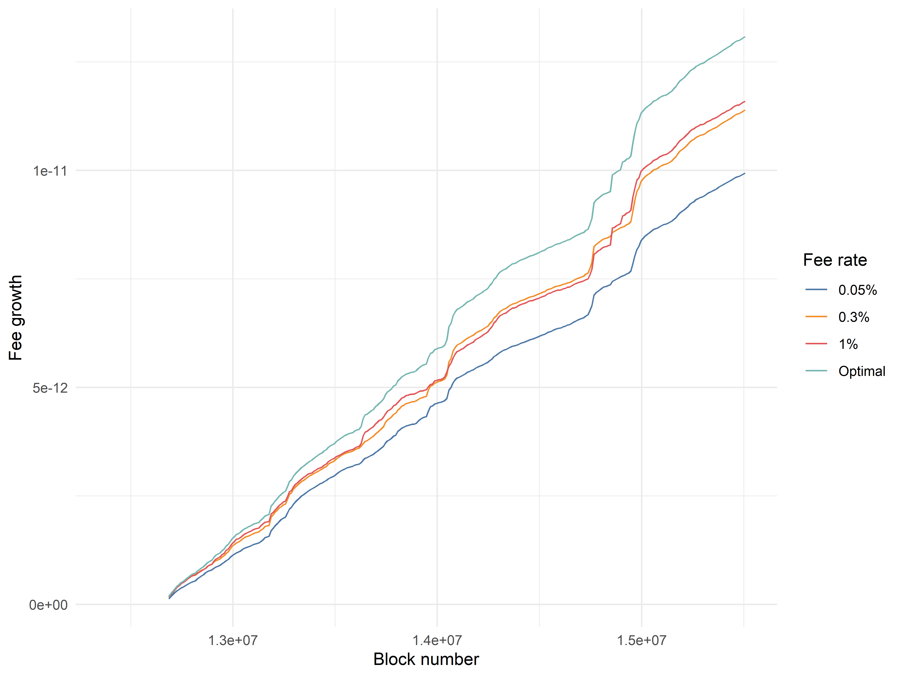

Unsurprisingly, the "optimal predictor" outperforms staying in any individual liquidity pool by a substantial margin, eventually attaining a terminal value 12.9% greater than the 1% fee pool and 31.8% greater than the 0.05% fee pool. A low double-digit performance improvement for a model with perfect foreknowledge may initially seem underwhelming; however, it is crucial to note that this model is only switching between fee tiers at an extremely low frequency (\~1.5 days)! Periods of elevated volatility often last minutes or hours rather than weeks, so it is plausible that an imperfect model that switches between fee tiers at a much higher frequency could perform comparably to this "optimal" but low-frequency model.

It is also valuable to briefly note that this model is not, in principle, the highest performing dynamic fee strategy that could be implemented on an external, non-Uniswap DEX. For example, a dynamic fee model that sets the fee to the tier recommended by the "optimal predictor" model minus a single basis point might find outsized gains from systematically undercutting a large tranche of Uniswap liquidity. Alternatively, setting the fee rate to an intermediate value not represented in the three fee tiers might also result in outperformance of this model if done correctly. However, it is difficult to model the hypothetical flow of liquidity in the presence of additional pools of liquidity, so we will reserve considerations of these complexities for later.

How often does the "optimal predictor" model switch between the 0.05%, 0.3%, and 1% fee tiers? We find that it spends about 40% of its time in the 0.3% and 1% pools and 20% of its time in the 0.05% pool:

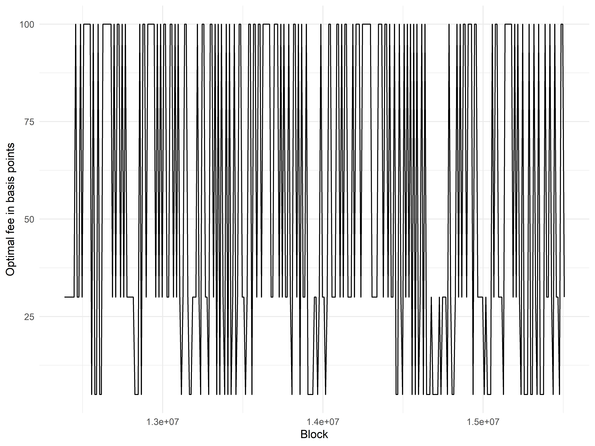

Although the plot is a little messy, it is clear that there is occasionally "persistence" of the choice of optimal fee tier across more than one interval of 10,000 blocks. This motivates the construction of a simple model without foreknowledge, where we look at the fee tier which outperformed best in the latest period of 10,000 blocks and select that fee tier for the next interval. The performance of this model is plotted below, as the "Lookback" model.

Unfortunately, this "single-period lookback" model underperforms the 0.3% and 1% fee tiers, although it still substantially outperforms the 0.05% fee tier. Examining the data more closely, we find that the average length of time the model "dwells" in a specific fee tier is equal to 1.58 intervals of 10,000 blocks, which is intuitively not sufficiently long for a simple lookback model to work well. This is a clear suggestion that there are substantial gains to be made by looking at higher-resolution data; because the selection of the optimal fee tier is not an unpredictably random process, looking at a sufficiently small time interval should allow us to detect persistence of pool outperformance across multiple intervals.

One last observation about this low-frequency dataset: if we examine the distribution of fee accrual per each 10,000 block interval, it is clear that the 0.3% and 1% pools have a wider distribution of outcomes than the 0.05% pool:

In other words, the lowest fee tier, 0.05%, is the most consistent of the three pools in generating a steady flow of swap fees for liquidity providers. Intuitively, this makes sense, as swaps should by default use the cheapest liquidity available; it is mainly in times of heightened volatility, when there is an inadequate supply of cheap liquidity, that the more expensive fee tiers receive a disproportionate amount of swap volume, hence the wider variance in their distributions of outcomes.

Overall, while we were unable to trivially construct a low-frequency dynamic fee policy that outperforms Uniswap's static fee tiers, we obtained some compelling evidence that 10,000 blocks is (perhaps unsurprisingly) far too low of a resolution for studying fee dynamics. We also introduce the concepts of the theoretically "optimal" predictor, which represents perfect foreknowledge of fee outperformance, as well as the idea of a "lookback" predictor that uses information about fee outperformance in the past several fee tiers.

In the next article in the series, we will extend these same principles to analysis of Uniswap fee pools at a much *higher* resolution, namely a 10-minute resolution. Will a straightforward application of these same ideas allow a liquidity provider to easily outperform Uniswap's static fee tiers? Or will it be very challenging to find consistent ways to outperform? How do our dynamic fee policies stack up against the divergence loss that liquidity positions are always exposed to? Stick around for the next installment to find out!

## Designing a Dynamic Fee Policy that Outperforms All Uniswap ETH/USDC Pools

*This is the third in a series of multiple posts about dynamic fee policy for AMM liquidity pools.*

[Previously](https://crocswap.medium.com/exploring-low-resolution-dynamics-of-uniswap-fee-performance-820bea2f0b90), we explored the dynamics of Uniswap ETH/USDC fee accrual across the three static fee tiers by looking at extremely *low-resolution* data (one snapshot every 10k blocks). We found that it was challenging to design a simple strategy that used historical data to select the fee tier in the next time interval, but we also identified several indications that we could benefit from looking at higher-resolution data, where fee outperformance of a specific pool in one time interval might have a better chance of carrying over through the next time interval.

### Initial analysis

To move past the simplistic, low-resolution analysis, we collect two new sources of data: (1) the entire swap history of the three Uniswap pools and (2) the same `feeGrowthGlobal0X128` and `feeGrowthGlobal1X128` variables collected above, but at a higher time resolution of approximately 10 minutes. In principle, knowing the swap history, one could directly calculate a rudimentary version of `feeGrowthGlobal0X128` and `feeGrowthGlobal1X128` by taking the swap volume in each time interval, multiplying by the fee rate, and dividing by the amount of active liquidity; however, this relies on careful bookkeeping of all concentrated liquidity positions and summing up mints and burns accurately, leading to an additional source of error in the results. That is why we chose to query the `feeGrowthGlobal` variables from EVM storage directly.

That is not to say that a direct calculation of `feeGrowthGlobal` is entirely useless, however. Even if the manual calculation from swap volume is inaccurate, we should still expect to see a reasonably tight correlation with the exact `feeGrowthGlobal` variables in contract storage; conversely, observing a tight correlation gives us confidence that our swap volumes are reasonably accurately determined. Fortuitously, it does appear that a tight correlation does hold, for example in the 0.3% pool:

Similar results are observed for the other two liquidity pools, suggesting that our swap volumes (and other values derived from swap data, such as measures of volatility) are reasonably accurate. If we shift the values of either axis by a single increment in either direction, the correlational structure is largely lost, as seen below.

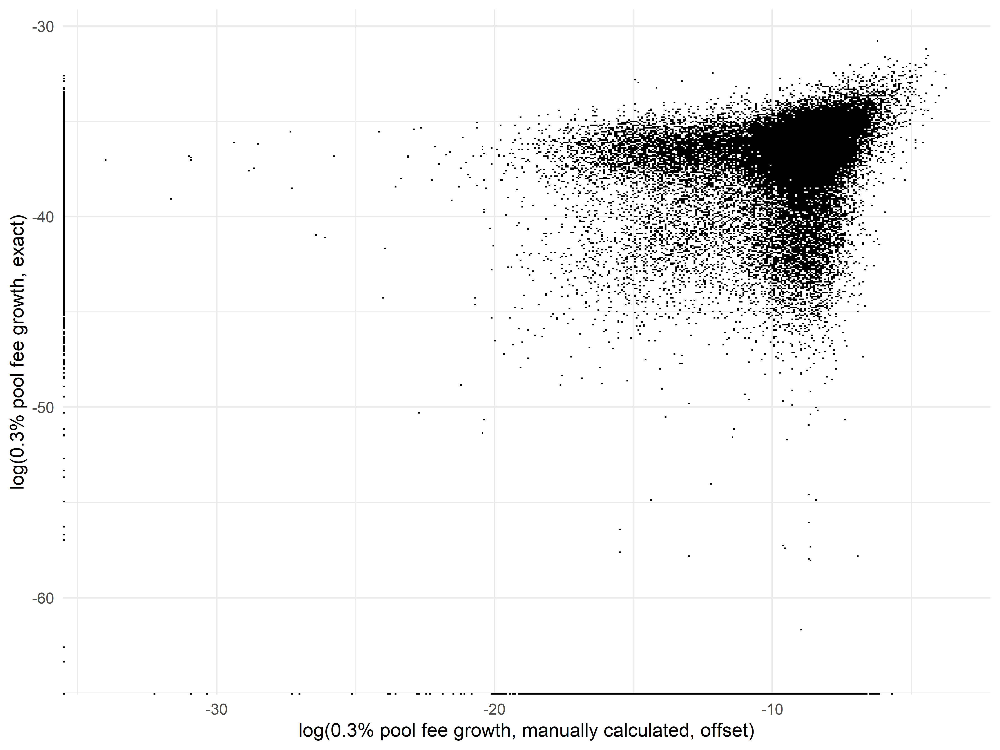

On one hand, this gives us additional confidence that our data are not subject to any "off-by-one" problems and that we have, in general, joined the swap volume data and the `feeGrowthGlobal` data together accurately; on the other hand, the much weaker correlation here means that a "lookback predictor" that moves liquidity to the fee rate which performed best in the previous 10 minutes will substantially underperform the theoretical optimum.

We test this directly by computing, as we did with the larger time intervals, cumulative fee growth statistics that track (1) an optimal predictor that moves between the 0.05%, 0.3%, and 1% pools with perfect foreknowledge and (2) a one-interval lookback predictor that stays in the best-performing pool in the most recent time interval.

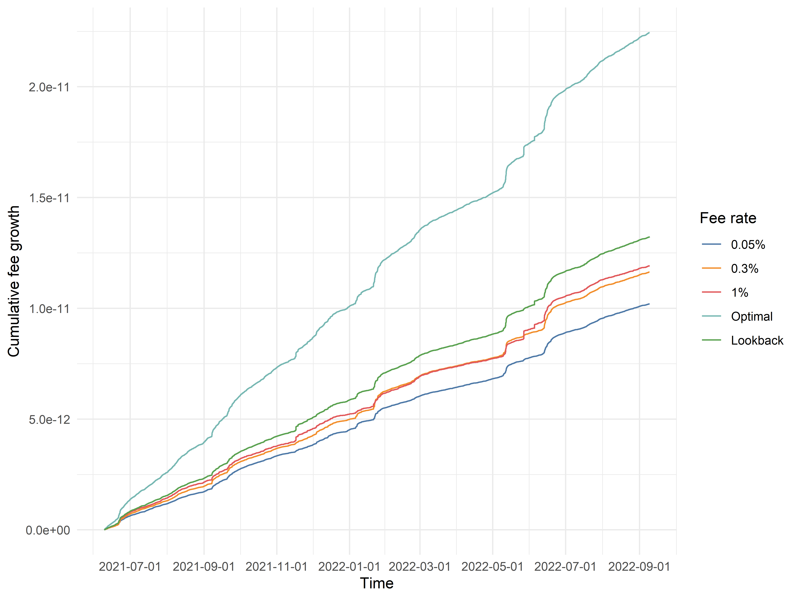

As we hoped, the optimal predictor outperforms the static fee tiers by an enormous margin, with over twice the rate of fee accrual! While the one-interval lookback predictor (labeled "Lookback" in the plot) does not perform nearly as well as the optimal predictor, it still outperforms all three of the static fee tiers. As a matter of fact, this one-interval lookback predictor, while exceedingly simple, already specifies a dynamic fee policy which clearly outperforms all three static fee pools!

Interestingly, the average "dwell time" for the optimal fee predictor is 2.13, which is meaningfully but not dramatically greater than the average "dwell time" of 1.58 intervals with the low-resolution data. In theory, it might be possible to improve the performance of the one-interval lookback predictor by using even smaller time intervals, although it is likely impractical to go much further in that direction due to excessive transaction fees from high-frequency fee updates. Hopefully, we will be able to narrow the gap with the theoretical optimum with alternative methods.

We also previously observed that the optimal predictor using 10,000 block intervals spent a *minority* of its time (\~20%) in the lowest fee tier. This is a little unexpected, as the typical market-making model in an orderbook setting is to quote a tight bid/ask spread most of the time and widen spreads in times of heightened uncertainty. However, we know that 10,000 blocks is such a large time interval that it obscures most of the dynamics of relative performance between different fee tiers. Does this unexpected observation also hold true when we use 10 minute time intervals instead?  As a matter of fact, it does not. When we examine the optimal predictor in the higher-resolution data, we find that it spends 60% of its time in the 0.05% pool, 30% of its time in the 0.3% pool, and only 10% of its time in the 1% pool, corresponding nicely to the analogous behavior of market makers in orderbook settings and further validating our choice of a smaller time interval.

### Extending the lookback model

How much further can we push the one-interval lookback model? If the only thing we are allowed to observe is the best-performing fee tier of the latest time interval, the space of models is quite limited (in fact, there are only 9 possible models). Suppose we ask the following question: if the best-performing fee tier of the latest time interval was *X* and we switch liquidity to fee tier *Y*, what is the average fee accrual? It turns out that simply "copying" *X* over to *Y* is quite close to optimal, within this limited model space:

The above plot has several interesting properties. As the fee rate of the best-performing fee tier in the previous interval increases, we notice that the average fee accrual increases overall, regardless of what fee tier is selected next. This matches our general intuition that higher fee tiers perform better in volatile environments, where the fee accrual of the 0.3% or 1% pools spikes due to an acute increase in the overall demand for liquidity. Additionally, when the best performing fee tier is 1%, the returns to selecting the 1% fee tier again in the next time interval are quite high! This suggests that there is great value in being able to accurately detect the "persistence" of the volatile periods where higher performing fee tiers outperform.

This narrative is supported by a direct examination of the "transition probabilities" of moving from optimal fee tier *X* at time *t-1* to optimal fee tier *Y* at time *t*, as shown below.

Notice that regardless of the optimal choice of fee tier at time *t-1*, it is most probable that the choice of optimal fee tier at time *t* is the 0.05% pool rather than the 0.3% or the 1% pools. How can we reconcile this with the success of our lookback model? The answer must lie in the fact that while the 0.05% pool is the most probable optimal fee tier, it outperforms to a smaller degree compared to when the 0.3% pool or, especially, the 1% pool experiences strong fee accrual.

The above analysis suggests that we have almost fully captured the signal of a one-period lookback with our naive lookback strategy. However, a simple way to extend this model is to simply use a *two-period* lookback, where we decide on the the fee rate at time *t* based on the optimal choice of fee tier at times *t-2* and *t-1*. First, we calculate the average fee accrual of selecting a given fee tier at time *t*, conditional on each of the 9 different Possibilities for optimal choices at *t-2* and *t-1*:

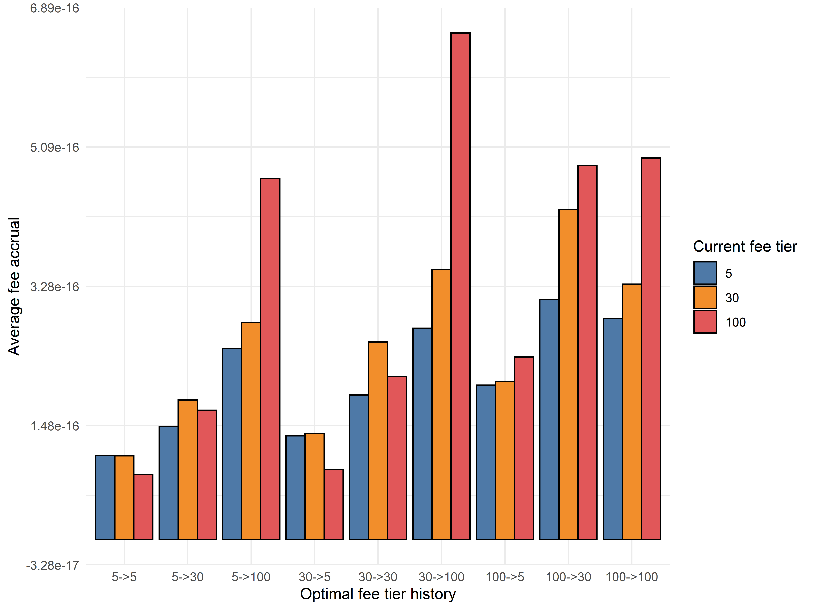

We can immediately notice differences from the one-period lookback. For example, if the optimal fee tiers at *t-2* and *t-1* were 1% and 0.3% respectively, the one-period lookback would suggest selecting the 0.3% fee tier at time *t*, whereas the optimal choice with two-period lookback is to return back to the 1% fee tier. In general, these results are consistent with our prior hypothesis that a large proportion of the gains come from successfully recognizing "regime shifts" where the higher fee tiers, especially the 1% fee tier, outperforms by a large margin.

Almost by definition, we know that the two-period lookback model should strictly outperform the one-period lookback when measured over the entire dataset. However, what is the actual quantitative degree of outperformance?

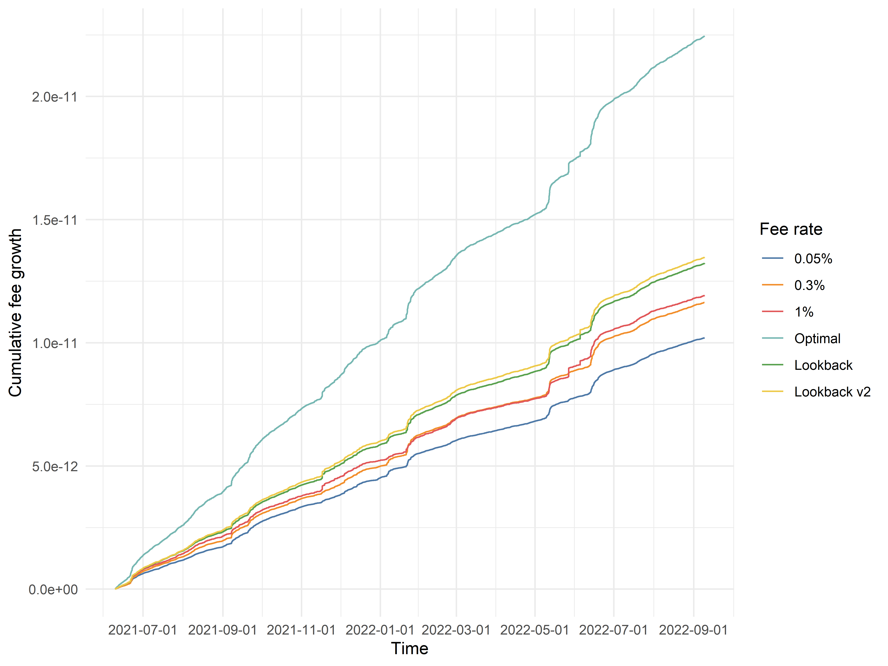

Looking at the cumulative fee growth of the two-period lookback model, labeled above as "Lookback v2", we see that it outperforms the one-period lookback model by a small but noticeable margin ー an impressive gain for such a tiny increase in model complexity! One interpretation of the additional return is as follows: even in periods of high volatility, where the 0.3% or 1% fee tiers outperform, there is inevitably going to be interval-to-interval variation in swap volume and relative fee accrual. For example, even if we are in a "regime" where the 1% fee tier is generally outperforming, it is possible that, from time to time, the optimal fee tier in a specific time interval may drop to 0.05% due to random variations in swap volume or price action. Assuming you are in such a regime, it is desirable to "smooth over" such variations, because of the asymmetric returns of correctly identifying time intervals where higher fee tiers outperform. Accounting for multiple time intervals in our lookback models implicitly takes the benefits of such "smoothing" into account.

The astute reader may notice at this point that our model is now effectively being "trained" on the dataset and, consequently, that it is improper to measure the performance of this model on the exact dataset where was trained. In principle, we want to ask: what is the performance of this model if, at any given time *t = T*, we train the model using all data where *t < T* and predict the optimal fee setting at *t = T*? We will explore this further in the next section.

At this point, it is natural to suspect that extending the lookback model even further back in history will only yield very marginal returns. In theory, of course, it is possible that there could be unusual nonlinearities that only begin to show up with sufficiently many lookback periods. At the risk of overly belaboring the point, we extended the lookback model to use *three* historical periods, *i.e.,* choosing the fee tier at time *t* based on the outperforming fee tiers at *t-3*, *t-2*, and *t-1*. The cumulative performance of this model is plotted below, as "Lookback v3":

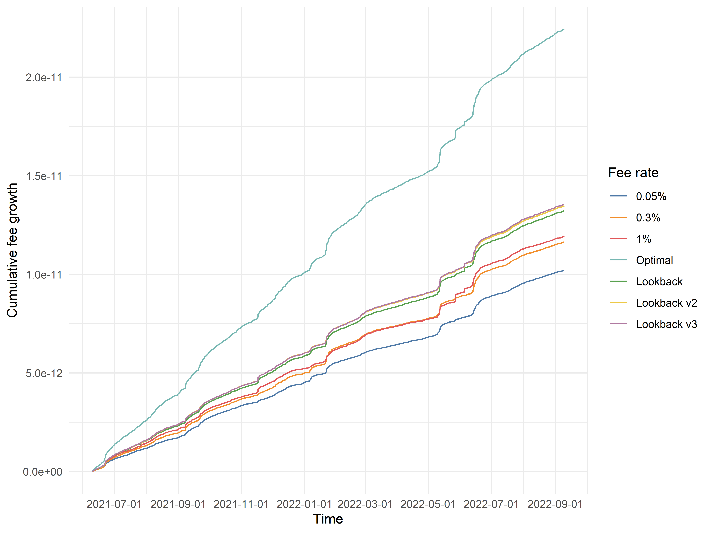

As expected, the improvement in performance over the two-period lookback model is nonzero but extremely slight, and it is likely safe to say that extending the lookback model with more "local history" will not prove to be a fruitful endeavor. To develop dynamic fee models with superior performance, we will have to begin incorporating in other variables into our analysis beyond the choice of optimal fee tier in the last 1 to 3 time intervals. For example, we might look at swap volume, price volatility, CEX metrics like the funding rates of perpetual futures, or the actual quantitative *degree* of historical fee outperformance rather than simply the *choice* of optimal fee tier in prior time intervals.

What we have learned from exploring simple lookback models will serve as a valuable foundation for more complex analyses. We have observed that historical fee outperformance is a high-signal predictor that we should incorporate into our models. Beyond that, the observation that there are effectively zero marginal returns to incorporating more than 3 historical time periods into our simple lookback model gives us a vague sense of the "local timescale" over which we should measure other variables such as swap volume or price volatility.

### Training models on historical data

As discussed above, it is improper to train and evaluate dynamic fee policies on the same dataset ー we only did so previously due to the convenience of easily illustrating the benefit of extending our simple model to use more historical data. However, of course, the resulting fee policy uses data from July 2021 through September 2022; if, say, we were attempting to use a dynamic fee policy at any time in between, for example May 2022, we would only have access to data up to that point!

If, at any given time *t = T*, we only restrict ourselves to data generated at times *t < T*, one can conceive of quite a diverse array of methods to develop fee policies from that historical data. As mentioned, one might simply apply the same strategy as with the three-period lookback model on data at *t < T* to set a dynamic fee at *t = T*. Alternatively ー and this is a somewhat separate but still interesting point ー it is valuable to note that the three-period lookback model we previously developed essentially uses *global* data to predict a *local* phenomenon. Conceivably, the relative fee growths of the 0.05%, 0.3%, and 1% pools in the last 24 hours might be far more informative for predicting the best fee tier at *t = T* than the relative fee growths in a 24 hour period many months back in time. Correspondingly, one might imagine a dynamic fee policy that only takes into account the latest *N* days of fee growth history, or perhaps uses all data *t < T* but assigns greater importance to more recent data.

Rather than explore every possible direction of inquiry here, we will postpone their exploration to a later date, when we can more explicitly create predictive models for optimal fee selection using a wider array of variables, as previously mentioned. Instead, we will explore a simple extension to the three-period lookback model where, at each time *t = T*, the only data used to generate the dynamic fee policy is data at *t < T*. For computational simplicity, the new dynamic fee policy is only regenerated once every 24 hours and is constrained to use at least 1 month of historical data (*i.e.,* the model makes no predictions for the first month's worth of data).

Doing so, we find that this model, termed "Lookback v4" below for lack of a better name, substantially underperforms not just the original three-period lookback model ("Lookback v3") but also the original, single-period lookback model ("Lookback")!

In some sense, this is actually a little surprising. The original, single-period lookback model simply replicated the best-performing fee tier in the previous time interval and did not involve any global computations over the entire dataset, and so we should expect that a model which takes into account more data (both in terms of using all data *t < T* to calculate transition probabilities and payoffs as well as determining optimal choices for each of 27 different scenarios based on the last 3 time intervals) should readily outperform such a simple model ー yet that does not seem to be the case. At the very least, however, our more principled "Lookback v4" model still readily outperforms all of the three static fee tiers.

Looking closely, it almost appears as though the relative performance of the "Lookback v4" model is steadily increasing over time. The effect is marginal, but it does appear to be "closing the gap" with the (unprincipled) "Lookback v3" three-period lookback model over time. One interpretation is that as the "Lookback v4" model accumulates a larger history of data over which it calculates a dynamic fee policy, those predictions become increasingly accurate; indeed, at the highest timepoint, the dynamic fee policy should be nearly exactly the same as the fee policy used in the v3 model.

One way to check this narrative is to only begin calculating cumulative fee growth halfway into the dataset, where the v4 model begins with access to half a year's worth of data rather than just a single month:

In this case, over the long run, the v4 model is clearly outperforming the naive, single-period lookback model we started with, and is halfway "caught up" to the cumulative fee growth of the unprincipled v3 model! On the other hand, one could argue that this is confounded by the ordering of events in the dataset ー if we shuffled the training data (on the level of days or months to preserve local structure), would we regain the same result?

Again, we will reserve consideration of these complexities for a fuller analysis. We have, by and large, achieved our principal goal with the lookback analyses, which is to demonstrate a *proof-of-concept* for an dynamic fee policy which is likely superior to any of the three static fee tiers.

(*N.B.* One might reasonably wonder whether it is fruitful to naively extend the lookback extent to a greater number of time intervals when we only allow usage of data at time *t < T*, the principle being that a greater "search depth" might in a sense be more useful when data is relatively scarce, the principle being that it might allow for capturing lower-frequency signals that are unnecessary or redundant in the case where one trains the model on all available data. When attempted, the benefit of doing so was effectively zero.)

### Accounting for divergence loss

Finally, before moving on to more sophisticated model construction, we ought to revisit the original premise of optimizing fee accrual. Naturally, liquidity will flock to whatever platform allows it to accrue the most fees; however, beyond optimizing fee accrual for liquidity providers, the key question here is whether or not liquidity provision can be made into a *consistently profitable* endeavor *net of divergence losses (DL).* If we quadruple fee accrual but LPs are still bleeding money from divergence loss, the broader question of sustainable liquidity provision remains unaddressed. However, if we can improve fee accrual to a point that allows unprofitable or marginally profitable LPs to become consistently and reliably profitable, that is a very real and meaningful contribution to the broader cryptoeconomic ecosystem.

To calculate divergence loss in a manner directly comparable to our fee accrual statistics, we ask the following question: suppose you begin each time interval with one unit of ambient liquidity, which corresponds to some fixed quantities of USDC and ETH depending on the ETH/USDC price at that time. You can either burn the liquidity and hold the tokens directly or you can keep the liquidity as-is, in which case it will be convertible to different quantities of USDC and ETH if the ETH/USDC price has changed from the beginning to the end of the time interval. The USD value of your portfolio can be calculated in either of those two scenarios; the former is mathematically guaranteed to have a greater portfolio value than the latter, and the shortfall between the two values is denoted as divergence loss. While actual portfolio values in practice also vary due to direct exposure to asset values, we assume that liquidity providers are hedged against this exposure; while this assumption is not necessarily true in practice, it is the only practical way to perform a principled analysis of fees vs. DL without being hopelessly confounded by asset price fluctuations dependent upon extrinsic factors.

Subtracting divergence loss from fee accrual in each time interval and calculating the cumulative portfolio growth in USD (without compounding), we find that, unsurprisingly, a static portfolio that remains in one fee tier throughout the entire dataset does not perform very well:

The 0.05% fee tier has remarkably poor performance, with very few periods of positive returns after DL is accounted for. The 0.3% and 1% fee tiers perform relatively better; one unit of ambient liquidity minted at the start of July 2021 would be in profit today. However, the margin of profitability is low, and there are long, multi-month stretches of negative returns where fee accrual consistently fails to outweigh DL. Remaining in those fee tiers would be a very poor experience for a liquidity provider, who must wait out stretches of underperformance of indeterminate length just to "catch" the very short time periods with extraordinarily high fee accrual in those fee tiers.

However, if we perform the same fees-minus-DL analysis with our final v4 lookback model, we find that it is a marked improvement over the static fee tiers:

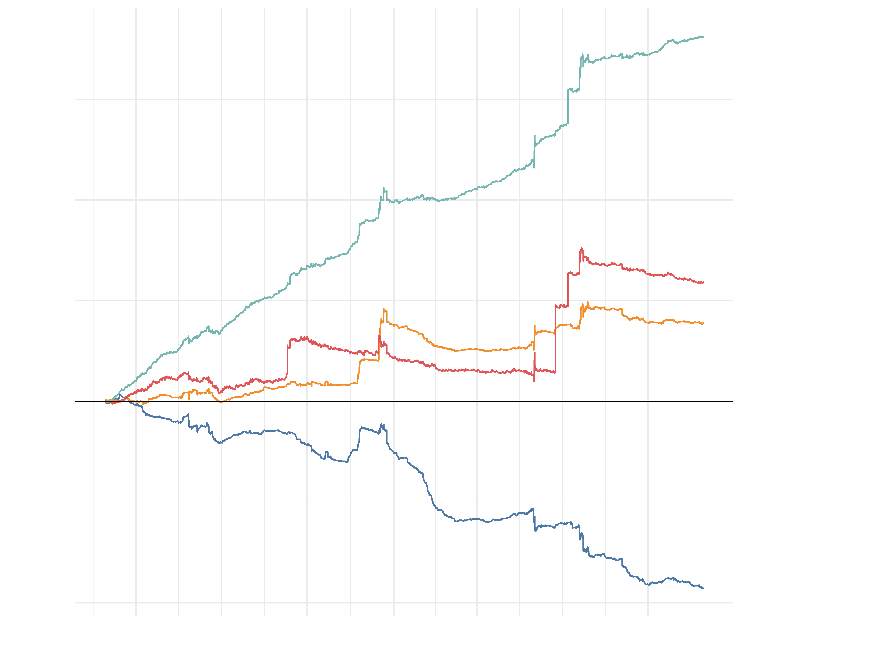

(Note that the cumulative fee accrual and DL are computed starting one month into the data, so that the v4 lookback model has a month's worth of training data to begin with.) The lookback model manages to deliver very consistent profits net of DL, outperforming the annual profits of the 0.3% or 1% fee tiers by a factor of 3 or greater. In addition to long-term outperformance, it also has much shorter stretches of local underperformance, while still managing to mostly capture the large spikes of fee accrual in the 0.3% and 1% liquidity pools ー certainly a very desirable property for any liquidity provider.

It is worth explicitly drawing attention to the benefits of the dynamic fee model from the perspective of the liquidity provider. Obviously, a LP supplying liquidity to the 0.05% static pool will, over almost *all* intervals of time, be in the red due to insufficient fee accrual compared to divergence losses. However, even if liquidity is supplied to the 0.3% or 1% static pools, there can be *multi-month periods,* approaching a year or greater, where the LP might be continuously unprofitable net of DL, despite the fact that the *overall* profitability of an ambient position over our entire historical data range is positive!

In fact, suppose that we look at all possible 1-month intervals in the dataset. A liquidity provider in the 0.05% pool is profitable in merely 20.9% of these intervals; the 0.3% and 1% pools are not much better, with LPs being profitable in 61.7% and 42.7% of all intervals respectively. (Note that although the 1% pool has higher overall growth, it is also more volatile and underperformed the 0.3% pool for a large duration of its history.) However, the dynamic v4 lookback model is profitable in an astonishing 98.4% of all 1-month intervals! Even with such a naive model ー one which only looks at three categorical variables, each with three possible values ー the dynamic fee model we have constructed is not only superior in terms of higher returns, it is also *dramatically* superior in terms of *risk-adjusted* returns.

In summary, we have managed to use high-resolution data to construct a conceptually simple yet highly effective dynamic fee policy which significantly outperforms each of the three static Uniswap ETH/USDC fee tiers. This outperformance is reflected in both higher returns and lower volatility, which is especially apparent when returns are adjusted for divergence losses ー the v4 lookback dynamic fee policy results in a sequence of portfolio returns which is qualitatively far more appealing to the prospective supplier of AMM liquidity than any of the static fee tiers individually, with much smaller and less prolonged drawdowns.

Can we improve even further on our simple v4 lookback model? In the next post in this series, we will explore the effect of adding variables such as trading volume, volatility, and even off-chain metrics to our models!

## Constructing Multivariate Models to Improve a ETH/USDC Dynamic Fee Policy

*This is the fourth in a series of multiple posts about dynamic fee policy for AMM liquidity pools.*

In the previous post in this series, we constructed a dynamic fee policy for ETH/USDC liquidity that cleanly outperforms all three of Uniswap's static fee tiers. However, we also noted that our model was extremely simple in construction. To refresh the reader's memory, our "lookback" model essentially executed the following algorithm:

1. For a given time interval of 10 minutes, determine which fee tier (out of the Uniswap 0.05%, 0.3%, and 1% pools) had the highest fee growth in each of the last 3 time intervals.
2. Use all available historical data to determine the highest-payoff selection of fee tier for the current time interval, conditional on the historical data in (1).

In effect, for each given time interval, we are classifying it as one of 27 distinct possibilities based on recent historical fee accrual data for Uniswap's liquidity pools. The choice of which fee tier to select next is based on two criteria: first, the *probability* that, conditional on the observed fee accrual history, a given fee tier will be the best-performing fee tier, and second, the *return* of correctly selecting that fee tier, also conditional on the observed fee accrual history. These are computed over all available historical data then multiplied together to determine the *expected payoff* of selecting a given fee tier, conditional on the observed fee accrual history. Finally, the fee tier with the highest payoff is selected.

To extend this to a more general framework, we could imagine, for example, also looking at trading volume in the previous time interval (*i.e.,* in the last 10 minutes). Trading volume is a continuous variable, so we could subdivide it into arbitrarily many divisions; for example, we could say that trading volume less than *X* represents one possibility, and trading volume greater than or equal to *X* represents another possibility. In total, we would now be calculating payoffs for each of 54 distinct historical scenarios!

One can see how extending this method to additional variables becomes overly cumbersome. Instead, we propose to take a more directly predictive approach to the problem. What we would like to determine is which fee tier to select in the next time period. In other words, there are two variables we would like to predict:

1. The fee accrual in the 0.3% pool minus the fee accrual in the 0.05% pool
2. The fee accrual in the 1% pool minus the fee accrual in the 0.3% pool

We could have chosen other differences (say, 1% pool minus 0.5% pool) to use, but regardless of the specific choice, it should be clear that these two differences (or some variation of them) are sufficient to fully determine our choice of fee tier. As such, this becomes an ordinary exercise in basic statistics: take a collection of historical variables (fee performance, volume, *etc.*); regress the two desired outcome variables against those historical variables; finally, use the trained models to make predictions and select the next fee tier.

In the following, we will explore the effect of adding different variables into our model or using different types of predictive modeling on our overall ability to predict the optimal selection of ETH/USDC fee tier. A note on implementation: in the previous post, we "retrained" our lookback model on a daily basis, incorporating new historical data into the payoff calculations at most 24 hours after it was generated. In principle, we need not retrain our model so rapidly; as the amount of total historical data increases, the effect of any marginal addition of a fixed data quantity diminishes (*e.g.,* if you already have 12 months of data in your model, it doesn't really matter so much if you retrain your model at 12 months plus 1 day or at 12 months plus 1 week). For simplicity of testing and analysis, we will switch to a monthly retraining interval for comparison of different models and only lower the retraining interval at the very end. We will also specify that models only start making predictions when they have at least 1 full month's worth of training data.

To start out, let's specify a model which is fully equivalent to our "v4 lookback" model as described in the previous post. In theory, this is exactly equivalent to regressing fee accrual differences on a set of 26 binary variables, where each of them represents one of the 27 different historical scenarios (an arbitrary choice of the 27th scenario is specified when all 26 variables are equal to zero). To empirically verify that this is equivalent to the lookback model, we plot the cumulative fee growth of the two models below:

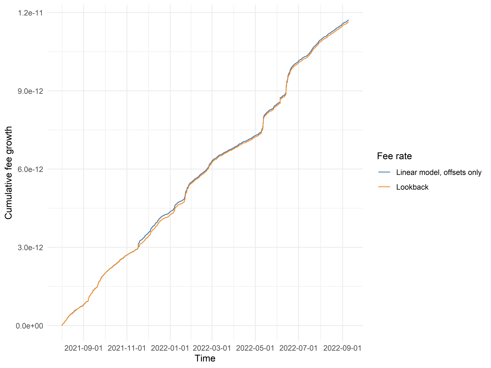

In this particular case, we do not expect the models to be *exactly* equal, because the lookback model as defined in the previous post is retrained on a daily interval, while the offset-only linear model (named as such because the model essentially learns a single constant predicted value corresponding to each of the 27 historical cases) is retrained on a monthly interval. They are indeed not *exactly* equal; however, they are extremely similar, enough so to give us confidence that the two models are equivalent in principle. We will use this offset-only linear model as a standard basis for comparison as we move into more complex model construction.

Now, suppose that we wish to determine exactly which variables we should add into our linear model. Visual examination often reveals compelling pairwise relationships; for example, comparing lagged swap volume in the 0.3% pool with the relative fee accrual of the 0.3% pool versus the 0.05% pool, we notice that when swap volume is extremely high, the 0.3% pool tends to outperform:

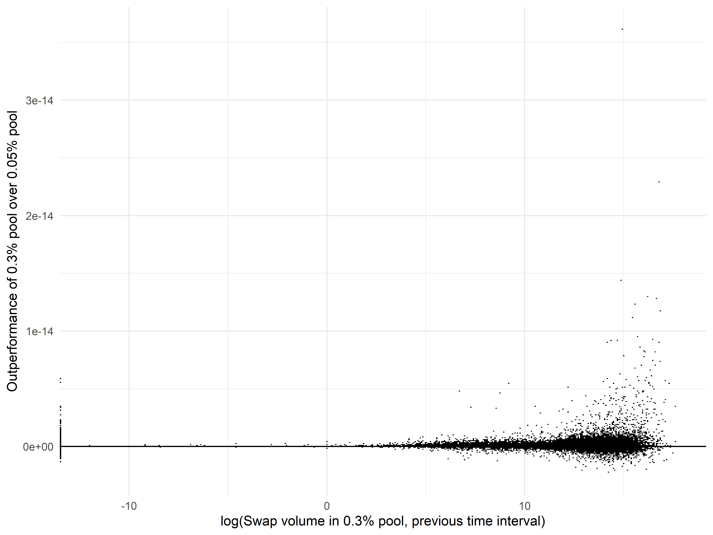

Similarly, we notice that when the absolute *number* of swaps in the 0.05% pool is very high, the 0.3% pool is likelier to outperform in the next time interval:

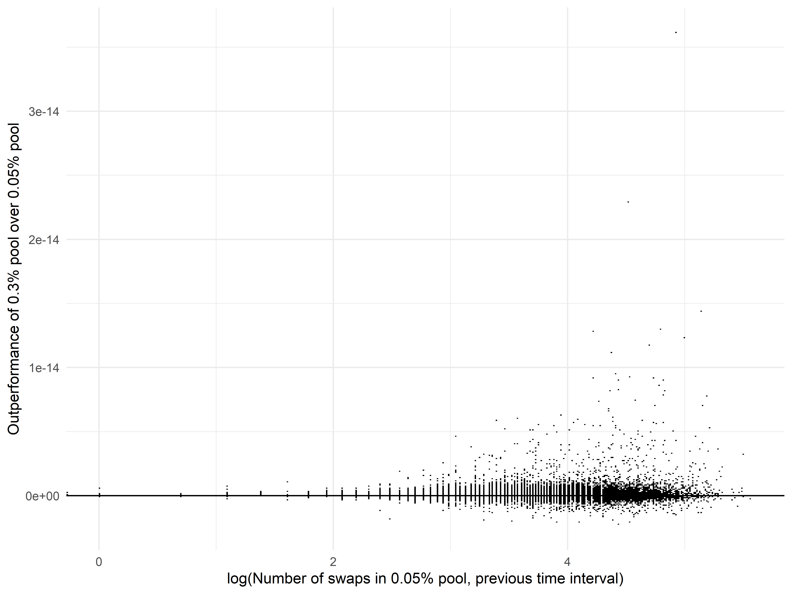

In general, one could spend a very large amount of time examining such pairwise relationships, trying to discern the appropriate transformations, *etc.* Rather than tire the reader with reams of exploratory analyses, we will simply present a combination of predictors that appeared to work well in practice:

1. Swap volume in USD, in the previous time interval
2. Maximum price tick minus minimum price tick, in the previous time interval
3. Number of swaps, in the previous time interval
4. Standard deviation of the price tick across different swaps, weighted by swap value in USD, in the previous time interval
5. Interaction of the difference in fee accrual with a categorical variable encoding the highest-performing fee tier, in each of the three most recent time intervals

Variables (1) through (4) are included twice: one time for each of the two fee tiers from which the outcome variable is derived. For example, in the model for predicting the difference in fee accrual between the 0.3% and 0.05% pools, we would include the swap volume in the 0.05% pool and the swap volume in the 0.3% pool as separate variables. Variable (5) is simply the actual value of the outcome variable in prior time intervals, stratified each time by the three possibilities for the best-performing static fee tier.

How does this model perform? Let's examine:

Clearly, adding this assortment of variables to our linear models results in a modest but significant improvement in the model's associated fee growth! It is interesting to note, however, that the linear model for predicting 0.3% vs 0.05% performance works far better than the linear model for predicting 1% vs 0.3% performance. In the former case, when trained on the entire historical dataset, the model achieves an adjusted R-squared of 10.75%; however, in the latter case, the adjusted R-squared fails to reach even 1%. Similarly, in the former case, almost all predictors included achieve a very high level of statistical significance (*p* < 0.001, unadjusted for multiple hypothesis testing); however, in the latter case, approximately half of all included predictors are nonsignificant. However, crucially, even if the model is very inaccurate, it can still be useful! We do not need to predict the *exact* degree of outperformance of one fee tier over another; instead, we only need to predict it with *sufficient precision* as to identify the highest-performing fee tier, which is a much weaker requirement.

The astute reader may ask: What about potential nonlinearities? For example, in the above plot of fee accrual difference against the logarithm of lagged swap volume, it appears that the relationship is not linear (even after taking the logarithm). In particular, it visually appears as though the majority of the predictive power comes from determining whether the lagged swap volume is above or below roughly the 90th percentile value in its own distribution.

In the process of identifying which variables to include in the linear model and how to include them, we attempted a large number of transformations: turning continuous variables into percentile bins; rank inverse normalizations; transforming into percentiles; variations of logarithmic transformations; hand-chosen thresholds for smaller numbers of bins; winsorization or other methods of outlier removal or truncation; *etc.* In the end, somewhat to our surprise, there was no consistent and principled set of transformations which substantially improved predictive power over simply throwing all the predictor variables into a simple linear model. (In fact, in many cases, the transformations we attempted degraded model performance!) Occasionally, some variables did benefit from discretization into, say, 10 different bins with endpoints at the 10th, 20th, *etc.* percentile; however, the improvement was sufficiently marginal that we chose to retain all variables as their original continuous variants in order to guard against overfitting and the addition of unnecessary complexity.

Beyond attempting various *ad hoc* transformations, it is typically recognized that certain techniques, such as random forests or gradient boosting, are usually easy and straightforward ways to improve model performance in the presence of nonlinear relationships. In effect, their usage frequently allows the modeler to have a "free lunch" above and beyond linear models, assuming that the additional training and prediction time is not overly inconveniencing. We therefore trained random forest models and compared their performance with our linear models:

Surprisingly, the marginal improvement in cumulative fee growth attained by replacing linear models with random forests is almost completely negligible! We found this result very unexpected. One potential explanation as to why is the property we previously mentioned: that the exact precision of our predictions does not matter very much after a certain point, because our ultimate goal is to select one of three fee tiers. As long as predictions are *directionally accurate* in a sense, that should largely suffice for our purposes! (As an aside, we will also note that we tried several other types of models beyond random forests, all of which resulted in similarly negligible improvements in cumulative fee growth: namely, gradient boosting, L1 normalized regression, and L1 normalized regression for variable selection followed by L2 normalized regression on the selected subset of predictors.)

Beyond moving further, we should also note that there is a critical flaw in the models as described above. Specifically, we are not necessarily interested in swap volume or the number of swaps in the previous time interval so much as we are interested in volume or swap count *relative to recent history.* For example, if, over the course of 10 years, swap volume increases tenfold due to an overall increase in on-chain activity, that intuitively does not seem like a trend that, in and of itself, predicts higher performance of the 0.3% fee tier over the 0.05% fee tier; instead, we are mainly interested in whether the swap volume or activity in a given time interval is abnormally high or low relative to swap volume or activity in the last week or the last month.

We correct for this effect very simply: by taking swap volume and swap count in a given time interval and dividing by the average swap volume or swap count across time intervals in the last month. Thankfully, the linear model using these normalized variables has almost indistinguishable fee growth from the unnormalized model:

It now appears that we have managed to construct, in a careful and principled manner, a linear model for relative fee tier performance which incorporates on-chain metrics such as swap volume, price volatility, *etc.* to attain a modest degree of improvement over the simple "lookback" model that we presented in the previous post!

One final note on model construction ー we had hoped that incorporation of external variables, such as time-based variables encoding seasonality or CEX metrics like funding or perp trading volume, would improve model performance. Unfortunately, and somewhat surprisingly, this was not the case. Although some modest 'seasonal' relationships were identified between swap volume and specific timepoints such as U.S. market open/close, Asia market open/close, or CEX funding payments (which occur at specific hours), these relationships did not carry over into relative fee tier performance. We also attempted to incorporate ETH-PERP funding rate or volume data from FTX, but those data did not improve the predictive model at all. However, the funding data used was much lower resolution (hourly), and so the addition of more up-to-date funding data to the model remains worth investigating.

To close out this chapter of our investigation, we ought to return once more to the motivating question behind our exploration of dynamic fees: to what extent can we design a dynamic fee which delivers returns to liquidity providers in excess of divergence losses? We already know that the lookback model described in the previous post, equivalent to the offset-only linear model in the present analysis, has far superior return properties for LPs compared to any of the three static Uniswap fee tiers. For a final evaluation of our final linear model, we calculated model performance using a one-day retraining interval (as opposed to the monthly retraining interval used in the discussion above) and subtracted off divergence loss from the cumulative fee growth, much like before.

We clearly see that our final linear model delivers an even better return profile to liquidity providers than the previous lookback model! If we examine the plot carefully, it is straightforward to see certain areas where the simpler lookback model failed to "react" appropriately and capture temporarily elevated fee growth in a particular fee tier, but where the more complex linear model appears to capture a great deal of the outperformance. Although our linear model is assuredly still quite far off from the theoretical optimum, we have already made great strides toward developing a strategy that durably improves returns for liquidity providers.

Now that we have developed a reasonable strategy for a ETH/USDC dynamic fee, further installments in this series will focus on the *generalizability* of this model. To be sure, we could simply replicate the same *strategy* and have independent models for WBTC/USDC, ETH/DAI, *etc.* ー one model for every single liquidity pool. However, it would be far simpler if the signal outputted from this ETH/USDC model could be straightforwardly applied to other pools! To what extent is this actually possible in practice? Follow along to find out!