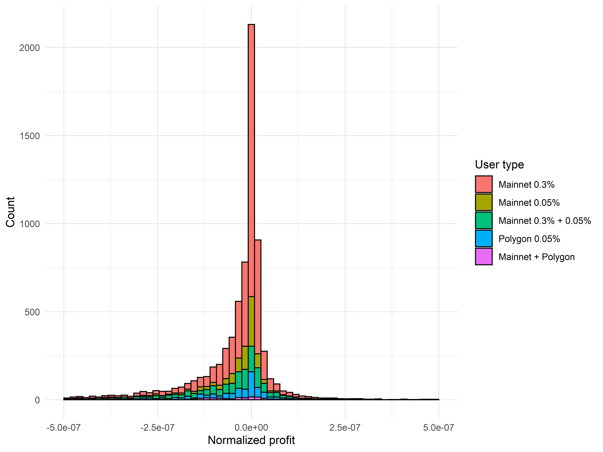
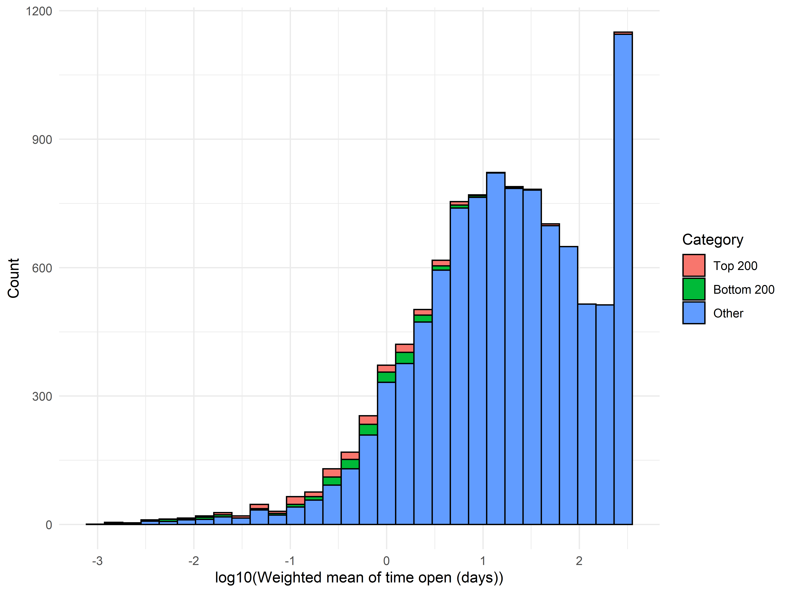
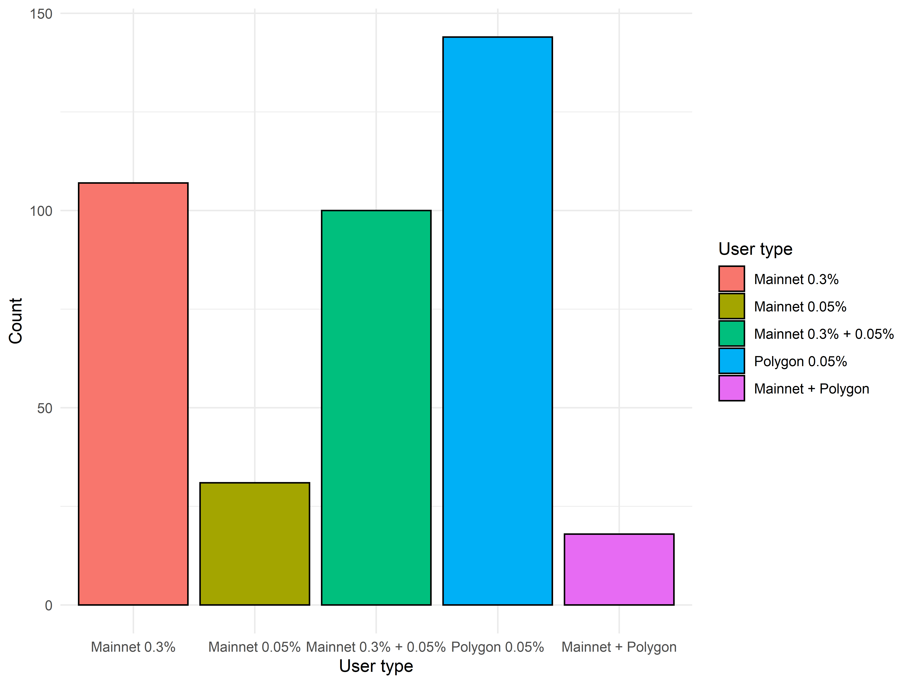
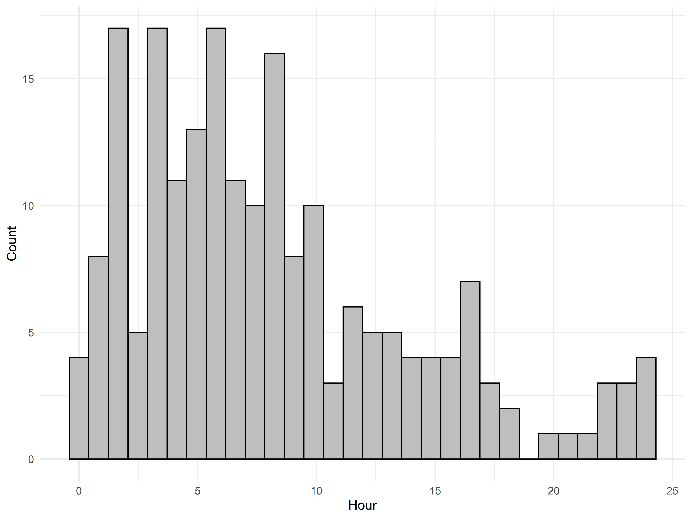

# Per-Wallet Analysis of ETH/USDC Liquidity Positions on Uniswap V3

This is the fourth in a series of posts by [0xfbifemboy](https://twitter.com/0xfbifemboy) on the performance of concentrated liquidity.

## Introduction

In a set of prior analyses, we examined the behavior and characteristics of ETH/USDC liquidity providers across three different Uniswap V3 liquidity pools: the Ethereum mainnet 0.3% and 0.05% fee pools as well as the Polygon 0.05% fee pool. We showed that although the behavior of liquidity providers conformed to rational expectations to some degree, such as with regard to the relative concentration of liquidity across the 0.05% and 0.3% mainnet pools, there nevertheless remained substantial room for improvement. For example, approximately half of all liquidity positions, representing 20-30% of TVL, were generally out of range at any given time, suggesting that active management of liquidity positions could allow liquidity providers to realize superior returns.

All of our prior analyses focused on per-position statistics. However, in practice, positions are not created in isolation; rather, individual users may mint one or multiple liquidity positions, and these positions may form part of a rational strategy to maximize returns on capital. In this analysis, we develop a careful strategy to aggregate and analyze the returns of liquidity positions on a per-user (precisely, per-wallet) basis.

We find that although the distribution of liquidity returns is centered around zero, there is a right tail of profitable users who appear to be skilled at providing liquidity. In particular, when examining profits normalized by the amount of capital deployed and the duration of time over which that capital was deployed, there appears to be a right tail of users who are capable of minting and burning liquidity in an exceptionally capital- and time-efficient manner. These users appear to generally prefer tight price ranges deployed for short durations of time. Curiously, many (but not all) of these users tend to mint their positions out of range; additionally, some of these wallets appear to be controlled by the same person, and the distribution of activity over time is suggestive of automated activity. Exactly what strategy is being employed by these actors is unclear.

We also show that beyond this small subset of highly efficient users, the overall profitability of liquidity providers is low. Strikingly, few factors show clear relationships to profitability. These results, which highlight the inevitable liquidity crisis approaching decentralized finance should Uniswap V3 continue to remain the dominant model for liquidity provisioning, also clearly point at the pressing need for the development of novel DEX systems which make fundamental improvements to the Uniswap V3 model of concentrated liquidity.

## Dataset generation

Aggregation of liquidity positions across multiple wallets is inherently more complex than analyzing liquidity positions individually. As such, it is particularly important for us to carefully define the scope of our analysis.

First, we begin with a dataset of 50,331 liquidity positions across three Uniswap V3 liquidity pools: 23,371 on the Ethereum mainnet 0.3% pool, 12,291 on the Ethereum mainnet 0.05% pool, and 14,669 on the Polygon 0.05% pool, opened as early as May 4th, 2021 and as late as March 22nd, 2022. Each of these positions is minted by interaction with a contract address. Examining the contracts used to mint positions, we see that 88.6% of these positions are minted via interaction with `0xC36442b4a4522E871399CD717aBDD847Ab11FE88` (across both Ethereum mainnet and Polygon), which is the contract address for the Uniswap V3 positions NFT. These positions plausibly represent 'normal' liquidity minters, whereas the remaining 11.4% of positions includes more complex use cases such as just-in-time (JIT) liquidity, vault managers that automatically adjust many different users' positions, etc.

The basic goal of this analysis is to identify patterns in the behaviors of liquidity providers which relate to their profitability, which motivates the exclusion of these more 'unusual' types of liquidity positions in the remaining 11.4%, as they may skew the dataset in ways that are difficult to retroactively disentangle. In particular, suppose we define the following inclusion criteria for liquidity providers:

* Minted via interaction with `0xC36442b4a4522E871399CD717aBDD847Ab11FE88`
* Either the position is still open or, if it was closed, remained open for at least 10 blocks
* Minted at least 1 day ago (relative to the most recent time time recorded in the dataset)

Specifying that liquidity positions must meet both inclusion criteria limits us to 87.4% of our dataset.

One problem immediately arises from the first two inclusion criteria. Addresses may mint multiple liquidity positions which both meet and fail these inclusion criteria; when aggregating on a per-wallet basis, only a subset of their liquidity positions will be included, which may again skew the resulting data in complex ways. (It is reasonable to ignore the third inclusion criterion here; addresses which have older positions should not be disqualified from analysis on the basis of having minted a single recent position within the last 24 hours.) Thankfully, these addresses only constitute a minority of all addresses from which liquidity positions were minted:

As one might naturally expect, most addresses only mint positions which all meet or fail those inclusion criteria. In particular, 10,361 addresses in our dataset are found to only mint liquidity positions which satisfy our first two inclusion criteria. Including only these addresses, and restricting consideration to liquidity positions satisfying the third inclusion criterion, yields a dataset of 38,825 liquidity positions (77.1% of the total dataset of liquidity positions).

We apply one additional filtering step. Occasionally, users create very small liquidity positions "by accident," quickly close them afterward, and never mint another position; for example, they may wish to only briefly test the Uniswap V3 position functionality. These users are relatively uninformative and simply add additional noise into the dataset (as an amusing anecdote, if they are not filtered, they occasionally appear with very high ranks for normalized profit due to sheer luck). We therefore exclude wallets from which only one liquidity position was minted and where the minted liquidity position was closed after a single day, leaving us with 9,811 users collectively managing 38,175 liquidity positions. (We note that all of the positions removed via this criterion had total market values of under $1,000, supporting their classification as ignorable 'test' positions.) Moving forward, we restrict all further analysis to this subset of addresses and liquidity positions.

## Basic observations

Having defined the basic scope of our analysis, we are in a position to begin to make basic observations on a per-wallet basis. We assume that it is appropriate to aggregate liquidity positions on the basis of the address from which the minting transaction originated. While this may not be a perfect assumption, particularly as users move funds between wallets, it is a practical and simplifying assumption.

The provision of ample liquidity is a cornerstone of decentralized finance. As such, it is highly desirable for the number of liquidity providers to increase over time; stagnation in the number of liquidity providers would be concerning insofar as it might represent the failure of decentralized finance to scale past a limited number of initial participants. Previously, we noted that the amount of capital locked into Uniswap's ETH/USDC pools increased over time. However, because prior analyses were performed at the per-position level, it is unclear if that represented an increase in the number of distinct liquidity providers or merely additional capital entering via existing participants.

After aggregating at the level of unique wallets, we see that the cumulative number of known ETH/USDC liquidity providers increases steadily over time:

Even during the last several months of market turmoil, we see a fairly steady increase in the number of unique wallets observed in the pool's history, perhaps representing a desire to capitalize on a "crab market"-like price movement by capturing trading fees without excessive IL. Although this does not account for participants 'dropping out' from providing liquidity, it is nevertheless heartening to see a consistent uptrend in LP interest over the course of nearly an entire year.

To what extent do liquidity providers actively manage and adjust their positions? Even in our limited dataset, we observe a very long-tailed distribution:

Although 52.9% of wallets are only observed to mint a single position and 86.2% of wallets mint 5 or fewer positions, we nevertheless identify a small number of 'power users,' with 0.19% of wallets minting 100 or more liquidity positions.

To what extent to users mint positions on different fee tiers or across different chains? We classified users into five different types based on where they minted their positions: (1) mainnet 0.3% exclusive, (2) mainnet 0.05% exclusive, (3) mainnet 0.3% and 0.05%, (4) Polygon 0.05% exclusive, or (5) mainnet and Polygon:

Notably, the majority of wallets only mint positions to the mainnet 0.3% pool, which is consistent with that pool having a significantly higher TVL tha the mainnet 0.05% pool. This distribution also suggests that although there is some propensity for users to spread their positions across both mainnet pools, cross-chain (mainnet + Polygon) activity is relatively less common.

Examining the distribution of 'user types' among power users with 100 or more positions minted is also informative:

It is immediately evident that the plurality of these users restrict their activity solely to Polygon, plausibly because transaction fees on Polygon are much lower than on mainnet. However, a substantial fraction of these users also provide liquidity across both fee tiers on Ethereum mainnet, whereas very few restrict themselves to a single Mainnet fee tier alone. This suggests that for these highly active users, there is at least some degree of active consideration of the relative benefits of each fee tier as well as some comparative decision being made in order to decide which one to use at a given time. Ultimately, however, there is no particular reason why a user who mints multiple liquidity positions, even if the number of positions is as low as 2, should necessarily have a preference for minting to one, rather than multiple, pools (as the transaction fee does not vary based on which mainnet pool a user mints to); as such, novel DEX systems that more appropriately guide users to distribute positions across fee tiers in accordance to their *a priori* beliefs about market volatility or which merge multiple fee tiers into unified systems may result in greater market efficiency and LP profitability.

In a previous analysis, we noted that larger positions were more likely to be in range, suggesting that wealthier users had a greater tendency toward active management. With our newly aggregated dataset, we can more closely examine the behavior of wealthy users directly. First, we study the extent to which wealth is distributed across different user types (as previously defined). To do so, we take the value of each wallet's liquidity position (in USD), multiply it by the duration of time by which that liquidity position remained open, and sum up this metric on a per-wallet basis (median plotted as vertical black line):

Note that this metric is not a perfect representation of a wallet's overall wealth. For example, it does not distinguish between a user who opens and closes two positions of identical size and duration in sequence and a user who does so in parallel. Although both users are deploying identical *overall* amounts of capital, the first user requires a lesser amount of upfront capital than the second.

That being said, however, it generally appears that Polygon-only users are deploying less capital than average and that multi-chain or multi-fee tier users are deploying more capital than average. This is consistent with expectations: we know that Polygon's transaction fees are much lower than usual, which should generally attract users with lower amounts of total wealth, whereas active management of positions across multiple mainnet liquidity pools is relatively more capital-intensive.

The correlative trend of overall wealth with more active management is also reflected in a plot of value times duration against the number of total positions minted by each wallet:

Generally speaking, wallets which mint more liquidity positions are managing larger amounts of capital over longer durations of time. It is particularly clear from the above plot that as a wallet's tendency to manage more positions increases, their tendency to restrict capital to a single pool (particularly the mainnet 0.3% pool) decreases. Additionally, this trend persists within both mainnet-only and Polygon-only users, although for any given number of liquidity positions minted, the corresponding Polygon users tend to be managing less liquidity than the corresponding mainnet users.

Another fascinating observation is that as the number of liquidity positions minted increases, the lower bound of the value-times-duration metric increases quickly, whereas its upper bound stays relatively flat. This reflects the fact that it is easy to manage a large amount of liquidity across very few positions, whereas it is infeasible to manage a small amount of liquidity across very many positions. In other words, even at high levels of overall wealth, there is a significant user population which opts for a relatively simple approach (minting only a handful of positions and refraining from active burning and re-minting). These users might stand to benefit substantially from the introduction of new DEXes which simplify management of concentrated liquidity, allowing them to derive higher returns on their sizeable capital with low marginal investment of additional effort.

Beyond observing that users who mint more positions manage more capital *overall,* we also find that they manage more capital on a *per-position* basis:

However, although the overall trend is for the per-position value-times-duration to increase as the number of total positions minted increases, it is notable that the upper bound of the per-position value-times-duration modestly but noticeably *decreases* with the number of total positions. Although the meaning of this observation is for now somewhat ambiguous, one reasonable interpretation would be that extremely active liquidity managers prefer to mint new positions rather than deploy marginal capital into existing positions.

Another intriguing observation about the behavior of active liquidity managers comes from observing the *range* of their positions. Previously, we observed that a large number of liquidity positions tended to go out of range, suggesting that users were setting the range of their liquidity positions to overly narrow values. To analyze this phenomenon on a per-wallet basis, we calculated the average range of each position that a given user minted, weighting each position (relative to other positions minted by the same user) by its total dollar value. The same pattern of 'convergence' of lower and upper bounds with increasing number of positions minted that we previously saw is again reflected in this metric:

Users who only mint one liquidity position overwhelmingly tend to mint it to the mainnet 0.3% pool with a relatively wide range. Unsurprisingly, users who mint more positions (reflecting more active management over time or expressing a desire to have a nuanced distribution of liquidity over different prices) generally prefer a more narrow range, which results in greater capital efficiency. However, what is most notable is that the *variance* of the range decreases as the number of positions minted increases. This suggests that very active liquidity minters are minting with a range narrower than that of the single-position minter who wishes to lazily capture trading fees across a very wide price range but with a range broader than that of inexperienced liquidity providers who rapidly go out of position. (Note that in our calculation of average position range, we weighted by value and not by value-times-duration as there is a natural relationship between position duration and range, where users who intend to keep a liquidity position around for a short period of time will set a lower range than those who intend to let them stay untouched for much longer.)

## Impermanent loss vs. fees

The findings thus far provide ample context for the overall dataset of liquidity positions and users. Additionally, they reinforce the results of prior analyses and are highly informative with regard to differentiating the behavior of passive vs. active liquidity managers. However, ultimately, they do not address the central question of this analysis: what differentiates a profitable liquidity provider from an unprofitable liquidity provider?

To determine per-user profit, we need to first determine per-position profit. We define profit as the difference of accrued fees vs. impermanent loss. To approximate accrued fees across all positions, we assume that all fees generated within each time interval (1 hour) are split pro-rata across positions active relative to the mean price in that time interval and with respect to the amount of virtual liquidity in each position. (Although fees are exactly calculable given a full history of liquidity adjustments and swaps, summarizing the data into hourly timepoints allows for greater simplicity of calculation, although at the cost of some precision. When both estimated and precise fees are available, we use the lower of the two, as a mildly pessimistic estimate.) To calculate impermanent loss, we define a time period over which IL is measured, which begins at the block that each position was opened and ends either at its closing block or, if the position is not closed, throughout all future timepoints in the dataset. Impermanent loss is then defined as the difference between the hypothetical USD value of the portfolio if all tokens added as liquidity had instead been held until the end of the IL evaluation period and the actual USD value of the position based on its USDC and ETH token quantities at the end of the evaluation period, in both cases converting ETH token quantities to a USD value based on the closest known price.

The distribution of accrued fees across individual liquidity positions, divided by the total value of the position, is shown below (positions with value under $1,000 excluded to avoid numerical problems with imprecision of calculation):

We see that although the majority of positions collect relatively little in fees, there is a long tail of positions which have exceptional fee collection ability. The extension of the abscissa to a value of 1 does not indicate that there are positions which have a >100% return in fees alone; rather, the axis has been extended for ease of comparison with impermanent losses, which are similarly graphed below as a fraction of total position value:

Comparing the two plots side-by-side, it becomes apparent that the total amount of fees collected is slightly lower than the total amount of impermanent loss. In other words, the fees collected are not, in general, sufficient to outbalance the impermanent losses suffered by the liquidity positions. However, this does not directly imply that all positions are at a loss; the exact distribution of profits depends on how losses are matched against gains. Subtracting each position's impermanent loss from its accrued fees, we see that the distribution of normalized profits has a median very slightly below zero:

In particular, only 48.6% of positions appear to be profitable. However, it is important to not overinterpret this statistic's deviation from 50%; given the limits of the data as well as the difficulties in precisely estimating gains and losses, this result suggests that the profitability of a given liquidity position is generally randomly distributed around zero. Notably, the distribution here has, again, very long tails; while the vast majority of liquidity positions are relatively neutral in profit, a small number have suffered extreme losses or are in tremendous profit. This is consistent with the hypothesis that the majority of liquidity positions have essentially random profitability aside from a tiny minority of skilled operators.

This sets the stage for us to aggregate profits on a per-wallet basis. First, for each liquidity position, we divide its profits by the USD value of the position as well as the duration of time that the position was open. Again, the motivation here is that we are interested in cases where profits are earned by a highly skilled operator, rather than through inefficient use of high quantities of capital or by simply leaving a position open long enough by pure chance. To aggregate this adjusted profit value on a per-wallet basis, we take the weighted mean of these adjusted profit values across all positions that a wallet opened, where the weight of each position is the product of its USD value and the duration of time that it was open. Here, we are taking the weighted mean to reflect the intuitive assumption that if a user opens a 1 USD position, that should affect the aggregated value much less than a 1,000,000 USD position, or that if a user leaves a position open for 1 second, that should affect the aggregated value much less than a 1-year-old position. In sum, to calculate a metric which we call a user's *normalized profit,* we divide each position's profit by value and duration and then take the weighted mean using value times duration as the weight of each position. The distribution of normalized profits is plotted below:

Note that this distribution is very long-tailed (the abscissa has been arbitrarily truncated to show the shape of distribution closer to 0) and that, as with the per-position analysis, the typical position is very close to zero normalized profitability. (To be precise, 54.2% of users appear to be in the red based on this metric.) Again, the roughly symmetric distribution of normalized profits around zero suggests that the majority of users experience a profitability which is effectively randomly sampled from a distribution centered at or close to zero.

To further characterize our metric of normalized profits, recall from the previous section that several per-wallet statistics were observed to vary substantially with the number of positions minted. How does normalized profit vary with the number of positions minted?

As the number of minted positions increases, normalized profits remain roughly centered around zero, at least in the median case. However, we see that the shape of the distribution of normalized profits for fixed numbers of minted positions varies in a fascinating way. Visually, it appears that as the number of minted positions increases from 1 to about 25, the variance of normalized profits decreases *very* slightly, potentially reflecting a 'regression to the mean' effect where averaging together the profits of multiple positions with randomly distributed profits results in a distribution of normalized profits with a lower variance than that of the distribution from which individual positions are sampled. However, as the number of positions minted increases beyond 50, the dispersion of normalized profits increases dramatically, particularly in the direction of profitability. These returns may reflect users who are attempting to implement more complex strategies and whose returns are therefore no longer being sampled from the same distribution as those who only mint a handful of positions here and there with relatively less thought.

How else can these high-normalized profit positions be distinguished? As with before, we can examine the weighted mean of the ranges of each user's liquidity positions (weighting by the dollar value of each position). Plotting normalized profits against each user's average position range reveals a striking trend:

(The above plot is truncated to exclude positions with extremely high ranges, which are effectively providing ambient liquidity.) In general, all of the exceptionally high-performing positions are minted to a very small range, typically below 100 USD! This is particularly apparent if we highlight the top 200 users in the distribution of average position range:

This leads us to a natural question: if these positions are minted to very narrow ranges, are they also limited to short time intervals? After all, if the price of ETH moves out of range, they will suffer extreme IL and fail to collect fees, dramatically reducing their overall normalized profitability. We can again take the mean of the duration of time that each user leaves their positions open, weighting by the dollar value of the positions:

As we suspected, the top 200 users generally mint and burn positions within very short durations of time, seldom leaving them open for more than 1 day! Such a high level of active management also leads one to wonder: where are users minting these positions? Extremely active minting and burning of liquidity positions leads to the consumption of high amounts of gas, resulting in potentially very high costs if performed on Ethereum mainnet. Again as expected, the distribution of user types (as previously defined) among the top 200 users reflects enormous overrepresentation among Polygon-specific users:

Recall in particular that the distribution of user types among *all* users showed that the majority of users only minted positions to the Ethereum mainnet 0.3% pool, which is a stark departure from the distribution of activity among the top 200 users by normalized profits!

## Case studies

Our results thus far paint a picture of liquidity provision where a small number of skilled participants deploy capital for very short durations and to very small, highly concentrated price ranges to capture trading fees in a highly capital- and time-efficient manner. The vast majority of liquidity providers, in contrast, have profits which are distributed around zero, suggesting that the balance of their fees to impermanent loss is essentially random.

To better understand these phenomena, it is instructive to directly examine a series of case studies. For example: who is the user with the highest normalized profit in the entire dataset? What, exactly, are they doing?

The user in rank #1 is [`0xC58EB5D56cDfD4aB3ed81D3C8df3522d232d064A`](https://polygonscan.com/address/0xC58EB5D56cDfD4aB3ed81D3C8df3522d232d064A), who has minted 203 liquidity positions on Polygon with a (value-weighted) average range of 36 dollars and which they keep open for an (value-weighted) average of 0.09 days! What is *particularly* notable is that only 10% of their positions are minted in range, suggesting that they are using concentrated liquidity positions in a limit-order like fashion, where they mint with the expectation of an incoming price movement and close their position rapidly afterward.

The wallet in rank #1 was first funded 97 days ago. However, curiously, it has been inactive for the last month or so. However, if we examine the last transactions they made, we can see that they were in fact transferring all funds to a new wallet:

Indeed, they seem to have moved all funds to [`0x24C993cB4F3345395471869B3f1a4281fb237Ad0`](https://polygonscan.com/address/0x24c993cb4f3345395471869b3f1a4281fb237ad0), who as of the time of this article's writing has an impressive array of [24 open Uniswap V3 liquidity positions](https://opensea.io/0x24c993cb4f3345395471869b3f1a4281fb237ad0). Interestingly, this new address appears in the dataset as being net unprofitable; however, the dataset only includes 10 of their liquidity positions, and closer examination of their transaction log suggests that they only began to resume liquidity position management in earnest several days ago (after the bulk of the data was retrieved). It is plausible that as time goes on, the profitability of their new wallet may also begin to rise up the ranks.

Curiously, the original address, [`0xC58EB5D56cDfD4aB3ed81D3C8df3522d232d064A`](https://polygonscan.com/address/0xC58EB5D56cDfD4aB3ed81D3C8df3522d232d064A), seems to have minted positions within nearly every hour of the day:

Although there is a relative period of inactivity within the day, there are nevertheless positions minted within that period; as such, it is not immediately obvious whether this distribution of activity reflects an unusual sleep pattern or is simply the result of automated computations.

The user in rank #2, [`0xBB6E61C95E06AfC212ad68de9d99a07aA66afb98`](https://polygonscan.com/address/0xBB6E61C95E06AfC212ad68de9d99a07aA66afb98), is mysteriously similar, having minted 73 positions to Polygon with an average range of $37 and keeping them open for an average of 0.9 days on average. They also went inactive 76 days ago, after which they transferred all their assets to [`0xA0aFbE834c88b7d978a785703104D9a63adb27BF`](https://polygonscan.com/address/0xa0afbe834c88b7d978a785703104d9a63adb27bf):

This address is ranked 130 by normalized profits (across 29 liquidity positions, including some on mainnet)! And it, in turn, went inactive 74 days ago, moving all its assets to [`0xF3f79f566f81917ecF2B9914A02799D6292738d0`](https://polygonscan.com/address/0xf3f79f566f81917ecf2b9914a02799d6292738d0):

[`0xF3f79f566f81917ecF2B9914A02799D6292738d0`](https://polygonscan.com/address/0xf3f79f566f81917ecf2b9914a02799d6292738d0) is, in contrast to the prior addresses, currently unprofitable.

The overall pattern of activity across all of these addresses so far—broadly favoring minting positions to Polygon, generally tending to perform well, and liable to suddenly transfer all of their assets to other wallets and go inactive—may be merely part of a larger web of addresses, all acting according to some sort of coordinated scheme. That being said, the pattern of hourly activity for the #2 user is fairly different from that observed for the #1 user:

A mystery for a more enterprising researcher, with more time on their hands, to solve!

What about user #3? In a curious turn of events, [`0xC0D9244af044315a1e586B4D569a83De3C4a5cA8`](https://etherscan.io/address/0xC0D9244af044315a1e586B4D569a83De3C4a5cA8) has zero positions minted on Polygon, instead reaping nearly $70,000 in profit across 33 mainnet 0.3% positions and 11 mainnet 0.05% positions. Again, however, this user prefers narrow, short-duration positions, with an average range of $14 and duration of 0.05 days. Additionally, only 9% of the positions minted by this user begin in-range. Somehow, this user has managed to eke out fairly consistent profits:

A manual examination of their positions suggests exceptionally skillful timing. For example, position [102294](https://etherscan.io/nft/0xc36442b4a4522e871399cd717abdd847ab11fe88/102294) was [minted](https://etherscan.io/tx/0x5c69836f00e9192b9a153ddb01b91418b262f62799180bf3d4f084a00ed27f3a) with a price range of $2,550 to $2,566 and initial capital of approximately $2 million in Ether. When it was [closed](https://etherscan.io/tx/0x347d5865b08200723262270b3d8ec8ed9c61e182686af7ddc2e70a1959c3a8be) one hour later, the user withdrew well over $10k in profit: unbelievable capital efficiency!

What happens if we instead rank users by unadjusted gross profits? The user with the highest gross profits is [`0xB0b0F6F13A5158eB67724282F586a552E75b5728`](https://etherscan.io/address/0xB0b0F6F13A5158eB67724282F586a552E75b5728), who minted 7 positions on the Ethereum mainnet 0.3% pool, all of which started in range. These positions have an average range of $1,158 and have been open for an average of 319 days—nearly the entire lifetime of Uniswap V3 itself! If one examines this address's positions [more closely](https://revert.finance/#/account/0xB0b0F6F13A5158eB67724282F586a552E75b5728), it becomes apparent that this user essentially "set and forget" extremely large liquidity positions, all of which were initialized at an ETH price fairly close to the current price (weighted mean of $3,475 using position values as weights). As such, this position has had an incredibly large amount of time to collect fees, during most of which the price of ETH was in range, and ultimately has relatively minimal IL relative current prices.

This user demonstrates several important points: First, even naive, simple usage of concentrated liquidity can be profitable; however, the user must set an appropriately wide range, otherwise trading fees will not be captured. Second, it is highly plausible that this is largely an artifact of current price movement rather than an explicitly anticipated outcome from the user (who I doubt did not expect the price of ETH to remain around $3,000 one entire year into the future). If IL were measured at different timepoints, for example at the peak of ETH prices close to $5,000, the profitability of this position would appear much different. Third, even despite this user's extremely fortuitous luck, they are still merely rank #454 in normalized profits, which emphasizes the remarkable value of active management which optimizes capital and time efficiency!

Broadening our search to the top 20 users in gross profits, it is clear that these users can be cleanly separated into two categories. First, there are 4 users with average position duration below 1 day, all of whom minted exclusively to the Ethereum mainnet liquidity pools. Interestingly, all four of these users are ranked 57 or below in terms of normalized profits, representing high capital and time efficiency as well as high absolute profits. Specifically, these users are:

* [`0x89Cd98a69Ac5dCfF78C5F436A5A34E90bB257b84`](https://revert.finance/#/account/0x89Cd98a69Ac5dCfF78C5F436A5A34E90bB257b84)
* [`0xaB7Deb42cAeA381efFe58E2F669fdeFd555db698`](https://revert.finance/#/account/0xaB7Deb42cAeA381efFe58E2F669fdeFd555db698)
* [`0x3F0f84b1a06C4281617be9af650395Bf71660035`](https://revert.finance/#/account/0x3F0f84b1a06C4281617be9af650395Bf71660035)
* [`0x1b272cBd2ae16192bcB748797a06B28f8b8539FA`](https://revert.finance/#/account/0x1b272cBd2ae16192bcB748797a06B28f8b8539FA)

In a deviation from the behavior of those users at the top of the normalized profits ranking, however, all four of these users minted with fairly wide position ranges (on average: $3,120, $93, $407, and $98 respectively). Again, this behavior is suggestive of exceptionally good liquidity timing. However, what strategy these users are employing to deliver such remarkable returns remains obscure.

The other 16 users in the top 20 by gross profits, in contrast, minted positions which were open for much longer on average (a mean of 87 days across the 16 users) and with much higher ranges (a mean of $3,052 across the 16 users, excluding the 1 user with effectively unbounded liquidity). Although it is in principle possible that these users are in fact making accurate predictions about long-term ETH movements on the order of months, it is also plausible that they are simply 'lucky' in terms of ETH price movements during the periods of time in which their liquidity positions are open (much like rank #1 in gross profits).

## Conclusion

Although somewhat discursive in nature, our exploration of Uniswap V3 data on a per-wallet basis appears to have identified the existence of a subset of users with preternaturally strong ability to 'time' the rapid addition and removal of highly concentrated liquidity. These users generate substantial fee accrual in short durations of time without undue exposure to impermanent loss and, as such, dominate in terms of normalized profits.

Users beyond this particular subset have normalized profits which appear to largely be sampled from a distribution centered around zero, *i.e.,* they are accruing profits largely based on luck rather than skill. Evidence for this hypothesis is supplied by the fact that the positions with the highest gross profits have very low levels of impermanent losses simply due to the fact that the time of evaluation, the price of ETH was fortuitously close to the price at which they opened their positions. (Since data was collected for this analysis, the price of ETH has changed by over 10%; were we to re-run the analyses, the same users would be at the right end of the distribution of normalized profits, but the members of the top 10 in terms of gross profits would likely be quite different.)

Our results are highly provocative insofar as they suggest the existence of sophisticated strategies employed by skilled actors. The particular nature of these strategies was beyond the scope of the current analysis; however, successful inference of the methods being used to time liquidity addition would result in highly valuable information. They could, of course, be implemented for profit; they could also be usefully integrated into DEXes, for example via forward-looking prediction of abnormally high volatility as a barometer to modify trading fees.

Additionally, our findings point to the extreme difficulties that 'normal' LPs face in profitably supplying liquidity (in the absence of sophisticated strategies deployed on extremely short timescales). In the long run, if supplying DEX liquidity is not profitable, decentralized finance may face a crisis of declining liquidity; as such, systems which propose novel solutions to address LP profitability, such as via merging fee tiers, automatically modifying pool parameters, or guiding LPs to set appropriate position ranges are in dire need. When interpreting these findings, it is crucial to note that all of these results are wholly *within* the context of Uniswap V3. On one hand, the lack of clear, 'obvious' signals which relate to LP profitability on a broader scale is disappointing; on the other hand, they clearly highlight the transformative *potential* of new DEXes which fundamentally change the mechanics of liquidity provisioning.