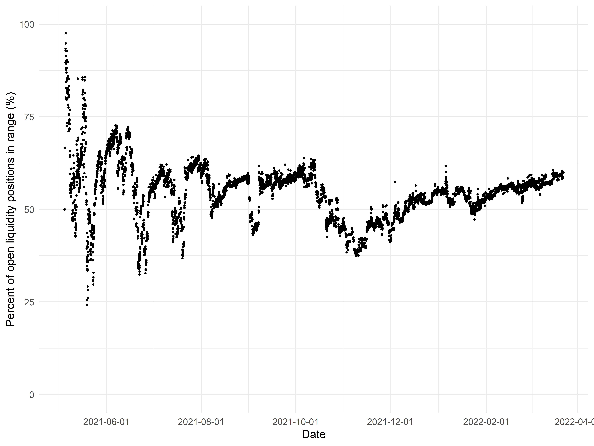
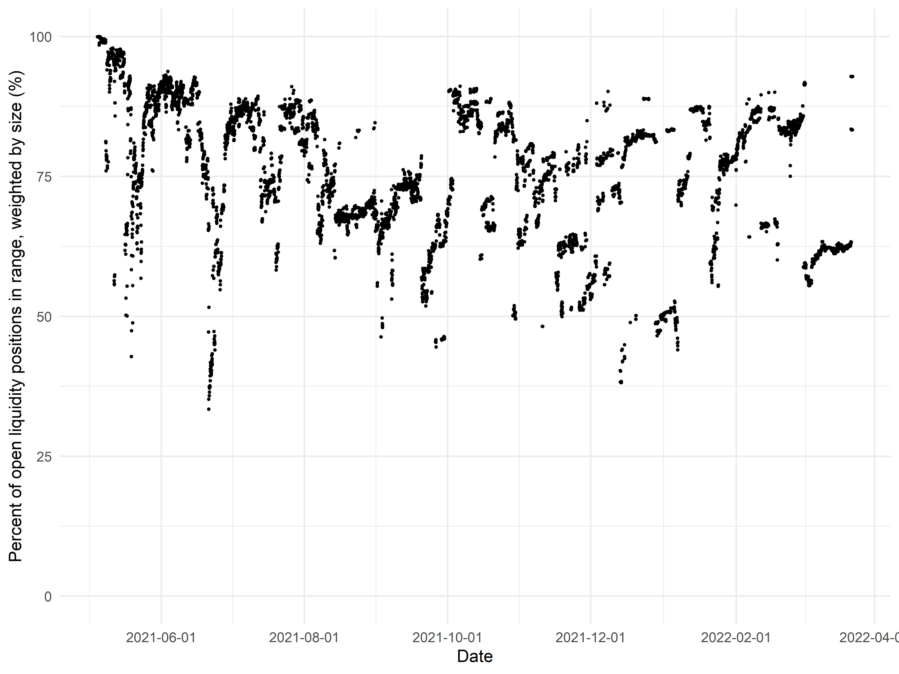
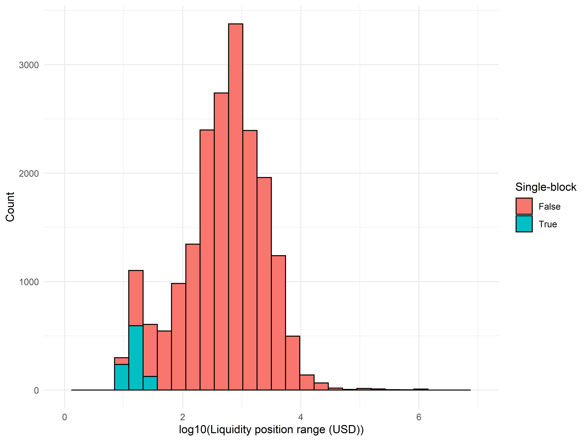
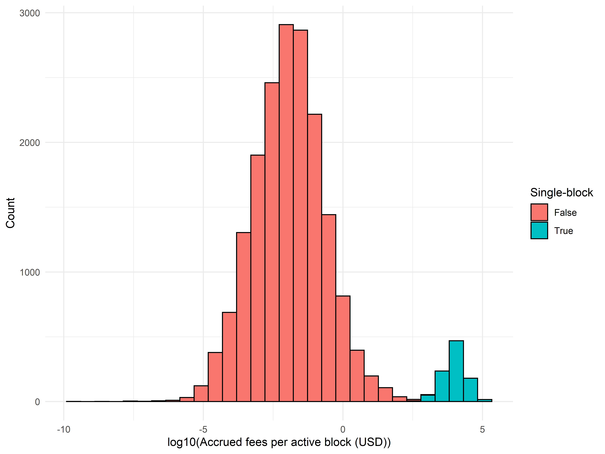
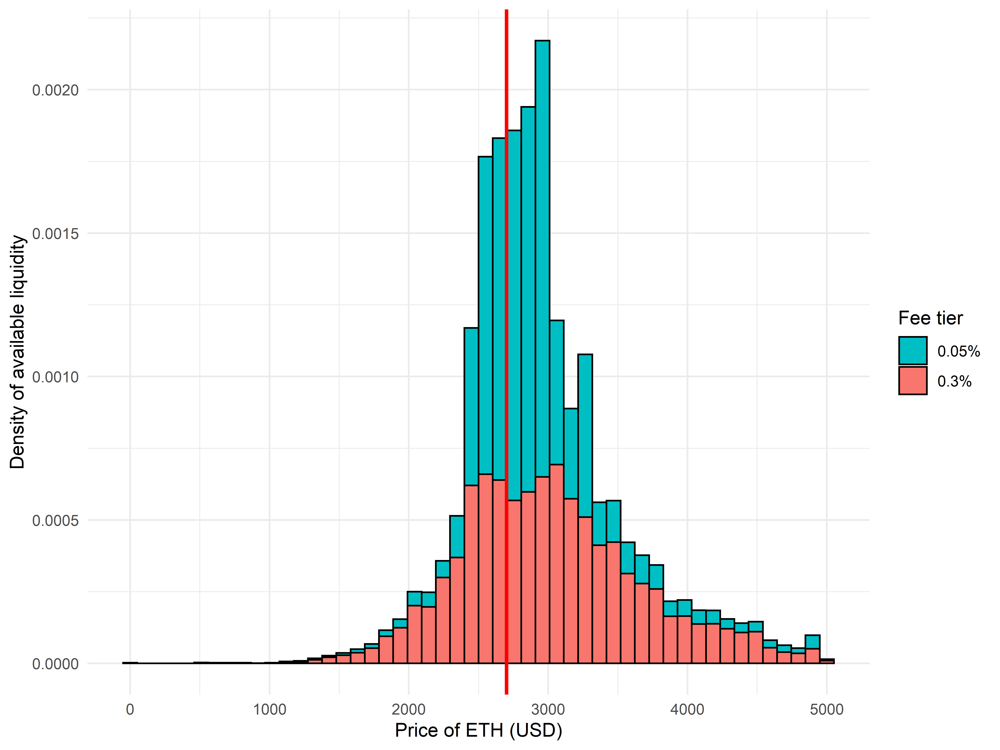
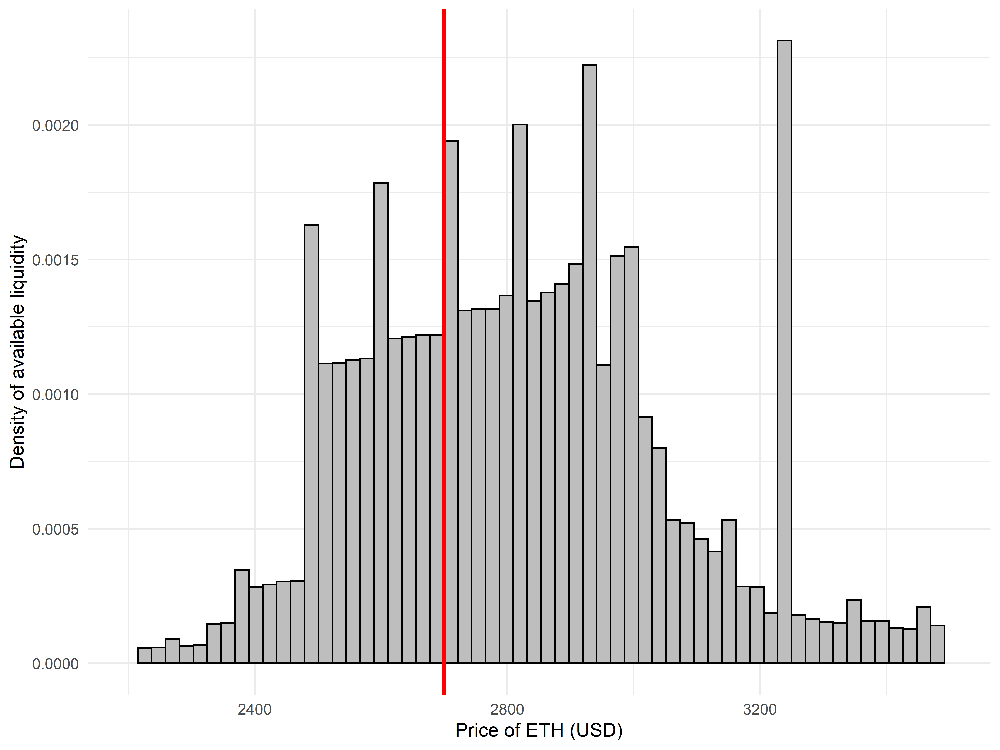
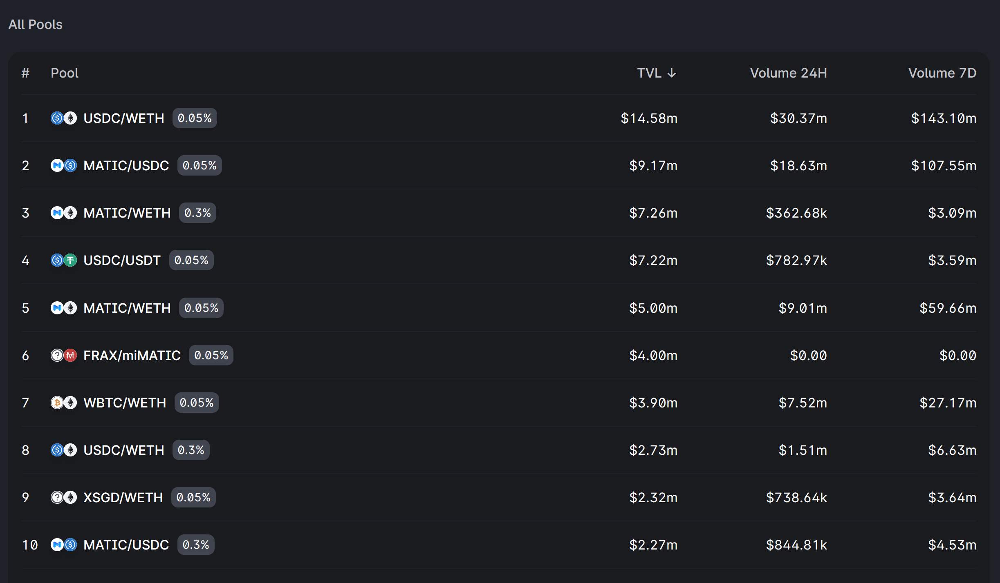
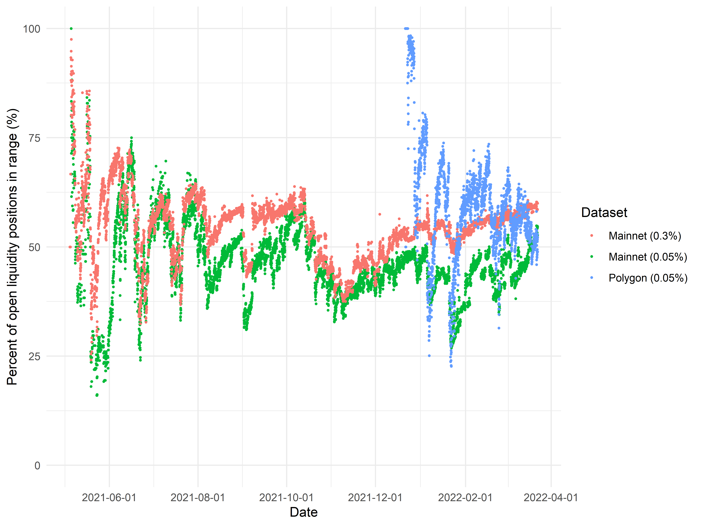

## Introduction

One of the most compelling and enduring primitives of decentralized finance has been the constant function market maker, starting with the release of Uniswap V1 in late 2018 on the Ethereum mainnet. Since then, new versions of Uniswap as well as innumerable forks have captured billions of dollars' worth of liquidity. For example, Uniswap V3, which introduced the concept of 'concentrated liquidity,' currently accounts for over [$4b of liquidity](https://info.uniswap.org/#/) on Ethereum mainnet alone.

However, the profitability of being a liquidity provider (LP) on Uniswap has recently been called into question. For example, a study by Loesch *et al.,* [Impermanent Loss in Uniswap v3,](https://arxiv.org/abs/2111.09192) estimated that about half of LPs would have been better off holding assets directly rather than providing liquidity. These results were widely popularized by an [article](https://rekt.news/uniswap-v3-lp-rekt/) on Rekt, and since then there has been a substantial amount of public dialogue about the losses that LPs face due to the phenomenon of impermanent loss (IL).

At a basic level, Uniswap LPs profit a fixed trading fee associated with each liquidity pool, typically 0.01%, 0.05%, or 0.3% of the value of each swap. However, when the price of the two assets begins to diverge, LPs experience IL associated with that divergence, as LPs are essentially continuously selling the appreciating asset of the pair for more of the depreciating asset. Therefore, LPs are in profit overall if the trading fees captured outweigh the IL to which they are subject. These considerations apply to both the *xy = k* model of Uniswap V1/V2 as well as the concentrated liquidity model of Uniswap V3. In Uniswap V3, LPs may capture more trading fees whenever their liquidity is in range; however, if the price moves permanently out of the range of their liquidity, their IL is correspondingly exacerbated. Additionally, Uniswap V3 comes with the phenomenon of "just-in-time liquidity," which further reduces the fee accrual of 'normal' liquidity providers.

Liquidity provisioning is crucial to decentralized finance; however, if providing liquidity is generally unprofitable, then eventually DeFi will experience an enormous liquidity crisis. It is therefore tremendously important to understand how we can improve upon Uniswap V2/V3 and arrive at a model of truly sustainable liquidity provisioning. To that end, we have performed a novel analysis of Uniswap V3 pool data, which is complementary to and extends the results of Loesch *et al.*

Our results suggest that LPs, especially smaller LPs, are constrained by capital, attention, and time in the degree to which they can actively manage their concentrated liquidity positions on Uniswap V3. As a result, their positions tend to drift out of range, suffering from IL and failing to capture any trading fees. Novel decentralized exchanges that allow for simpler, more gas-efficient, active liquidity management may therefore serve as a step toward a long-term model of sustainable DEX liquidity.

## Analysis of the largest ETH/USDC pool

As previously mentioned, approximately $4.4 billion of liquidity is currently accessible through Uniswap V3 on Ethereum mainnet. However, most pools are very small, with a handful of top liquidity pools capturing the lion's share of that value:

To begin exploring the wealth of on-chain data, we retrieved the price and liquidity history of the pool with the highest TVL (ETH/USDC 0.3%). Because the state of the pool is always known, by keeping track of when new liquidity positions are minted, updated, or burned, we can straightforwardly interrogate the data to answer a number of basic questions.

For example, at the time of this post's writing, the ETH/USDC 0.3% pool on mainnet has around 3.4k open liquidity positions. Taking a look at the size of these positions (as measured by the market value of added collateral at the time(s) liquidity was minted or added), it appears that the majority of liquidity positions are worth 3 to 5 figures:

In fact, out of these 3.4k positions, the vast majority (close to 80%) were minted with less than 10k of liquidity. However, the bulk of the liquidity in the pool (in dollar terms) resides in the remaining 20% of positions, some of which are individually worth millions of dollars each.

Notably, as of the time of this post's writing, only around 2k of these 3.4k open liquidity positions are actually in range---meaning that 41% of all Uniswap V3 positions on the largest liquidity pool are earning no trading fees whatsoever! More generally, we can ask: at each timepoint since the pool was created, what proportion of liquidity positions are active (*i.e.,* the price of ETH is inside the active range specified by the position's minter)? The plot below shows the time course of this position over the last eight months.

Immediately, we notice that in the first week of the pool's existence, the majority of liquidity positions are in range; however, over time, the proportion of in-range positions seems to fall dramatically, stabilizing at slightly above 50%. This result is naively quite unexpected, as liquidity which is completely out of range is not generating any fees for its owner, and the capital locked in those positions could be far better used elsewhere.

One natural extension of this analysis is to see how the proportion of in-range positions varies with the price of ETH. In the plot below, these two time series have been overlaid on the same plot (with an arbitrary scaling factor of 0.01 applied to the ETH price for plotting):

Periods of sudden price movement, such as the timepoints at the beginning of September 2021, appear to be associated with sharp reductions in the proportion of active positions, as expected. In addition, the run-up in price from October to mid-November appears to be correlated with a consistent decline in the proportion of active positions, which gradually reversed as the price of ETH fell from its all-time high over the following 3 months. Taken together, these data would appear to suggest that a great deal of the variation in the proportion of active positions is coming the price drifting in and out of range of "old" liquidity positions.

Another natural question is to ask what proportion of liquidity *in dollar terms* is in-range at any given time. Because the gas cost of modifying a position is static regardless of size, it is intuitive to expect that smaller positions end up out of range more often than larger positions. Consequently, examining the proportion of active positions alone may understate the degree to which the volume of liquidity in the pool is utilized. The results of this calculation are shown below.

We performed this analysis by valuing liquidity at the market price of ETH at the time that liquidity was minted or added to a given position. This is not a perfect approximation, as the price of liquidity positions varies continuously over time; however, we believe it is a reasonable simplification to make.

It is readily apparent that weighting liquidity positions by the value of the liquidity contained within them results in much higher estimates for the proportion of liquidity in range, which for the ETH/USDC 0.3% pool appears to fluctuate between 60-80%. The "jumpy," discontinuous nature of the graph likely results from the instantaneous price moving across the boundaries of very large liquidity positions, as well as large LPers choosing to enter or exit the pool wholesale.

Although the situation appears to be improved, there are several important points to note. First, upwards of 20% or more of the liquidity in the pool typically remains entirely out of range, representing a poor usage of capital. Second, these results suggest that smaller liquidity providers are limited by the costs and complexity of active liquidity management, causing their positions to frequently stay out of range as opposed to larger LPers for whom the fixed cost of active management is far more worthwhile. Effectively addressing these barriers would allow for smaller players to more equitably share in the rewards of liquidity provisioning, rather than having LPing become a game dominated by large players.

To further understand why positions become or stay out of range, we can directly examine the relationship between different variables, such as a liquidity position's age or value, and the propensity for an currently open liquidity position to be in or out of range.

The relationship between a position's age and its likelihood of being in range is admittedly fairly confounded by month-to-month variation in the price of ETH. For example, if the price increases and then decreases, then an older position minted at the original price may go out of range on the uptrend but end up back in range after the downtrend. However, if the price of ETH continues to steadily trend upward or downward over the course of multiple years, the number of out-of-range positions minted months or years ago will steadily accumulate.

However, the relationship with position size is considerably stronger:

Aside from an 'edge effect' at the very rightmost end of the graph (due to extreme data scarcity; there is a single [very large position](https://opensea.io/assets/0xc36442b4a4522e871399cd717abdd847ab11fe88/179646) out of range worth 10 million dollars), larger liquidity positions are far more likely to be in range, consistent with our prior observations that the proportion of total liquidity in range is far greater than the proportion of distinct positions in range.

Beyond positions moving out of range, another factor that reduces the profits of liquidity providers is the phenomenon of just-in-time (JIT) liquidity, where liquidity is added and removed in the same block by a MEV bot. The liquidity addition and removal are narrowly targeted to sandwich large swaps; although this actually improves execution price for the swapper, the provisioner of JIT liquidity captures a large fraction of the trading fees generated by the swap at the expense of preexisting liquidity providers. In the long run, the increasing proliferation of JIT liquidity may serve as a strong disincentive to provide liquidity to risky asset pairs.

As such, it is informative to examine the prevalence and impact on JIT liquidity. Although there is no way to precisely identify which liquidity positions originate from JIT MEV bots, one plausible heuristic is to simply examine liquidity positions which are minted and burned in the same block. One block on Ethereum mainnet corresponds to approximately 12 seconds, so the likelihood of manually generating non-JIT liquidity positions which fall under this classification is relatively low. (We also exclude positions where the minting transaction also burns a different liquidity position or vice-versa, to filter out complex liquidity management procedures from automated vaults.)

Using this criterion, we identify around 3,000 JIT liquidity positions in the history of the ETH/USDC 0.3% pool (around 6% of all minted positions). To validate this classification, we examine the extent to which the following assumptions hold: First, JIT positions should be very narrowly targeted, to allow the minter to capture as much of the trading fees generated by a target swap as possible. Second, JIT positions should be very *efficient* in generating fees relative to typical liquidity positions and with respect to the amount of time they remain active. Below, we show the distributions of the corresponding metrics (on a per-liquidity position basis).

As expected, all of the single-block liquidity positions are targeted at a very narrow price range.

Similarly, all of the single-block liquidity positions are extremely efficient at generating fees. Together, these results suggest that our putative classification of single-block liquidity positions as JIT positions is accurate. Furthermore, the distribution of fees per active block shows the extent to which JIT positions are far more effective for fee generation than normal liquidity provisioning; indeed, the distribution of JIT fee efficiency falls almost completely outside the distribution of non-JIT fee efficiency.

Perhaps thankfully, the proportion of total fees accruing to JIT liquidity continues to remain quite low. However, over time, the presence of JIT bots will continue to serve as an ongoing disincentive to the provisioning of non-JIT liquidity, whether passively or actively managed.

## Analysis of ETH/USDC liquidity across fee tiers

The previous analyses have focused solely on ETH/USDC liquidity within a single pool charging a 0.3% swap fee. However, on Uniswap V3, the liquidity for the ETH/USDC token pair is actually split between two different pools, one charging a 0.3% swap fee and another one charging a 0.05% swap fee. As we can see, although the TVL of the 0.3% fee tier is higher, the volume of swaps executed via the 0.05% fee tier liquidity is much greater:

Although it may not be immediately apparent why liquidity is fractured across multiple fee tiers, a comparison to standard order books renders the utility clear. The fee charged by a given liquidity pool is roughly analogous to the bid-ask spread charged by a traditional market maker on an order book. The depth of liquidity should be greatest close to midpoint of the order book, where the bid-ask spread is minimized. However, as you proceed deeper into the order book, the liquidity falls off and the effective spread captured by a market maker is typically greater.

Due to the unique nature of constant function liquidity and concentrated liquidity positions, there is less of a necessary mechanical relationship between all of these different concepts than in a standard limit order book. However, if the market for providing liquidity is at least somewhat efficient, one should expect relationships between analogous concepts to roughly hold. For example, one should expect the majority of the ETH/USDC liquidity on Uniswap (across both pools) to be concentrated around the current instantaneous swap price; furthermore, one should also expect the lower fee tier's liquidity to be more tightly concentrated around the market price than the higher fee tier's liquidity. Intuitively, one could say that as liquidity providers expose themselves to more adverse selection by providing liquidity at greater depths, they should also charge commensurately higher fees as compensation.

The distribution of liquidity across the 0.3% and 0.05% fee pools appears to be consistent with these expectations:

In the above plot, the vertical red line represents the current ETH price. As expected, the depth of liquidity drops off at increasingly distant prices, and the 0.05% fee tier liquidity is typically minted to a tighter range than the 0.3% fee tier liquidity. In practice, what this means is that most swaps will be routed through the 0.05% fee liquidity; however, in conditions of market volatility and movement, especially if large swaps are made or if the price moves substantially upwards or downward, the 0.3% fee liquidity will begin to receive an increasing share of the trading fees.

Beyond the concentration of liquidity at a a tighter range, the size of individual liquidity positions also appears to be slightly higher in the median case for liquidity positions minted to the 0.05% tier pool:

This observation is interesting in light of the fact that the 0.05% pool has much lower TVL than the 0.3% pool, suggesting that liquidity provisioning in the 0.05% pool is somewhat more dominated by large players. That being said, however, even large players should prefer to spread out their liquidity over several smaller positions, to avoid sharp threshold effects where sizable chunks of their liquidity become completely active or inactive as the instantaneous price crosses a boundary point. The existence of these boundary effects is clearer when examining the liquidity distribution on the 0.05% pool alone:

There is a very clear dropoff in available liquidity when the price of ETH falls under $2,350 or rises abouve $3,000, largely attributable to the fact that a single liquidity position accounts for the a large proportion of the liquidity in the rectangular 'chunk' in the middle of the distribution. It is, of course, possible in principle that a liquidity distribution with sharp thresholds past certain prices might be preferred for certain assets. However, the existence of these threshold effects even within the ETH/USDC liquidity distribution is suggestive of inefficiencies in the existing LP system. Conceivably, were liquidity positions more easily manageable (*e.g.,* with lower gas fees for adjusting positions), the resulting distribution of liquidity across ETH prices would exhibit a smoother curve as liquidity providers incorporate more sophisticated strategies with multiple, frequently changing positions.

## Analysis of ETH/USDC liquidity across chains

In December 2021, Uniswap [launched a deployment](https://www.coindesk.com/markets/2021/12/22/uniswap-launches-on-polygon-driving-matic-to-all-time-highs/) on Polygon. As Polygon is an EVM-based sidechain with much lower transaction fees than Ethereum mainnet, comparison of the behavior of liquidity providers between Uniswap pools of identical assets on Ethereum mainnet and Polygon may indicate to what extent liquidity providers are constrained in their actions due to high transaction fees on Ethereum mainnet.

There are, of course, many intrinsic differences between the mainnet and Polygon datasets: the Polygon deployment is only 2 months old, compared with nearly a year for Uniswap V3 on mainnet; the two chains plausibly have different userbases with different levels of wealth, behavioral tendencies, and preferences; the data for Polygon is confounded not only by the recency of deployment but also by highly volatile market conditions post-launch; finally, the preexistence of Uniswap V3 liquidity pools on mainnet may crowd out liquidity provisioning which might otherwise have occurred on Polygon. As such, it is challenging to perform these comparisons in a rigorous manner. Nevertheless, even informal analyses provide some clarity into future directions for improvement of DEX liquidity management. (Thankfully, because the structure of Uniswap event data is exactly identical across both chains, we were able to use the exact same data retrieval and analysis scripts, meaning that the data should be comparable at a basic level.)

In general, the Uniswap TVLs are much lower on Polygon than on Ethereum mainnet:

Interestingly, on Polygon, the 0.05% fee tier pool for ETH/USDC leads in both TVL and 24-hour volume traded, as opposed to Ethereum mainnet, where the 0.05% pool has higher volume but the 0.3% pool has higher TVL. The reason for this discrepancy is not immediately clear. One plausible explanation (among many) is that swaps on Polygon Uniswap are smaller than swaps on Ethereum mainnet:

This difference may originate in part from Polygon users being less wealthy and in part from the fact that preexisting liquidity on mainnet is much deeper. Because sufficiently large trades will naturally route through both lower and higher fee tier liquidity pools for superior execution, small swap sizes on Polygon might disproportionately favor the 0.05% pool for returns on liquidity provisioning, leading to the dominance of the 0.05% pool in both TVL and swap volume. However, in the absence of additional information, it is not clear to what extent this is an accurate characterization of the reasoning behind liquidity provider's choices. For simplicity, we will consider only the Polygon 0.05% pool in subsequent analyses.

If liquidity providers' ability to readjust out-of-range positions is limited by the fixed cost of gas on Ethereum mainnet, we should expect liquidity positions on Polygon Uniswap pools to be in range at a higher frequency than liquidity positions on Ethereum mainnet. Owners of large positions will be able to readjust their positions regardless, and so the proportion of total liquidity in range by dollar value may not be all that much higher on Polygon; however, if it is true that smaller LPs are gated by mainnet transaction fees, then it would be natural to predict a higher proportion of individual liquidity positions is in range on Polygon Uniswap than on Ethereum mainnet.

This is *weakly* supported by the data:

Looking first at the proportion of individual positions in range at any given time (without weighting for position size), the Polygon 0.05% pool's liquidity positions are in range roughly as often as positions on the 0.3% mainnet pool and noticeably more than positions on the 0.05% mainnet pool. Several caveats are worth noting. First, there is clearly very high variability in this metric in the first several weeks immediately following deployment on Polygon. Second, because the Polygon deployment has only been active for two months, positions have not yet had as much time as the mainnet Uniswap pools to drift out of range, especially given the relatively range-bound price action of ETH in the first part of 2022.

The difference between the mainnet and Polygon deployments is also quite modest after weighting liquidity positions by size:

As with positions on Ethereum mainnet, a much higher fraction of total liquidity value on Polygon is in range as compared to the fraction of individual positions in range at any given time, suggesting that large positions are being actively managed to avoid staying out of range for prolonged periods of time. However, again, the dearth of data renders it difficult to draw strong conclusions.

Overall, the analysis of Polygon data is somewhat inconclusive. It does not strongly indicate that out-of-range positions would be readjusted were it not for gas fees on Ethereum mainnet; at the same time, especially given the difficulty of drawing direct comparisons between the Ethereum mainnet and Polygon deployments of Uniswap V3, it does not preclude that possibility. That being said, if gas fees are indeed not a strictly limiting factor to liquidity position readjustment, the Polygon data might then plausibly be interpreted to suggest that liquidity providers would benefit from the direct incorporation of tools, vaults, or strategic aids for active position management directly inside DEXes' dApps, as well as from more comprehensive support and education about liquidity provisioning in general.

Broadly speaking, it is reassuring to notice the same trends holding up across multiple chains, such as relatively comparable distributions of position sizes and swap volumes as well as the observation that the proportion of liquidity in range is generally higher than the proportion of liquidity *positions* in range. This consistency lends credibility to the overall validity of our analyses.

## Conclusion

The introduction of decentralized exchanges operating via a constant function market maker model and, later, incorporating concentrated liquidity have brought in tremendous amounts of capital to decentralized finance. These primitives serve as building blocks driving the progressive evolution of DeFi protocols and platforms. However, it has become clear that liquidity providers may suffer substantial losses due to impermanent loss, driven by high transaction fees, the complexity of active management, lack of education, and the growing presence of JIT liquidity. In the long run, these problems must be effectively addressed in order to foster a healthy ecosystem for liquidity providers.

In this post, we analyzed historical metrics for ETH/USDC liquidity on Uniswap, focusing first on the highest TVL pool on Ethereum mainnet and subsequently drawing comparisons across fee tiers and across deployments on alternate chains. We demonstrated that very large amounts of capital are inefficiently sidelined, with 40-50% of positions and 15-25% of total capital out of range at any given point in time. Although it is difficult to know the exact intentions of individual liquidity providers, our results suggest that the overall complexity of liquidity provisioning is a major impediment to more efficient, active management of liquidity positions. On Ethereum mainnet, where transaction fees are high, the costs of adjusting small positions often outweigh the immediate benefits. However, even on Polygon, where transaction fees are fractions of a dollar, liquidity positions are often allowed to stay out of range, suggesting that smaller liquidity providers are simply finding it too complex and unrewarding to frequently update their positions.

We also document the prevalence of JIT liquidity on Ethereum mainnet, which improves trade execution quality for swappers but cannibalizes returns for LPs. Although JIT liquidity only takes a small proportion of all fees generated, it is highly time- and capital-efficient, and the long-run equilibrium of unchecked JIT liquidity may be one where passively available liquidity is much less, if at all, accessible.

Overall, our work suggests clear directions for future improvement in AMM and DEX design. Given the substantial losses incurred by LPs as they allow capital to sit idle, it is likely that novel DEXes that allow for cheaper or simpler liquidity management will be highly attractive to LPs.
