# Usage of Markout to Calculate LP Profitability in Uniswap V3

This post is a new installment in an [ongoing series](https://crocswap.medium.com/) by [0xfbifemboy](https://twitter.com/0xfbifemboy) on Uniswap liquidity pools, concentrated liquidity, and fee dynamics.

## Introduction

Recently, there has been a great deal of discussion around the profitability of ETH/USDC LPs on Uniswap V3. These debates centered around the validity of a [Dune dashboard](https://dune.com/thiccythot/uniswap-markouts) produced by Twitter user [@thiccythot_](https://twitter.com/thiccythot_), which uses a markout-based calculation to demonstrate that the susceptibility of Uniswap V3 LPs to toxic order flow cost them potentially as much as ~$100 million over the last year:

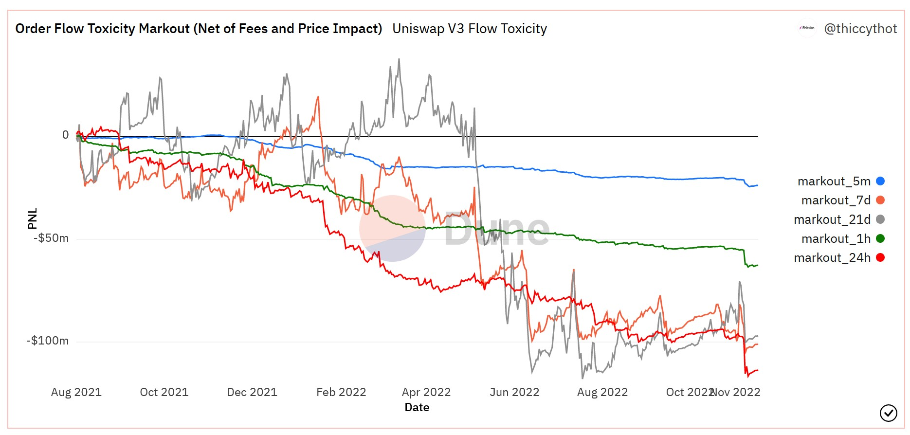

We will discuss the concept of markout in more detail later; for now, it suffices to know that it is a common metric used in high-frequency trading to analyze a strategy's profitability. (In this setting, we are imagining the Uniswap liquidity pool as implementing a trading strategy that takes the other side of every valid trade submitted to the pool.)

After being [popularized](https://twitter.com/0xShitTrader/status/1579510561267929089) by [@0xShitTrader](https://twitter.com/0xShitTrader), these findings prompted a [response](https://twitter.com/teo_leibowitz/status/1587527337117188101) from the Uniswap Labs team, who generated [their own Dune query](https://dune.com/queries/1493066) and claimed to demonstrate that, after properly accounting for fees, Uniswap LPs were actually quite profitable in aggregate:

However, a [detailed examination](https://twitter.com/0xShitTrader/status/1587844736156684291) of the Uniswap Labs analysis by [@0xShitTrader](https://twitter.com/0xShitTrader) revealed that there was a major flaw with their Dune query, causing *half of all trades made* to be ignored in the analysis!

Additionally, [@0xShitTrader](https://twitter.com/0xShitTrader) noted that fees were already accounted for in the original analysis, in contrary to the claims made by Uniswap Labs.

Correcting the single error identified above resulted in PnL plots quite similar to those originally generated by [@thiccythot_](https://twitter.com/thiccythot_), suggesting that ETH/USDC LPs on Uniswap V3 are truly losing staggering amounts of money:

The error was [graciously acknowledged](https://twitter.com/xin__wan/status/1589321967286378497) by [Xin Wan](https://twitter.com/xin__wan) at Uniswap. That being said, they cast doubt upon the validity of markout as a useful metric in the context of AMM liquidity providers:

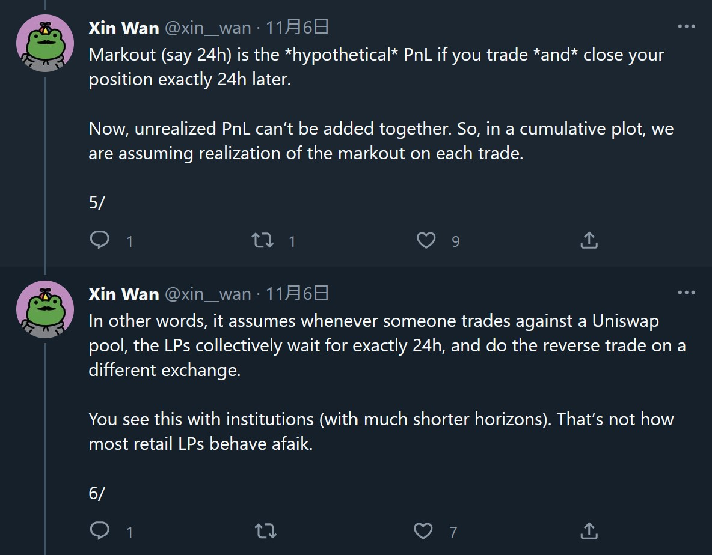

The validity of markout was previously [discussed](https://twitter.com/0x94305/status/1587578006427422720) at length, although consensus was not reached.

Ultimately, we are left with the overall impression that although there is disagreement about whether or not markout is a useful metric for AMM LPs, if we accept that it is, then ETH/USDC LPs have been immensely unprofitable as a result of toxic swap flow!

Curiously, though, the astute reader may recall that in one of our previous analyses, [Designing a Dynamic Fee Policy that Outperforms All Uniswap ETH/USDC Pools](https://crocswap.medium.com/designing-a-dynamic-fee-policy-that-outperforms-all-uniswap-eth-usdc-pools-8948b0cc72ab), it appeared as though a unit of ETH/USDC ambient liquidity staying in a single fee tier would actually have been net profitable in the 0.3% and 1% fee liquidity pools (considering the balance of impermanent/divergence losses versus fee accrual):

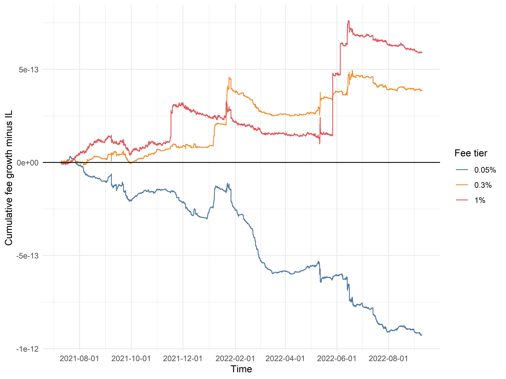

These results appear to contradict those of [@thiccythot_](https://twitter.com/thiccythot_), prompting us to dig a little deeper and identify the source of the discrepancies.

## Original calculation of markout PnL

When we reviewed the Dune SQL query used by [@thiccythot_](https://twitter.com/thiccythot_) in his calculation of markout PnL, we identified two major points of disagreement, all related to the calculation of markout PnL.

Consider the following block of code which defines the 5-minute markout PnL:

    sum(
      protocol_buySell * (markout5m - swapPrice) * eth_swapped
    ) as pnl_5m

This matches exactly the formula for calculating markout PnL given on [@thiccythot_](https://twitter.com/thiccythot_)'s Dune dashboard:

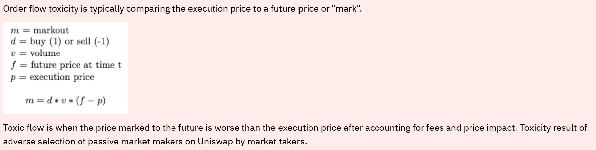

We will discuss various aspects in turn.

**Swap fees are incorporated into the effective swap price**

Let us first consider the question of fees. Is it true, as [claimed](https://twitter.com/teo_leibowitz/status/1587527343723409408) by Uniswap Labs, that this analysis does not factor in LP fees? Superficially, it might appear so, because `pnl_5m` does not explicitly add on the LP fee corresponding to the swap. However, the crucial observation here is that the fee is already "baked into" `swapPrice`.

Here is how `swapPrice` is defined:

    CASE
      WHEN t.token_b_symbol = 'USDC' then t.token_b_amount / t.token_a_amount
      WHEN t.token_b_symbol = 'WETH' then t.token_a_amount / t.token_b_amount
    END as swapPrice

The important observation here is as [@0xShitTrader](https://twitter.com/0xShitTrader) [pointed out](https://twitter.com/0xShitTrader/status/1587844727247966208)ーthis swap price is computed from the amount of tokens transferred to and from the swapper, as reported in the Uniswap event logs. What happens when someone makes a swap is the following: they send in `X` tokens of one type, a fee of `(1 - fee)*X` is taken out (for example, `fee = 0.01` for a 1% LP fee), and `Y` of the paired token are sent back corresponding to a sale of `(1 - fee)*X` tokens of the first type. That is to say, when we calculate the effective execution price using the token in/out values, a higher LP fee will make it appear as though the swapper received a worse-than-market price, and conversely, that the LP filled the order at a better-than-market price.

Let's work through an explicit example. Suppose that ETH is trading at $1,000 on the 0.3% fee pool and that we have infinite liquidity (so price impact is zero). Someone wants to buy ETH, so they send in 1,000 USDC and receive 0.997 ETH. The effective swap price here is `1000 / 0.997 ~= 1003`. Now, if we assume that the price of ETH remains at $1,000, the markout PnL calculation immediately reflects the accrual of the LP fee: `protocol_buySell` is equal to -1, and `markout5m - swapPrice` is equal to -3, so we have a positive number multiplied by `eth_swapped`, hence positive PnL.

As such, it is *not* true that the original markout analysis does not include fees! It is in fact very convenient from an analysis standpoint that the fee is automatically incorporated into the effective swap execution price.

However, that sets the stage for a discussion of the two potential irregularities we identified. (These two disagreements are closely related, and both are resolved by a single change; however, for the sake of conceptual and expositional clarity, we choose to present them separately.)

**Disagreement #1: The markout price should be the pool price**

Let's take a look at how `markout5m` is defined:

    LAST_VALUE(
      CASE
        WHEN t.token_b_symbol = 'USDC' then t.token_b_amount / t.token_a_amount
        WHEN t.token_b_symbol = 'WETH' then t.token_a_amount / t.token_b_amount
      END
    ) OVER (
      ORDER BY
        block_time asc range between current row
        and interval '5 minutes' following
    ) as markout5m

Notice that this is very similar to the calculation of `swapPrice`! In plain language, it is asking: "For any given swap, take the last swap performed in the next 5 minutes, including that swap itself if no other swaps occur. Then, calculate the average execution price of that last swap, either `t.token_b_amount / t.token_a_amount` or `t.token_a_amount / t.token_b_amount` depending on the direction of the swap. That is the 5-minute markout price."

However, this is potentially quite different from the price of the pool after the last swap was made! To illustrate, consider the following example. Assume that ETH is trading at $1,000.

* You make one swap, buying 0.00001 ETH, with zero price impact. The swap execution price and the pool price are both at 1 ETH : 1,000 USDC.
* In the next 5 minutes, there is only one additional swap. This swap buys 1,000,000 ETH, with a huge price impact. After this swap, the pool price is at 1 ETH : 1,100 USDC, $100 higher than it was earlier. The swap's average execution price is 1 ETH : 1,050 USDC, which is a full $50 below the pool price.

For very long markout periods, this has a very small impact. For example, if you use a markout period of 1 year, the difference between the markout price and the swap price will be completely dominated by the overall fluctuation of ETH prices over that time period relative to the price impact of the last swap in that 1 year period. However, for small markout periods, like 5 minutes, this can cause quite a substantial change in the overall results.

**Disagreement #2: There should be no exit slippage**

Stepping back a little bit: In general, when you calculate markout PnL, you should not assume the existence of any exit "slippage" or "fee." Although markout as a metric looks at the profitability of individual trades, it is almost always applied in the context of a continuous trading *strategy.* In this setting, you are continuously making trades at a very rapid pace compared to your markout interval; for example, you might buy some inventory according to a buy signal alpha, then sell some inventory according to a sell signal alpha, and so on and so forth. You only exit at the end of a long trading period, and if you calculate markout PnL assuming an exit fee on every single trade, you will be vastly underestimating your strategy's profitability.

This is even more true for AMMs, where liquidity providers almost always provide liquidity over a continuous span of time (setting aside just-in-time liquidity, which accounts for a minority of trades, and is known to be highly profitable). However, recalling our previous discussion, we realize that:

* The calculation of `swapPrice` and `markout5m` both use the average (effective) swap price
* The calculation of `swapPrice` implicitly includes the swap fee

Therefore, *separate* from the problem that `markout5m` does not reflect the actual (infinitesimal) pool price, this means that estimates of markout PnL are downwardly biased by the inclusion of a swap fee in both the entry and exit transaction! If a given swap goes in the same direction as the last swap in its markout period (including itself), this means that the LP fee is exactly canceled out.

This is easily seen with an example. Suppose that there is no price impact, so that the average swap price and final pool price are always the same. If a given swap is the only swap in its markout period, we have `swapPrice = markout5m` for an overall PnL of exactly 0, which is certainly wrong as the swap fee is still captured by the LP. Of course, if the last swap goes in the opposite direction, then you capture twice the fee; however, the former case should be more common, because directionality of swaps is typically correlated, and because there are likely many intervals in which the markout period contains no additional swaps. As such, we suspect this leads to a systematic underestimation of markout PnL.

## Revised calculation of markout PnL

We wondered: Could the two disagreements identified above account for some of the discrepancies between our previous analysis and the results obtained by [@thiccythot_](https://twitter.com/thiccythot_)? In order to resolve this, we re-analyzed the Uniswap V3 swap data.

In particular, we looked at swap data directly retrieved from Uniswap V3 event logs for the 0.05%, 0.3%, and 1% ETH/USDC fee tiers. We matched the analytic methodology used by [@thiccythot_](https://twitter.com/thiccythot_) as follows:

* Restricted to swaps happening on or after August 1st, 2021 (Unix timestamp `1627776000`) (Dune query: `t.block_time >= '2021-08-01'`)
* Restricted to swaps with nonzero amounts of USDC sent in or out
* Restricted to swaps with at least `1e-8` ETH sent in or out (Dune query: `eth_swapped > 1e-8`)
* Restricted to swaps with an average execution price between $500 and $5,000 per ETH (Dune query: `[swapPrice expression] BETWEEN 500 AND 5000`)

In order to determine the liquidity pool's final price after any given swap, we used the `tick` variable emitted by the `Swap` event. The [Uniswap V3 documentation](https://docs.uniswap.org/protocol/reference/core/interfaces/pool/IUniswapV3PoolEvents) defines this as "the log base 1.0001 of price of the pool after the swap," which is exactly what we want. Note that when multiple swaps occur in the same Ethereum block, they all have the same timestamp; for ease of data analysis, we dealt with this by associating each timestamp with the mean ETH price calculated from each swap's emitted `tick` value, weighted by the amount of USDC transferred in or out. We expect this to be a relatively small, non-biasing factor in the analysis.

First, we checked for basic data consistency by plotting ETH prices as well as a 1-month markout price after every trade:

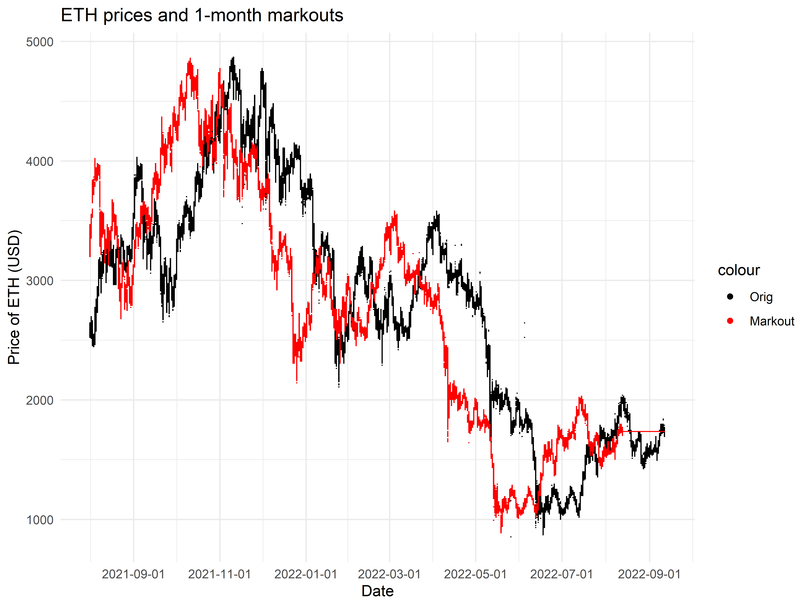

It is straightforward to verify that (1) the black line accurately tracks the price of ETH over time and (2) the red line, representing the 1-month markout price, is indeed equal to the black line shifted left by a 1-month period.

Next, we verified that we can reproduce [@thiccythot_](https://twitter.com/thiccythot_)'s results using the exact same methodology, *i.e.,* calculating markout using the average execution price (incluidng fees) of the last swap in the next *N* minutes.

Doing so with a markout period of 5 minutes, we calculate a cumulative PnL of approximately ~$25 million over the period under consideration:

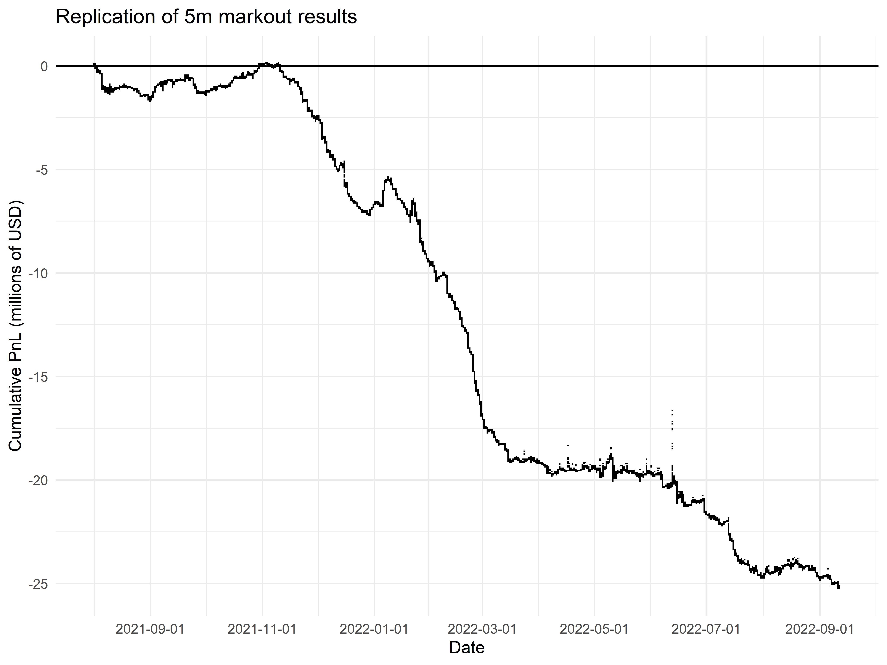

This is qualitatively very similar to the graph of cumulative 5-minute markout PnL given in the [original Dune query](https://dune.com/queries/1374934/2340840)

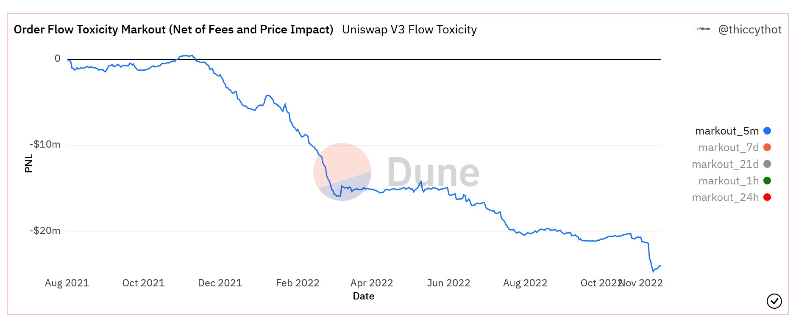

They are not *exactly* identical, and the Dune query includes approximately one more month of swap data, but they match closely enough that it is reasonable, in our opinion, to claim that we have faithfully reproduced the original analysis.

We also replicated the calculation of cumulative PnL using a 24-hour markout interval. In our analysis, we find that losses approach ~$100 million:

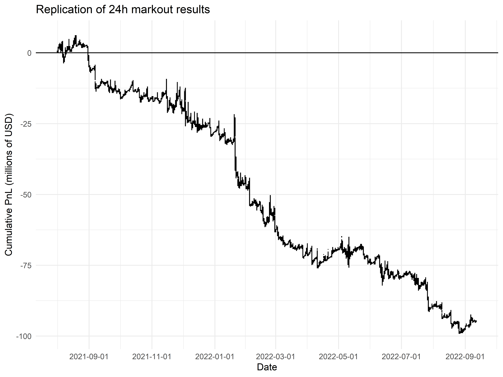

This is again very similar to the results of the original Dune query, again with the exception that their dataset includes approximately 1 more month's worth of data than hours:

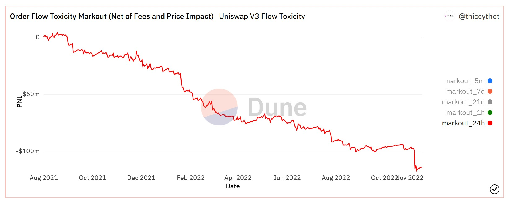

We believe that these comparisons indicate that (1) we are using essentially the same data and (2) we are capable of analyzing the data in essentially the same way, even though the date source and analysis methodologies are not exactly the same (*e.g.,* we are performing our analysis in R and not using the Dune `dex.trades` table as the source of swap data).

What happens if we make a single change: Instead of calculating the markout price using the average swap execution price of the last swap in each markout period, we use instead the price of the pool after that final swap? In theory, this should resolve both of the disagreements pointed out in the previous section. When we recalculate the cumulative PnL of all ETH/USDC LPs, we find that the results are *substantially* different:

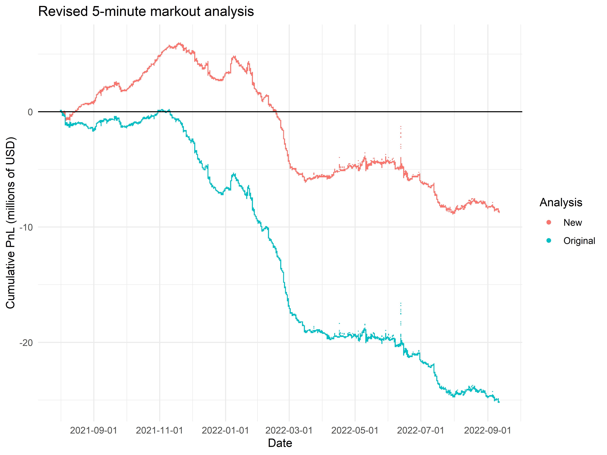

With the revised analysis, the losses at the end of the analysis period reach about -$7m, nearly 75% lower than the figure of $25m losses found in the original 5-minute markout analysis. Additionally, there is a long, multi-month period of profitability in the first half of the data! As we suspected, this seemingly small adjustment makes quite a large difference.

What if we look at performance of each fee tier separately? For simplicity, we will consider the 0.05% and 0.3% fee tiers. (The 1% fee tier receives a very small proportion of the swap volume, and in past analyses we have found that there are strange artifacts in the swap data, so we feel it is more straightforward to consider the 0.05% and 0.3% tiers alone.)

Using the original methodology, we see that the 0.05% pool is very unprofitable, and that the 0.3% pool tier is essentially flat throughout the analysis period. That being said, it should be noted that the 0.05% pool has larger TVL and also receives the majority of ETH/USDC swap volume. (A methodological note: the markouts in each fee tier's swaps was performed using AMM swap data across *all* fee tiers, because (1) swaps come in less frequently to higher fee tiers and (2) the pool price in a higher fee tier will be farther away from the true "fair" price on average because of limited arbitrage.)

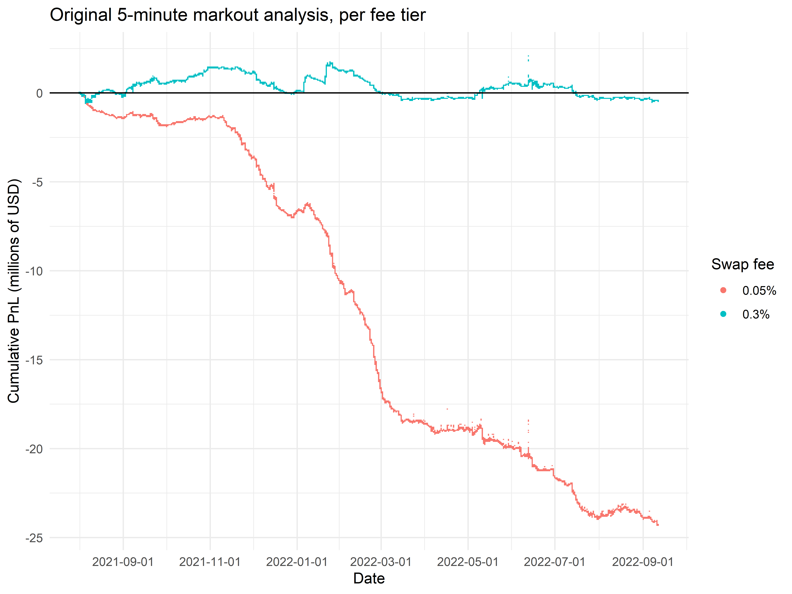

Using the revised methodology, however, we find that the 0.05% pool's losses are significantly lesser, and that the 0.3% liquidity pool is actually net profitable throughout the analysis period:

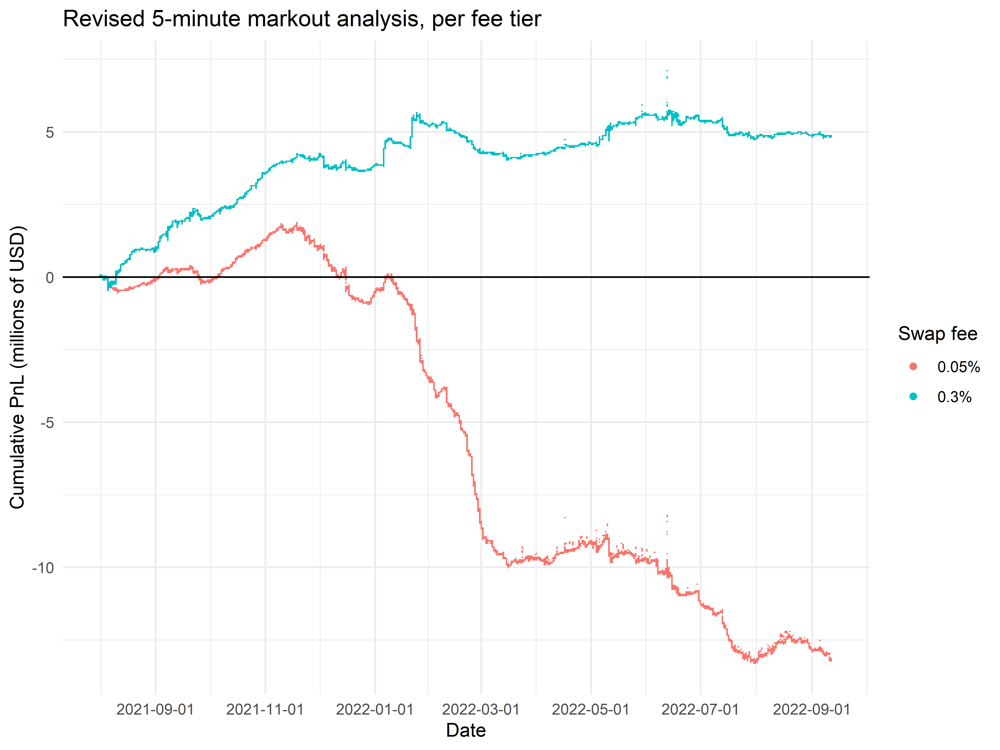

These are roughly consistent with the results we obtained in a prior blog post! They are not identical, but that is only to be expectedーthe exact details of the analyses performed differ in many ways. What is important is that a small change made to the calculation of the markout price yields results which (1) corroborate previous analyses and (2) clearly indicate that it can be profitable to supply liquidity to certain fee tiers.

## Longer markout periods

One might ask: What happens when we apply this revision to the 24-hour markout period, for which the original analysis demonstrates losses around ~$100 million? Some have [argued](https://twitter.com/xin__wan/status/1587581787995344898), in fact, that a longer markout period more appropriately captures organic LP exposure, in the sense that if someone supplies liquidity to an ETH/USDC pool and the price of ETH is the same at the starting and ending points, they have strictly profited from fees, a result which is not reproduced if markout is calculated at intermediate points along the way.

We argue that a shorter markout period is in fact preferable. To be specific, we argue that the optimal markout period is one which captures as much *microstructural* properties as possible but as little *asset price drift* as possible.

For example, suppose that we use 1-month markouts for the price of ETH. Currently, the price of ETH is around $1,200, and six months ago, the price of ETH was around $3,400. That means that in those six months, the price of ETH has gone down nearly 3x!

It follows directly from the decrease in the price of ETH that overall, there was more selling activity than buying activity. Conversely, the liquidity pool bought more ETH on the way down than it sold (assuming liquidity remains roughly constant). Therefore, if we use 1-month markouts, it is very likely that in any given month, cumulative PnL is negative, because (1) the liquidity pool was a net buyer of ETH and (2) the price of ETH went down.

This thought experiment demonstrates exactly why we should not use 1-month or, arguably, even 24-hour markouts. Doing so means that the calculated PnL (with markouts) is dominated by exposure to the *drift* of the price of ETH rather than the balance of accrued fees vs. exposure to toxic flow! If we accept very long markout periods, we may as well simply plot the square root of the price of ETH rather than doing any markout analysis at all, given that the portfolio value for a supplier of ambient ETH/USDC liquidity scales *exactly* with that function.

It is arguably true that many suppliers of ETH/USDC liquidity do not hedge their deltas; however, that does not mean that there is any sense in doing a markout analysis in which we implicitly allow for the accumulation of unhedged delta exposure via long markout periods! *From a market-making standpoint,* the analysis that makes sense is one with a short markout period. Of course, our markout period cannot be *too* short. In the extreme case where we have a markout period of zero, and simply mark each trade to the infinitesimal price after that trade, PnL is generally extremely high, but obviously, this does not properly account for the toxicity of flow in the short term.

Our theoretical analysis still holds for longer markout periods. However, the revised methodology more or less converges to the original methodology as the markout period grows arbitrarily long, for the reason that unhedged delta exposure dominates PnL relative to the points of disagreement we previously outlined.

What is the correct markout period to choose? It is difficult to say for certain. However, for ETH/USDC, one of the most liquid and competitively traded markets in crypto, we believe that 5 minutes is sufficiently long to capture all microstructural features.

Suppose that we extend the markout period to 10 minutes. (One can very roughly argue that this corresponds approximately to a situation where a liquidity provider rehedges their deltas every 20 minutes.) We find substantial degradation in the cumulative PnL; for example, the net profitability of the 0.3% fee tier hovers at around zero even in the revised analysis:

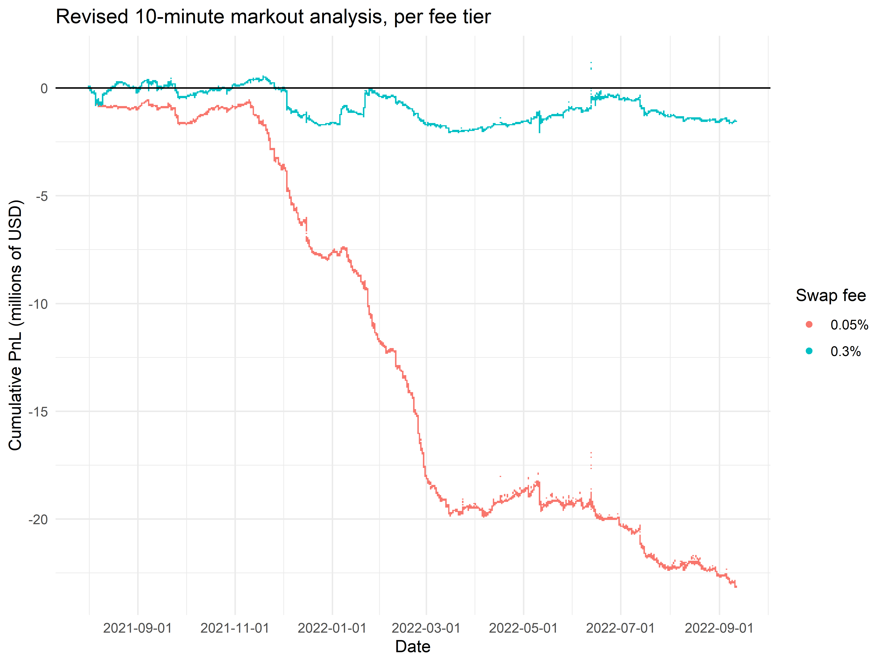

If we look at the actual frequency with which swaps arrive, there is no strong indication that a 10 minute markout period is preferable to a 5 minute markout period. Even with a 5 minute markout period, 98% of swaps in the dataset have at least one other swap in the markout period. Additionally, the distribution of intervals between blocks with at least one ETH/USDC swap suggests that after any given swap, it is very likely that at least one new swap will arrive in a following block within the next 60 seconds, suggesting that 5 minutes is ample time for CEX/DEX arbitrage and general microstructural phenomena to play out:

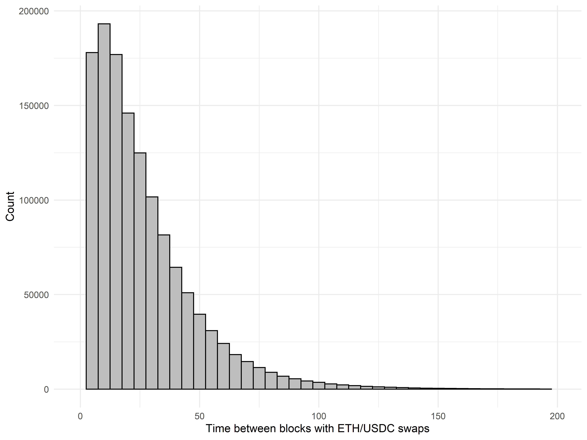

All being said and done, it is important to note that remaining in a static fee tier is quite inefficient. As we have [pointed out](https://crocswap.medium.com/designing-a-dynamic-fee-policy-that-outperforms-all-uniswap-eth-usdc-pools-8948b0cc72ab) in prior work, a dynamic fee that toggles between different fee tiers based on statistical signals could help achieve substantial outperformance.

## "Instantaneous" profitability of each swap

Our discussion of liquidity provider PnL motivates the following, extremely simple question: Suppose that we only look at each swap on a purely individual basis. Someone buying ETH might mean that the LP is subject to adverse flow and that, taking into consideration future ETH buys, the LP is taking on losses relative to the price of ETH several minutes into the future; however, even if we set all of that aside, we should *at the very least* hope that the swap fee collected by a Uniswap liquidity provider is sufficiently high such that the LP is compensated for the price impact of the swap itself. If swaps are not *individually* profitable even if we completely ignore markout prices at future times, then we really have a problem on our handsーsuch a result would suggest that liquidity is deeply underpriced.

Performing such an analysis, we find that the overall ETH/USDC pool remains unprofitable:

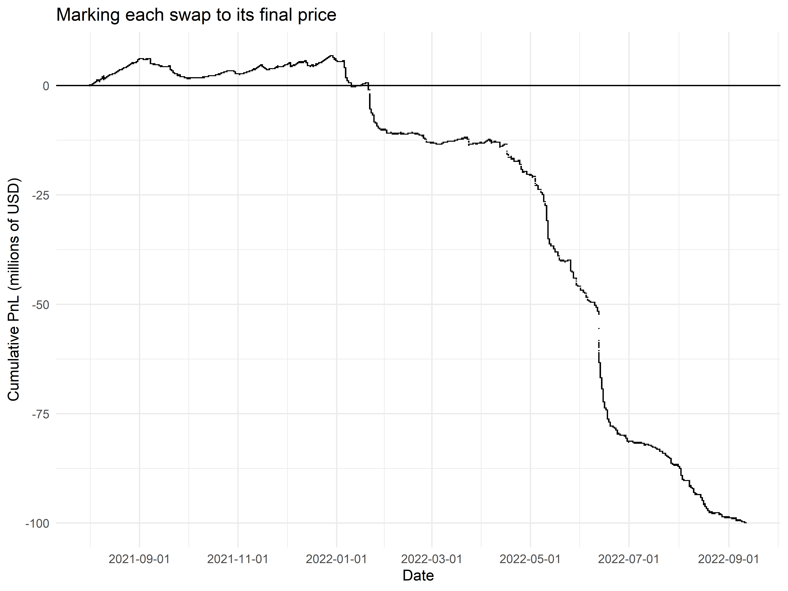

However, breaking out the cumulative PnL between the 0.05% and 0.3% fee tiers, we find that this is largely a function of the 0.05% pool's deep unprofitability:

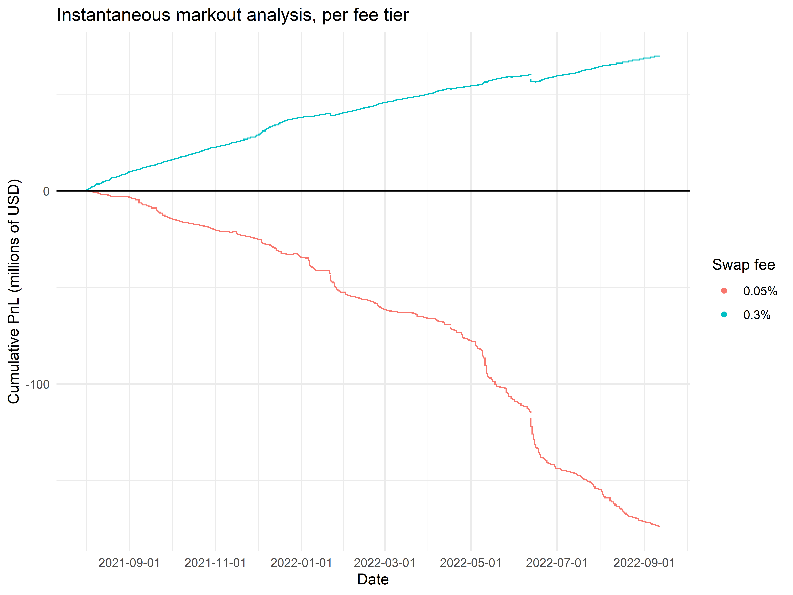

At the very least, the 0.3% pool (and probably also the 1% pool) is pricing liquidity sufficiently high such that swaps are profitable when viewed in purely atomic terms. That being said, as we have just seen, this is no guarantee of profitability when considering price movement *after* a swapーit is merely a sort of "lower bound" heuristic argument for determining which fee tiers are, in some sense, "too cheap."

## Using CEX data to calculate markout prices

How can we extend our analyses further? One potential avenue is to obtain a better estimate of the fair price of ETH at any given time.

A major problem with using Uniswap pool prices as markout prices is, essentially, that only takers can change prices on Uniswap. As Alexander Nezlobin ([@0x94305](https://twitter.com/0x94305)) and others have [pointed out](https://twitter.com/0x94305/status/1593672562630103040), this means that the pool price on Uniswap tends to "lag" the fair price of the asset: there is a cost associated with being a taker on a Uniswap pool (equal to the swap fee plus a fixed gas cost), and arbitrage only happens if the arbitrage profits are greater than the cost of the trade.

[Simulation analyses](https://twitter.com/0x94305/status/1593672567281229824) from [@0x94305](https://twitter.com/0x94305) indicate that this effect leads to an overestimation of LP profits when markout periods as low as 5 minutes are used:

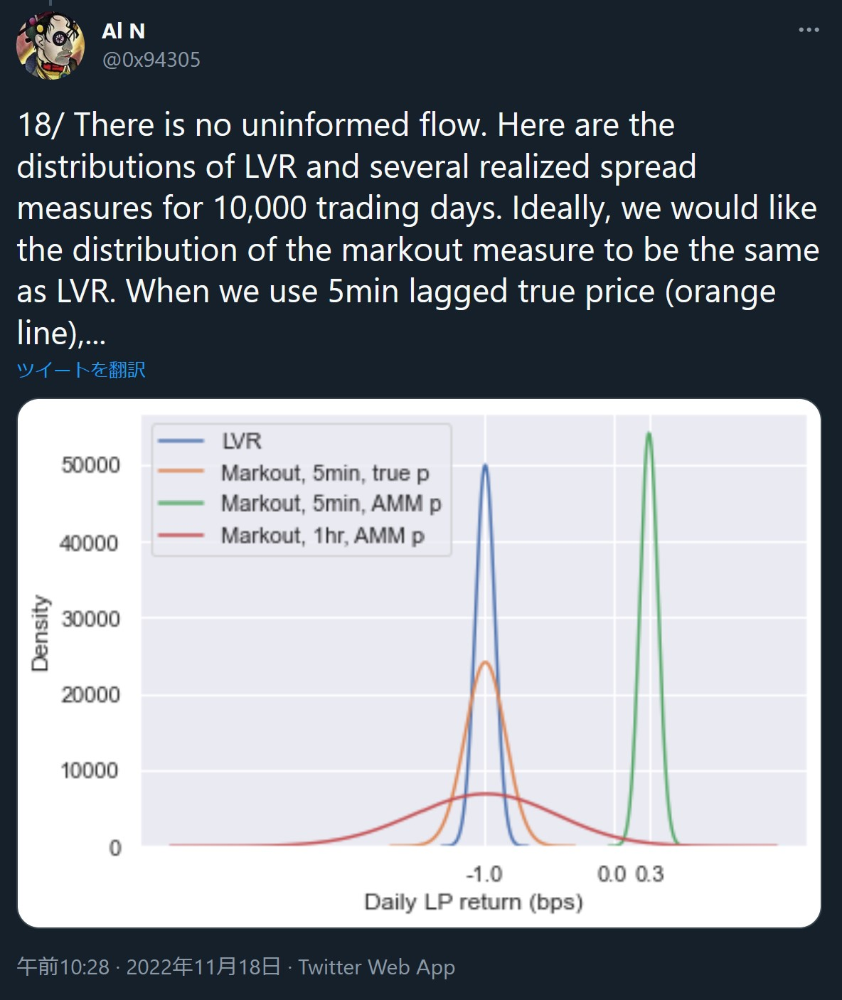

In particular, this is one reason why one might prefer to use longer markoutsーthere is a bias-variance tradeoff here, where longer markouts lead to higher variance from accumulated delta exposure but supply a much less upwardly biased estimate of LP profitability compared to smaller markout periods.

Interestingly, we can improve upon this scenario and potentially retain both the low bias of a long markout and the low variance of a short markout by using data from a centralized exchange (CEX) like Binance. Using spot data from the ETH/BUSD market is advantageous for several reasons:

* Unlike gas fees on Ethereum, there is no semi-fixed cost of making a trade
* Maker and taker fees are quite lowー0% maker fees on all BUSD pairs and a 4 basis point taker fee for VIP 9 level traders
* Market makers can adjust their quoting as desired, so price discovery is not purely facilitated by takers

For these reasons, we typically expect the spot price of ETH on Binance to be a more accurate and less biased measure of the fair price of ETH than the Uniswap pool price.

Consequently, we downloaded all 1-minute candles on the ETH/BUSD spot market from Binance (referred to as [K-lines](https://binance-docs.github.io/apidocs/spot/en/#kline-candlestick-data) in the Binance API) from August 1, 2021 onward. We use the opening price and timestamp of each candle to calculate markout prices.

Doing so, we see that using markouts from Binance data actually provide *worse* estimates of LP profitability compared to both the original Dune analysis and our revised analysis:

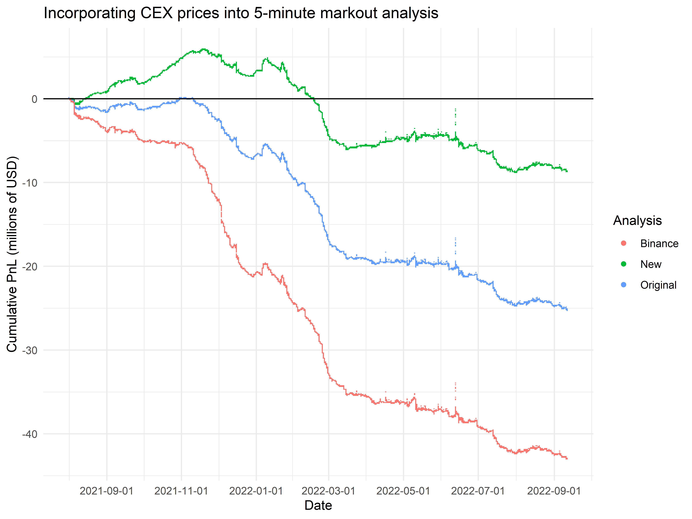

Continuing to use 5-minute markouts, we find that when the markout price is estimated from Binance spot data, both the 0.05% and the 0.3% fee tiers are distinctly unprofitable:

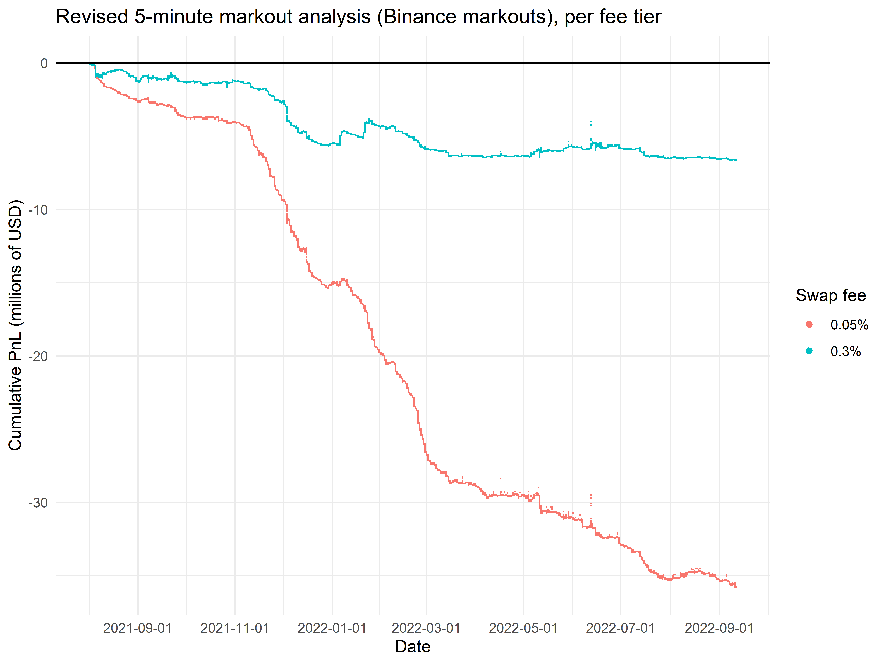

This is not an artifact of the specific markout period used, either: longer markout periods (10 minutes, 1 hour, *etc.*) all yield consistent results. Although on long time horizons the adverse effect of unhedged delta exposure dominates cumulative PnL, using Binance data to calculate markout prices yields a pessimistic estimate of LP profitability in which no fee tier is net profitable over the course of the last year.

## Normalizing by the amount of active liquidity

There is one remaining factor that we have not yet considered in our analysis of pool profitability. Notice that thus far, we have taken the perspective of the *entire liquidity pool's* net profitability! However, from the perspective of an individual, a more relevant question is: If I enter the liquidity pool and stay for some time, what is my net profitability? That is to say, that is our *time-weighted,* rather than *volume-weighted,* profitability?

This is not just an idle or theoretical question. Over time, the absolute amount of liquidity in the pool varies dramaticallyーas evidenced by the fact that the TVL of Uniswap V3 started at $0 and is now at hundreds of millions of dollars! Moreover, the fraction of that liquidity which is *active* also varies dramatically, as some of our [previous work](https://crocswap.medium.com/impermanent-loss-and-jit-liquidity-in-the-uniswap-eth-usdc-0-3-pool-8fc58c755d7) has shown. For example, looking at the 0.3% ETH/USDC pool, the proportion of liquidity units in the pool which are actually in range at any given time ranges between 20% and 95%:

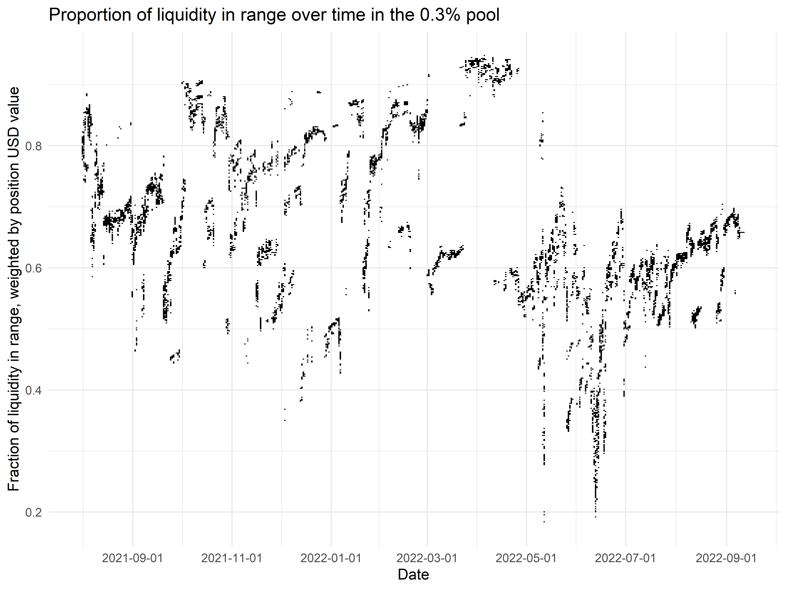

A very similar situation prevails in the 0.05% liquidity pool.

The impact of such fluctuations should not be understated. For example, imagine that a liquidity pool has net profits of -100 and +1 at time periods 1 and 2, but that there are respectively 100 and 1 units of active liquidity at each timepoint. Normalizing by active liquidity, we predict that a single unit of liquidity which entered the liquidity pool and stayed through both time periods would have a net profitability of 0, even though the pool itself has a net profitability of -99! Of course, in practice, the differences are not *that* drastic, but the example well illustrates the value of taking this variable into account.

We therefore modified the 5-minute markout analysis using Binance spot prices by dividing by the number of active liquidity units at each timestep:

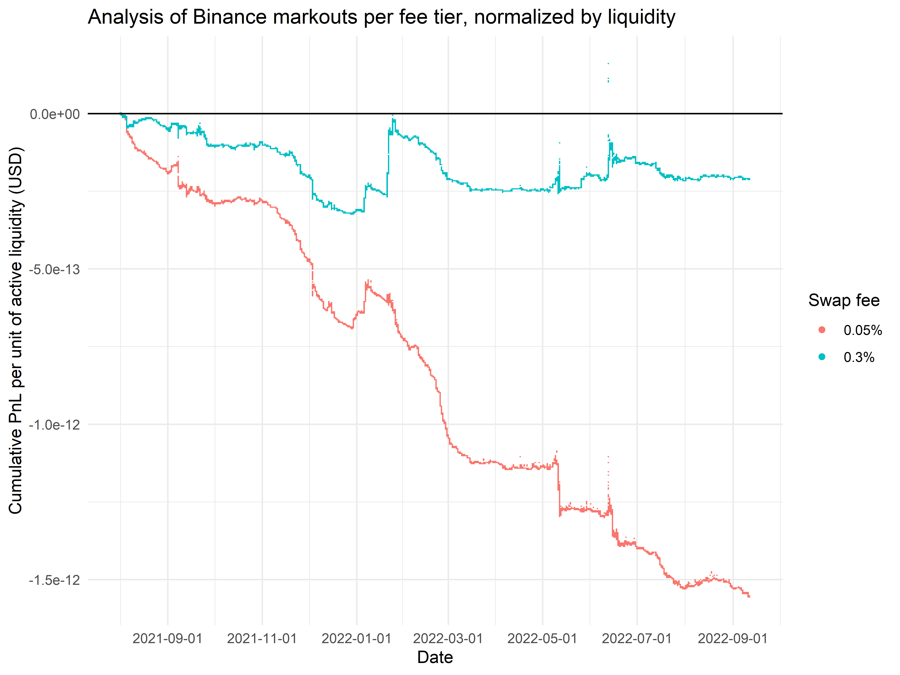

It is notable that even after adjusting for pool TVL, it appears that the 0.05% pool is still accruing much greater losses than the 0.3% pool, reinforcing our belief that the 0.05% pool is underpricing liquidity. Additionally, there is a subtle but crucially important phenomenon which shows up after this normalization: Although the cumulative PnLs move in correlated directions, there are often times when the cumulative PnL of the 0.3% pool goes up much more than the cumulative PnL of the 0.05% pool (and vice versa)! This directly suggests that a strategy that *toggles* between fee tiers intelligently, as [discussed](https://crocswap.medium.com/why-use-a-dynamic-fee-for-liquidity-pools-def07a1e6c3b) at length in our prior research, could in fact deliver positive cumulative PnL to liquidity providers even if staying in a static fee tier is net unprofitable over long time horizons. Such a dynamic fee could be a crucial step in developing systems that facilitate the sustainable provision of on-chain liquidity.

## Change in final PnL using different markout periods

Thus far, we have started with a straightforward Dune query on Uniswap data and applied, in turn, the following adjustments:

* Calculating markout prices differently, first by using the price of the liquidity pool itself and, afterward, by using Binance ETH/BUSD 1-minute candle opening prices
* Normalizing PnL of each swap by the number of liquidity units active at that time

Previously, we briefly considered, in theoretical terms, the question of what an "optimal markout duration" constitutes. We argued that the markout duration should be as long as necessary to capture microstructural features of the asset's relevant markets, but beyond that, as short as possible in order to minimize exposure to unhedged deltas in an AMM liquidity setting. At the same time, though, others might argue differently; for example, some have commented that the markout period should actually reflect the average LP's length of stay in the Uniswap liquidity pool, and that in this context it is proper and appropriate to consider the impact of unhedged deltas over time.

We hesitate to make overly strong claims about the "best" or the "ideal" choice, recognizing that different perspectives may lead readers to prefer different choices of markout periods. That being said, we feel it is informative to compare how the cumulative PnL at the end of the evaluation period changes as we increase the markout period from 1 second all the way to 24 hours. For example, in the case of the entire set of Uniswap ETH/USDC pools, we see that the differences between various analysis methodologies appear to converge to nearly zero as delta exposure comes to dominate the cumulative PnL:

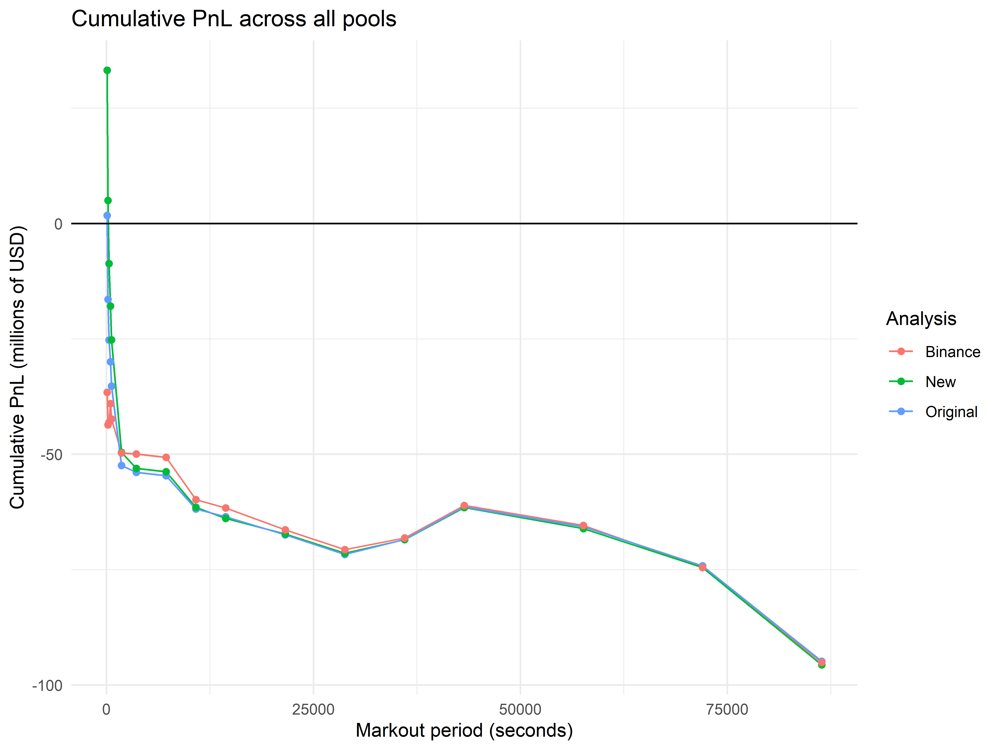

It is perhaps a little surprising that the difference in cumulative PnL between the "original" and "new" analyses (which respectively calculate markout price using the average or final price of the last swap in the markout period) diminishes over time. This may reflect some distributional quality of the swap flow, for example, perhaps small swaps are likely to be followed by small swaps, and large swaps are likely to be followed by large swaps; if this were the case, then as the markout period increases, we expect such effects to wash out and for the difference between the cumulative PnLs of the two analyses to converge to a fixed value. However, we did not explore the exact cause in detail, as we feel that the "new" analysis (using final price rather than average price of the last swap) is strictly methodologically preferred to the original analysis.

We may also reasonably ask how the same graph of cumulative PnL looks when we separate out different fee tiers and normalize for active liquidity units within each one. For example, with the 0.05% fee tier, it is very clearly and consistently unprofitable at approximately the same numerical level for all markout periods from 8 minutes onward to 20 hours, after which it declines substantially:

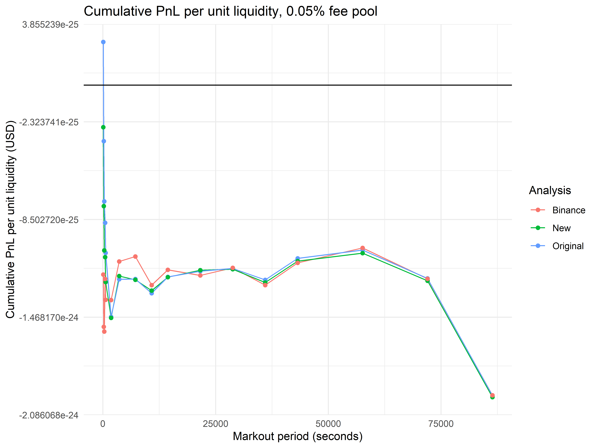

A qualitatively similar pattern is observed with the 0.3% pool, where markouts between 10 minutes and 8 hours are relatively stable at near zero (actually a somewhat more optimistic result than our findings with 5-minute markouts!):

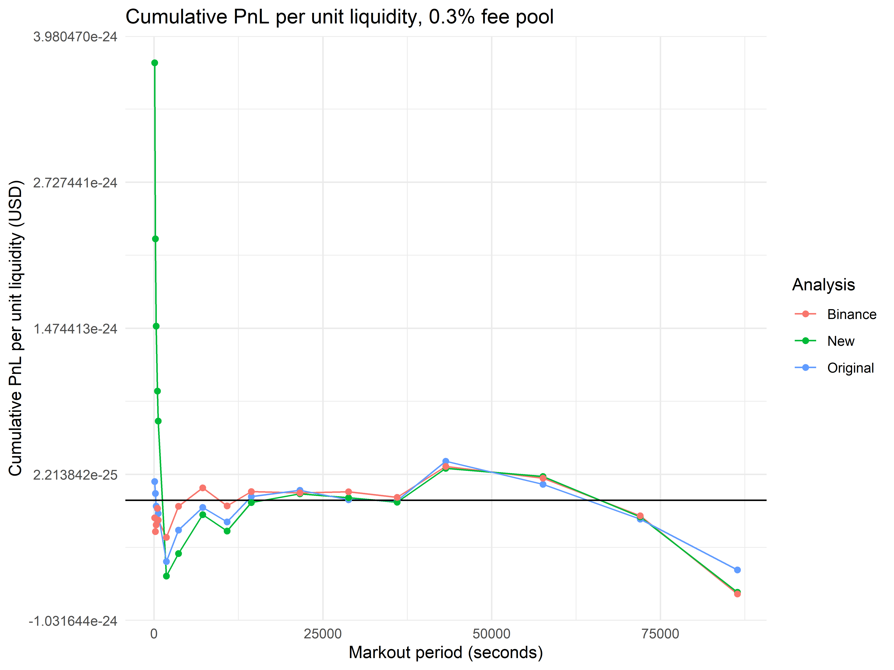

It is not strictly obvious how to interpret these results. However, one could plausibly argue that properly taking into account fluctuations in the amount of liquidity active at any given time, and therefore arriving at PnL values that represent the profits or losses of a liquidity provider that stays in the pool with a constant amount of active liquidity over the course of a long period of time, yields cumulative markout PnLs that strongly suggest that microstructural effects, adverse flow, *etc.* are mostly accounted for after 5 minutes, and almost entirely accounted for after 10 minutes, resulting in PnLs that are relatively stable until markouts periods reach durations long enough to allow the accumulation of significant amounts of unhedged deltas, around 8 hours or longer.

This is actually the most optimistic picture for LP profitability we have arrived at thus far! In this framing of the problem, while it remains clear that liquidity providers in the 0.05% pool are taking on substantial losses (the question is really just one of exactly *how large* these losses are), there are reasonable settings (*e.g.,* rehedging deltas every 30 minutes or so but keeping the number of active liquidity units constant) in which LPs in the 0.3% pool come out, if not clearly in the black, then at least relatively close to break-even. 

## Conclusion

To summarize, we have made the following observations:

* The original analysis from [@thiccythot_](https://twitter.com/thiccythot_) can arguably be improved by using pool prices as markout prices, which tends to increase estimates of LP profitability
* When the pool price is used to calculate markouts, estimates of LP profitability increase, with some fee tiers moving into net profitability when using 5-minute markouts
* If we mark eachs swap to its final marginal price, we obtain fairly conclusive evidence that the 0.05% fee tier is almost certainly underpricing liquidity; as most swap volume flows to the liquidity there, it is responsible for the majority of losses accruing to Uniswap LPs
* When we use Binance spot data is used to calculate markouts (arguably providing a less biased estimate of fair price), we obtain very pessimistic estimates of LP profitability, where no fee tier appears to be profitable at 5-minute markouts
* Longer markout periods intrinsically bias LP profits downward due to accumulation of unhedged delta exposure; therefore, even despite the fact that using Binance spot data for markouts yields worse estimates of LP profitability, the overall situation is arguably not nearly as bad as the original estimate of $100 million in losses would suggest
* We can estimate the cumulative PnL of an average unit of liquidity, rather than the entire pool; doing so, we find that cumulative PnL is still weakly negative across fee tiers, but uncover patterns which suggest the viability of a dynamic fee strategy
* If we look at how cumulative PnL varies with length of markout period in different settings (varying the analysis methodology, separating out fee tiers, and normalizing by active liquidity), empirical patterns suggest that markout periods of perhaps 5-10 minutes, and certainly 20+ minutes, are more than enough to capture relevant microstructural features without excess delta exposure, and that LPs in the 0.3% pool may in principle come out reasonably close to breakeven in specific framings

Quite a rollercoaster of different findings!

Even if one feels that markout is not a fully appropriate metric relative to actual user behavior or preferences, we believe that we have resolved a number of methodological disagreements and provided a series of useful empirical findings with regard to the profitability of ETH/USDC liquidity providers on Uniswap V3. Ultimately, the choice of exact analytic procedure is perhaps more of an art than a science. However, in aggregate, we feel that our results clearly demonstrate that static liquidity tiers, especially the 0.05% tier, tend to inaccurately price liquidity over time, leading to substantial losses for LPs. These findings therefore motivate the development of new DEXes with modern capabilities, such as dynamic swap fees and lower gas costs, which may help us slowly move toward an ecosystem of sustainable decentralized liquidity.