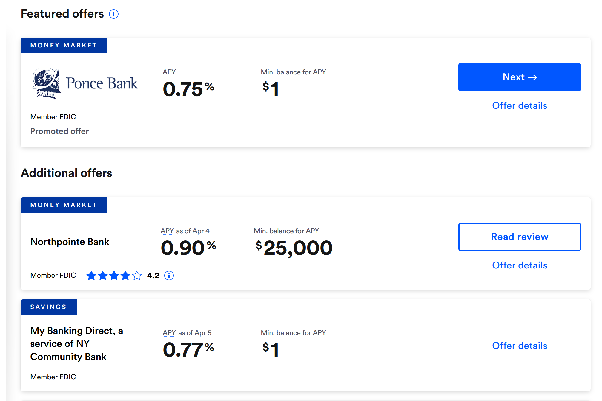

# Stablecoins on Uniswap V3

This is the fifth in a series of posts by [0xfbifemboy](https://twitter.com/0xfbifemboy) on the performance of concentrated liquidity.

**Note on TerraUSD (UST):** This post was written before the [depegging of UST]( https://www.nansen.ai/research/on-chain-forensics-demystifying-terrausd-de-peg) in the second half of May 2022. As such, some of the figures in this post will show UST as maintaining its peg with respect to other stablecoins, because the source data was obtained in April 2022, well before UST depegged. This post will not discuss the depegging, which is a highly complex event and which falls well outside the scope of this analysis. The interested reader may refer to the linked Nansen analysis of on-chain data during the UST depeg for more information.

## Introduction

In previous posts in this series, we performed extensive analyses of ETH/USDC liquidity across fee tiers and across Uniswap deployments on alternate chains. In this post, we redirect our attention to a different topic: stablecoins.

Stablecoins, or tokens designed to maintain a 1-to-1 "peg" to fiat currency (typically the United States dollar), currently play an essential role in the day-to-day operation of decentralized finance (DeFi). Converting assets to stablecoins or vice versa allows users to exit or enter risky portfolio positions; lending and borrowing of stablecoins allows users to apply leverage to their positions and attain greater overall capital efficiency; denominating prices in stablecoins allows for sales to be quoted in terms of fiat currency without reliance on oracles for referencing the prices of risky assets on-demand; in general, stablecoins are an indispensable and growing element of modern DeFi.

To address this need, a number of different stablecoins have come into play, ranging from centralized, fully collateralized stablecoins such as USDC and USDT to decentralized, overcollateralized stablecoins like DAI and, finally, to decentralized and undercollateralized stablecoins like UST which seek to maintain their peg via complex algorithmic or incentive systems. These different systems, naturally, come with their distinct benefits and risks.

In this article, we report several results from an analysis of selected stablecoin liquidity pools on Uniswap V3 (Ethereum mainnet only). While a full analysis of stablecoin dynamics is well beyond the scope of this research effort, liquidity on Uniswap is nevertheless a reasonably important component of the overall stablecoin ecosystem. Consequently, we hope that these limited findings contribute to the overall dialogue on stablecoin liquidity, which we feel has thus far focused largely on other ecosystem players such as Curve.

Overall, we find that major stablecoin pairs have maintained a relatively tight peg despite volatile market conditions in the last several months. Unsurprisingly, the swap fee for a given liquidity pool affects the stability of the peg via increasing barriers to arbitrage. Some stablecoin pools are observed to drift away from a 1:1 ratio for extended periods of time, potentially reflecting excess demand for that stablecoin.

Curiously, an extremely large amount of liquidity is provided to major stablecoin pools, driving returns down to well below 1% APR in some cases; although the precise reasons why are unclear, this liquidity may be supplied by major actors with vested interests in Uniswap or the broader DeFi ecosystem who seek to benefit from the positive externalities of deep Uniswap stablecoin liquidity. We propose that more robust support of on-chain limit orders may allow market makers to explicitly capture a profitable spread on stablecoin swaps, which may in turn spur the growth of sustainable stablecoin-stablecoin liquidity overall.

## Peg maintenance

As early as [2014](https://www.wsj.com/articles/BL-MBB-23780), the creation of on-chain "stablecoins" valued at 1 USD has been a topic of considerable interest in cryptoeconomic systems. For several years, stablecoins remained relatively niche; however, with the explosive growth of Ethereum-based DeFi, stablecoin issuance has rocketed upwards to nearly 200 billion USD:

Although most of this supply originates from a relatively small number of established stablecoins, there is a very long tail of alternative, lesser-known stablecoins which have attempted to claw market share away from the dominant players. For practical reasons, we limit our consideration to a small number of stablecoin pairs on Uniswap, namely the following seven liquidity pools:

These stablecoins generally fall into three major categories:

* **Centralized and fully collateralized (USDC, USDT, BUSD):** These stablecoins are theoretically backed one-to-one by USD (or low-risk assets such as bonds easily convertible into USD) held by centralized entities, such as [Circle](https://www.circle.com/en/) in the case of USDC. Typically, an entity can mint 1 stablecoin by depositing exactly 1 USD or retrieve 1 USD by depositing and burning 1 stablecoin (minus a small minting/redemption fee). Primary risk: centralized entity can blacklist addresses from using their funds.
* **Decentralized and overcollateralized (DAI, FEI):** These stablecoins are backed by assets managed in a decentralized manner on-chain. As some of these assets are typically risky (such as Ether) and may reduce in value in times of market volatility, these stablecoins are typically *overcollateralized* by requiring the deposit of more than 1 USD value of collateral in return to mint 1 stablecoin. Primary risks: protocol hacks; value of risky collateral falls excessively and stablecoin depegs.
* **Decentralized and undercollateralized (UST):** These stablecoins are formally backed by less than 1 USD of asset value than each unit of the stablecoin issued. Typically, the issuing protocols attempt to maintain a 1 stablecoin : 1 USD peg via algorithmic measures. For example, the Terra protocol allows holders of UST to redeem 1 UST for 1 USD worth of the LUNA token, which is a quantity that fluctuates with the price of LUNA. Primary risks: protocol hacks; peg maintenance program fails and stablecoin depegs.

Decentralized stablecoins were initially developed in response to the centralization risks of centralized stablecoins, which may be subject to adverse regulatory action. However, because they are not directly redeemable for 1 USD of fiat currency, they are subject to the risk of "depegging," *i.e.,* becoming redeemable for less than 1 USD. This risk typically manifests during a "bank run," where many users seek to exchange stablecoins for fiat (due to, *e.g.,* regulatory action) or to exchange risky stablecoins for less risky stablecoins (in *anticipation* of a future bank run, which can reflexively *cause* a bank run). Among decentralized stablecoins, overcollateralized stablecoins are typically considered less risky than undercollateralized stablecoins, although this is a fairly general statement which is not universally applicable to all situations.

Due to the important role that stablecoins play in DeFi, it is important to understand the trading and liquidity dynamics of major stablecoins, which naturally both inform and affect their depegging risk. Additionally, understanding these dynamics can lead to insights about existing inefficiencies in DeFi and, consequently, potential routes of improvement. Stablecoin dynamics are reliant upon the confluence of numerous, distinct mechanisms on separate chains as well as trading and liquidity provision on decentralized exchanges beyond Uniswap, and ultimately a full analysis of stablecoins is beyond the scope of this post; nevertheless, analysis of the Uniswap stablecoin liquidity data is an illustrative window into a highly complex and multifaceted topic.

In particular, we begin by examining the prices of all seven pools over time:

For each pair, we plot the price of the "less established" stablecoin in terms of the "more established stablecoin, which is either USDC if the pair includes USDC or DAI otherwise. For example, the *y*-axis in the graph in the top left hand corner represents the price of BUSD in terms of USDC. The price is derived from the ratio of token quantities observed in every single swap transaction made in each pool. Note that the *entire* history of all swaps is included in the plotted data, meaning that swaps at very unbalanced prices (away from 1:1) are very distinct, even if the prices were only unbalanced for a short period of time.

We immediately observe that USDC/USDT, DAI/USDC, and FEI/USDC are clear standouts with respect to peg maintenance: over time, swaps made within these two pools deviate far less from the ideal 1:1 ratio than in the other four liquidity pools. This is clearly not solely a function of the volume of available liquidity, as the pool with the highest TVL among all seven is FRAX/USDC, which appears to consistently experience greater price volatility. Instead, it is very likely due to the fact that these liquidity pools have a 0.01% swap fee, which is lower than the 0.05% swap fee of other pools (except for USDC/UST, which has a 0.01% swap fee but extremely low TVL). Due to the lower swap fee, the degree to which the price must deviate from 1:1 before arbitrageurs are incentivized to profitably restore the peg is lower than in the 0.05% pools; as such, the peg maintenance in these three pools is particularly good.

One natural objection is that plotting the instantaneous price of each swap overrepresents the volatility of each token pair because individual large swaps may result in extremely high slippage even if the overall price is quite stable when averaged over a longer duration of time. On a similar note, because the majority of UST liquidity does not reside on Uniswap, one could plausibly object that the deviation of the USDC/UST peg from 1:1 is due to limited liquidity within the pool itself. As such, it is instructive to compare the above plot to the time course of each pool's price *averaged over hourly time intervals:*

Clearly, such an averaging operation reduces some of the observed volatility; for example, an extreme outlier in the DAI/USDC pool is no longer visible, and the volatility in the USDT/UST pool is dramatically dampened. Nevertheless, it is clear that pools still occasionally drift away from a 1:1 peg for extended periods of time, most notably in the USDC/UST pool, where the market price of 1 UST has slightly exceeded 1 USDC for the majority of the pool's existence. In particular, we see the price of UST (denominated in USDC) spike dramatically for a period of multiple weeks.

It is particularly interesting to see the price of a relatively riskier stablecoin command a *premium* in terms of USDC over a long period of time. Typically, riskier stablecoins are considered so because they have a higher probability of depegging, in which case they would generally be exchangeable for *less* than 1 USDC. Additionally, because stablecoins with a greater history of reliability are considered more desirable to hold than risky stablecoins, one generally expects users, even in ordinary times, to be willing to exchange a quantity of, say, N highly risky, undercollateralized stablecoins for a quantity of slightly *less* than N USDC. As such, the fact that the price of UST is *above* 1 USDC reflects a remarkable degree of interest in capital entering the Terra ecosystem. Note that minting UST requires the purchase of LUNA; as such, the timing of the recent runup in LUNA prices (relative to market beta as represented by ETH) corrborates the hypothesis that the deviation of the UST/USDC price from 1:1 reflects an enduring and significant increase in capital inflows into the Terra ecosystem:

Knowing what we do now (in June 2022), one cannot help but wonder what proportion of these UST inflows can be attributed to an entity setting up for triggering a UST bank run in late May!

In general, it is illustrative to observe the frequency with which each pool's price deviates from an ideal 1:1 ratio:

We previously noted that the short-term variance of pool prices likely results from the presence of two fee tiers within this dataset. Such differences will be reflected in the variance of the subdistributions in the above plot, whereas differences in the overall tendency of each pool's price to deviate from 1:1 will be reflected in the means of the subdistributions. We clearly see that among all seven pools, the USDC/DAI pool is consistently the closest to a 1:1 ratio over time, which is roughly consistent with the generally observed sentiment that USDC and DAI are the most "desirable" or "reliable" stablecoins, as well as with the fact that nearly half of DAI's collateral is USDC itself:

## Abundance of stablecoin liquidity

One interesting feature of stablecoin liquidity pools on Uniswap is that the fees generated are remarkably low in comparison to pool TVLs. For example, consider the fees generated in the DAI/USDC 0.01% pool:

Extrapolating from the fees generated in the last 24 hours, the return on providing liquidity corresponds to an annualized return of approximately 0.35% APR! Similarly, consider the USDC/USDT 0.01% liquidity pool:

In this case, the generated fees correspond to approximately 0.85% APR. In both cases, these are actually comparable to or even inferior to returns offered by high-yield savings accounts in traditional finance:

Fee generation and pool TVLs naturally vary from day to day; however, even if one doubles or triples the estimates as a conservative 'fudge factor,' the returns still fall well short of easily obtainable, high-capacity, low-risk yield opportunities on other DeFi protocols such as [Aave](https://app.aave.com/):

This motivates the following question: Why is *any* liquidity provided on Uniswap V3 for stablecoin pairs? One plausible reason is that Uniswap is considered a safer protocol, with less risk of funds being drained via smart contract exploits; however, protocols such as Compound or Aave are also generally considered quite secure, and the difference in stablecoin returns seems out of proportion with the relative risk assessments.

Curiously, one can note that despite the 9-figure TVLs, liquidity is typically spread across a relatively small number of positions:

Indeed, even for a major, high-TVL pool like DAI/USDC, there are currently fewer than 50 open liquidity positions! The largest liquidity position, token ID [161372](https://revert.finance/#/uniswap-position/mainnet/161372), currently supplies approximately $14m liquidity, constituting nearly 6% of the pool's TVL.

It is generally not immediately obvious who controls the addresses which supply extensive liquidity to stablecoin pairs. However, one potential exception is the largest liquidity position on the USDT/USDC 0.01% pool, token ID [194480](https://revert.finance/#/uniswap-position/mainnet/194480), which has supplied a whopping $100m liquidity. This position was minted via the transaction [`0xcbb049df9dd41b1f558499e325424dbd78ef2fdecba819e0def82ee4355c1283 `](https://etherscan.io/tx/0xcbb049df9dd41b1f558499e325424dbd78ef2fdecba819e0def82ee4355c1283), originating from address [`0x0d4E989c7620C8749c9417d2BF218896C767B606`](https://etherscan.io/address/0x0d4e989c7620c8749c9417d2bf218896c767b606). Notice that in one of its earliest transactions, this address was funded with 10 ETH from `k06a.eth`:

Googling "k06a," one readily observes that this corresponds to the online handle of [Anton Bukov](https://github.com/k06a), a co-founder of the DEX aggregator 1inch!

This is likely not a coincidence. In general, although the explicit returns on stablecoin liquidity are low, the presence of extensive stablecoin liquidity on Uniswap V3 generates many positive externalities for Uniswap itself as well as for aggregators such as 1inch. When abundant liquidity is provided to major stablecoin pairs, users do not have to worry about optimizing slippage by slipping to the "right" stablecoin, resulting in a substantially improved UX for the end user. As such, it is plausible that actors with vested interests in Uniswap, 1inch, or the broader DeFi ecosystem, such as venture capital firms like Paradigm, may be among those providing liquidity at what appears tobe a remarkably low return on capital. (Even so, however, the stablecoin pool TVLs seem higher than the amount needed to ensure seamless UX, so the resilience of these TVLs remains somewhat mysterious.)

## Capturing spreads

Despite the incentivization of the FRAX/USDC 0.05% liquidity pool on Uniswap as well as the initially overcollateralized nature of FRAX, the price of FRAX fluctuated substantially against USDC in the first several months following its launch:

In principle, someone with strong confidence that the price of FRAX would eventually return to peg would be very interested in buying FRAX at relatively low prices (*e.g.* 0.9975 USDC) and selling it at relatively high prices (*e.g.* 1.0025 USDC). Generally speaking, explicitly market-making the spread on a stablecoin-stablecoin pair in which you have high confidence could be a highly profitable strategy, even more so than capturing swap fees alone by minting a concentrated liquidity position.

It is not currently possible to construct such a strategy by minting single-tick concentrated liquidity positions alone, which are *reversible* in the sense that if the price passes back and forth through the position's tick but eventually returns to the same value at which it was minted, the liquidity provider's claim on the pool's assets remains the same (plus trading fees). In contrast, a true limit order would leave the liquidity provider with a different asset composition, representing the nonreversible execution of the limit order. However, new DEX systems which implement limit order functionality would potentially allow for explicit market-making of a spread on stablecoin pairs, which may lessen price volatility and aid in peg maintenance for novel stablecoin pairs.

Limit orders already exist via aggregators such as [1inch](https://help.1inch.io/en/articles/4656415-how-to-place-a-limit-order-on-1inch) and [Matcha](https://help.matcha.xyz/en/articles/4346691-how-are-limit-orders-on-matcha-free). However, we note that placing limit orders via these platforms intrinsically depends on their centralized order-matching databases (with limited transparency and composability), and no major DEX to date has implemented limit order functionality. Moreover, the limit order functionality on 1inch, Matcha, *etc.* necessarily involves your order being filled by some matching counterparty, which is intrinsically less reliable, and in principle less preferable, than having limit orders directly represented as part of the total distribution of liquidity resting in any given pool (and therefore 'naturally' accessible in the same way as typical ambient or concentrated liquidity positions).

It is challenging to evaluate the profitability of explicitly market-making stablecoin pairs such as USDC/USDT or DAI/USDC when provision of concentrated liquidity is subsidized to such a great extent that the return on marginal capital is well below the risk-free rate of return (approx. 0.50% APR depending on the specific pair; see discussion in pprior section). Conceivably, such explicit market-making will never be directly profitable in cases where liquidity is so abundantly subsidized. However, for new stablecoin pairs, or in cases where the degree of subsidization is insufficient to maintain a strong peg relative to realized trading flows, native, high-quality support for limit order functionality in a modern DEX might open up novel modes of liquidity provision. (Interesting, we note that limit order functionality would be particularly relevant to the recent 'depegging' of stETH against ETH. Users with large spot ETH holdings and confidence that the Merge will render stETH directly redeemable before too long would profit considerably from being able to set limit orders to buy stETH at a 'discount' if the price becomes sufficiently discounted relative to ETH in the short term.)

## An amusing digression

As a final digression, we call to attention a curious, and amusing, phenomenon which we observed in the course of this article's preparation. Earlier, we displayed a graph of the price per swap over time in each pool. That plot was, in fact, truncated to remove a single outlier, which was a swap in the USDT/USDC 0.01% pool made at a remarkably unbalanced price of 1 USDC to 2 USDT. When that outlier is included, the price of swaps made in this pool over time looks like the following:

Upon investigation, we found that this price was realized by a swap made in the transaction [`0x6f7105055ca60d73e4870983a776d1e61d3090ffd30b783acb5418589be00c53`](https://etherscan.io/tx/0x6f7105055ca60d73e4870983a776d1e61d3090ffd30b783acb5418589be00c53):

Notably, the unusually aberrant price is likely a result of rounding imprecision in the token calculations! Unfortunately, this user appears to have paid nearly $30 in gas for the privilege of losing a minuscule fraction of USDC...

## Conclusion

Ultimately, stablecoins encompass a far broader topic than what this single article could possibly hope to encompass. A fuller understanding of stablecoin dynamics would entail an investigation of other DEX protocols such as Curve, lending protocols such as Aave and Compound, and stablecoin issuance protocols such as Maker and Terra, as well as flows of capital across wallets, protocols, and chains. Nevertheless, stablecoin swapping activity on Uniswap V3 is an interesting, if limited, window into this complex ecosystem, and our work here lays the groundwork for future expansion of this analysis.

We note that yields on supplying stablecoin liquidity appear to be abnormally low, perhaps due to the presence of motivated ecosystem actors which have strong incentives to maintain ample liquidity between major stablecoin pairs. However, the development of decentralized, on-chain limit orders to allow market makers to directly capture a spread across a stablecoin peg is one potential route toward which healthy stablecoin liquidity might evolve, particularly for newer pairs where preexisting liquidity is not subsidized to as great a degree.